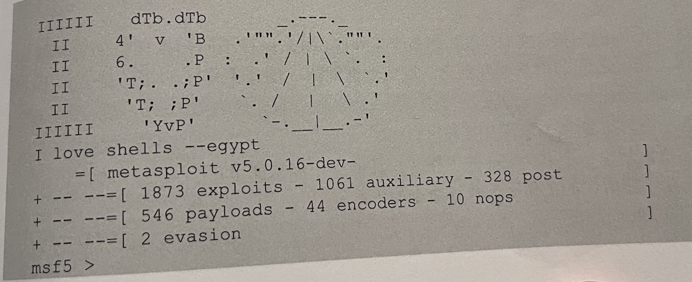

## Metasploit的界面
- Metasploit 框架提供了两种界面，分别是图形界面和终端模式。之前，还提供了一种命令行模式的界面，但是已经废弃。
#### Metasploit的终端模式Msfconsole
- MSF 终端(Msfconsole）是目前 Metasploit框架最为流行的用户接口，而且MSF 终端是metasploit框架中最灵活、功能最丰富，以及支持最好的工具之一。MSP终端提供了一站式接口，能设置Metasploit框架中几乎每一个选项和配置。用户可以使用MSF终端做任何事情，包括发起一次渗透攻击、装载辅助模块、实施查点、创建监听器，或是对整个网络进行自动化渗透攻击等。
  ```shell
  启动Metasploit 的终端模式。执行命令如下：
  root@daxueba: ~# msfconsole
  ```
- 执行以上命令后，即可成功启动Metasploit的终端模式

- 看到命令行提示符显示为msf5>，则表示成功启动了Metasploit的終端模式。从输出的信息可以看到支持的攻击模块及对应的数量。例如，渗透攻击模块有1873个，辅助模块1061个，后渗透攻击模块有328个，攻击载何模块有546个，编码模块有44个，空指令模块有10个，规避模块有2个。接下来，用户就可以使用这些攻击载荷实施渗透测试了。
