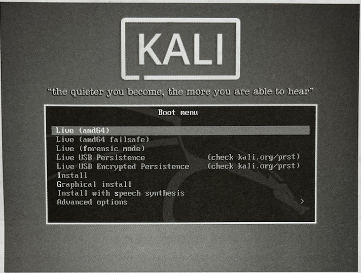
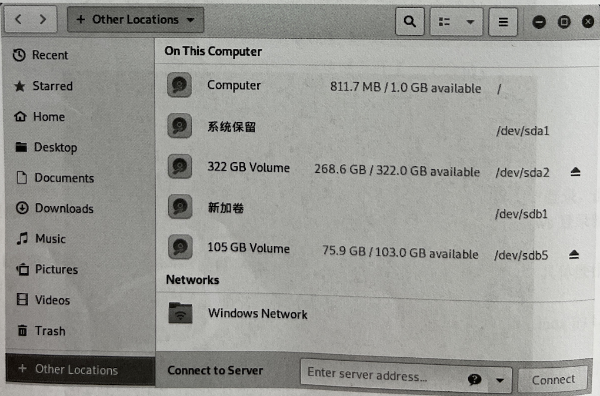
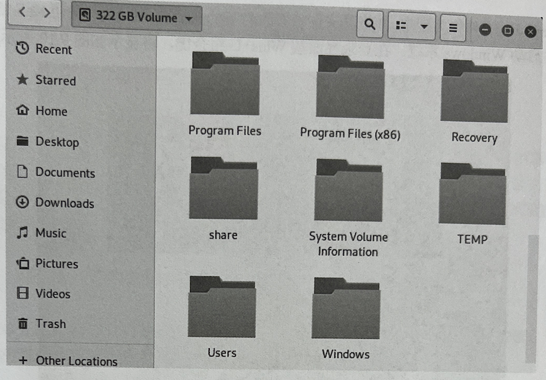
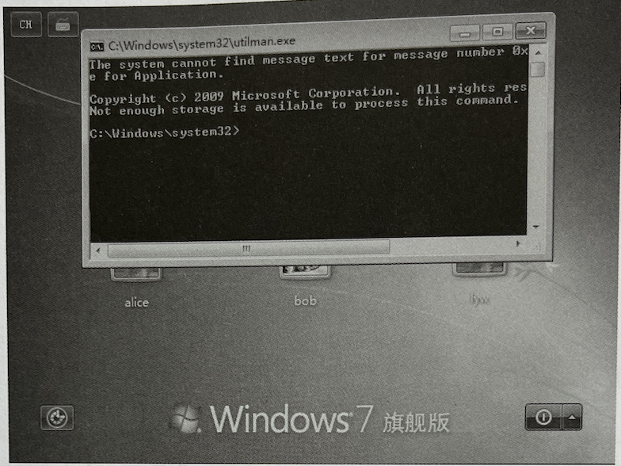
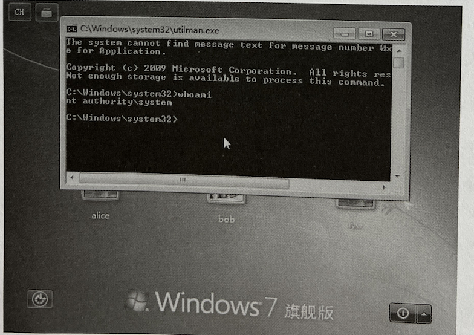

#### 借助Utilman统过Windows登录
- Utilman是Windows辅助工具管理器。在Windows下，即使没有进行用户登录，也可以使用 Windows+U 组合键调用 Utilman 进程。借助该机制，可以绕过 Windows 登录验证机制，对系统进行操作。本节将介绍如何使用这种方式。
- 通过将 Utilman.exe 文件替换成 cmd.exe，绕过登录进行操作。具体操作步骤如下：
  - (1）在Windows系统的计算机上，使用U盘安装介质的方式进入Kali Linux的Live模式。首先启动U盘安装介质，将显示系统安装引导界面
  - (2）在该界面选择Live（amd64)，即可进入Live模式。然后，在该Live模式中打开Windows文件系统。在该界面依次选择Places|Computer选项
  - (3）在该界面单击 Computer 选项后，将打开本地计算机文件系统
  - (4）该界面显示了Linux Live系统的文件列表。此时，在左侧栏中选择Other Locations命令，即可看到其他硬盘文件
  - (5）该界面显示了该计算机中的所有磁盘分区。根据显示的分区大小，找到Windows系统的分区。在本例中， Windows系统的分区为 322GB Volume。所以，打开该硬盘分区，将显示Windows系统的文件列表

   
   
   
   
   
   
   
   