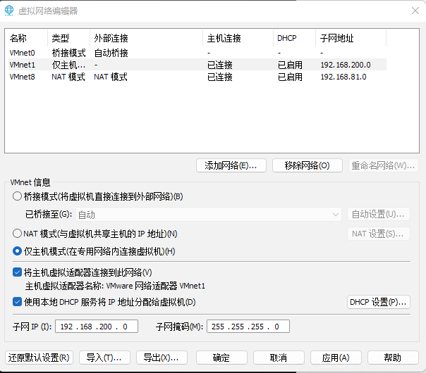
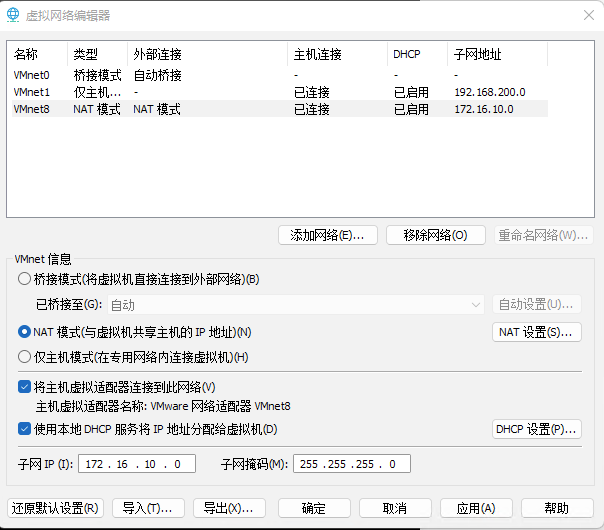
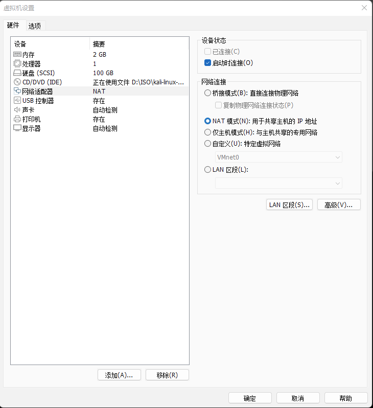
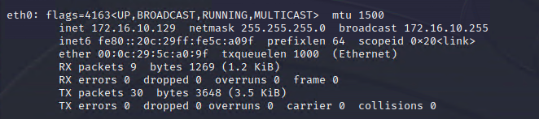
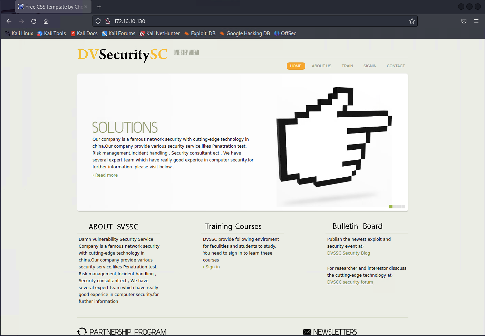

## 基本环境要求
- 渗透测试实验环境由于需要在一台宿主主机上安装5个不同的虛拟机镜像，在后续的实验中，一般需同时启动2～4个虚拟机，因此对宿主主机的硬件配置需求较高。
- 宿主操作系统依据读者自己偏好可以是 Windows、Linux 和 Mac Os X 等任意的主流操作系统平台，以下只介绍基于 Windows 宿主操作系统平台的搭建步骤。而Linux 和 MacoS×操作系统上，只需要读者能够安装相应的 VMware Workstation for Linux 及 VMware Fusion 软件，并了解如何配置虛拟网络，也可以很快配置出实验环境虚拟网络，而上层的虚拟机镜像部署与配置与宿主操作系统平台就无关了，步骤都是完全一样的。
- 在Windows 宿主操作系统平台上采用默认方式安装 VMware Workstation 软件之后，就可以从本书支持网站 FTP 站点上下载各个虚拟机镜像，然后就可以开始实验环境的实际部署过程了。

## 网络环境配置
- 在配置虛拟机镜像之前，还需要对 VMware Workstation 软件的虚拟网络环境进行简单的配置。
- 在 VMware Workstation for Windows 版本中，可以在软件菜单项中的编辑一编辑虚拟网络中打开 VMware 虛拟网络编辑器选项卡。(注意：在Windows 10/11平台上运行 VMwareorkstation 请右键选择以管理员身份运行，否则可能无法修改网络配置。）在选项卡中选择VMnet1，如图0-2所示进行设置，将子网IP地址段设为 192.168.200.0。

图0-2

- 在选项卡中选择 VMnet8 虚拟网络，如图0-3 所示进行设置，将子网I地址段设为172.16.10.0。

图0-3

- 以上是基于 VMware Workstation for Windows版本的虚拟网络设置过程。

## 虚拟机镜像配置
### 攻击机的部署
#### Kali攻击部署步骤如下:
- 打开 VMware Workstation 软件，选择文件一打开，选择虚拟机所在目录，选择相应的 VMX 文件。
- 配置靶机虚拟机的硬件。
  - 鼠标选择 Kali 的选项卡，菜单中选择虚拟机一设置，在右侧硬件选项卡中选择网络适配器，如图0-4 所示设置为 NAT 模式。

图0-4

- 由于NAT 模式的 VMnet8 虚拟网络中默认开启了DHCP 服务，开始从先前配置的172.16.10.0/24网段中分配 IP 地址的，因此攻击机镜像会自动分配到IP地址，当然也可以手工将 Kali 攻击机设置为 自定义 的IP地址）。在虚拟机的命令终端中执行 ifconfig，确认攻击机IP 是否配置成功，命令如下所示。

图0-5

### Win10攻击机的部署方式和Kali类似，这里不重复展示了

### 靶机部署
#### OWASP BWA靶机部署:
- 在OWASP 虚拟机镜像的选项卡中选择打开虚拟机电源，虚拟机会自动分配到 IP 地址,我这里分配到的是172.16.10.130,同样也可以手工设置该IP 地址。
- 测试网络环境。分别在 Kali 和 OWASP 虛拟机上互相ping 对方IP 地址，都能成功说明网络连通正常（注意，如果ping 不通，请检查防火墙是否关闭)。
- 在 Kali 攻击机镜像上打开的浏览器，访问172.16.10.130，应能够正常显示如图 0-6 所示的门户网站首页。

图0-6

### Win2K3 Metasploit靶机部署:
- 在Win2K3 虚拟机的选项卡中选择打开虚拟机电源，虚拟机会自动分配到 IP 地址,我这里分配到的是172.16.10.131（同样也可以手工设置该IP 地址。
- 分别在 Kali 和 Win2K3 虚拟机上运行 ping 命令，测试两台虚拟机能正常连通。

### Linux Metasploit靶机配置:
- 打开 VMware Workstation 软件，选择文件一打开，选择虚拟机所在目录，选择相应VMX 文件。
- 打开电源并登录后，在命令行下输人 iconfig，会发现有两个网卡eth0 及eth1，两个网卡所对应为 172.16.10.254 (NAT 模式，连接VMnet8 虚拟网
段）和 192.168.200.254 （Host-only 模式，连接模拟企业内网的 VMnet1 虚拟网段，并作为VMnet1 网段的网关）。
- 在命令行下输人 sudo vim /etc/network/interfaces 命令，修改/etc/network/interfaces 网卡配置文件如下 图0-7 所示：
