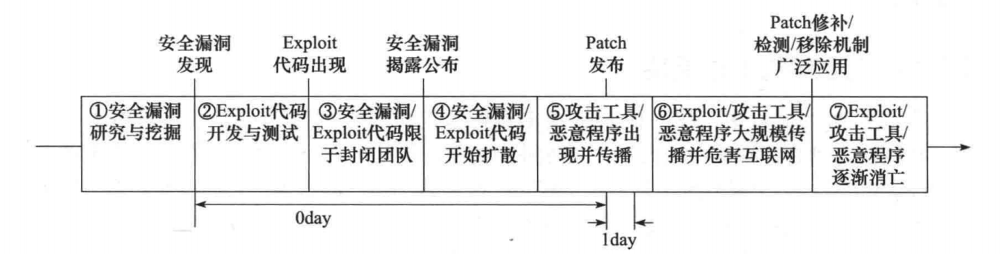

## 安全漏洞生命周期
- 在渗透测试流程中，核心内容是找出目标系统中存在的安全漏洞，并实施渗透攻击，从而进人到日标系统中。而这一过程最主要的底层基础是日标系统中存在的安全漏洞(Vulnerability)。安全漏洞指信息系统中存在的缺陷或不适当的配置，它们可使攻击者在未授权情况下访问或破坏系统，导致信息系统面临安全风险。利用安全漏洞来造成人侵或破坏效果的程序就称为渗透代码（Exploit)，或者漏洞利用代码。
- 围绕着安全漏洞生命周期所进行的攻防技术博弈一直以来都是安全社区永恒的话题，而一个典型的安全漏洞生命周期包括如下 7个部分：
  - 安全漏洞研究与挖掘：由高技术水平的黑客与渗透测试师开展，主要利用源代码审核（白盒测试）、逆向工程（灰盒测试）、Fuzz测试（黑盒测试，等方法，挖掘目标系统中存有的可被利用的安全漏洞。
  - 渗透代码开发与测试：在安全漏洞挖掘的同时，黑客们会开发概念验证性的渗透攻击代码（POC)，用于验证找到的安全漏洞是否确实存在，并确认其是否可被利用。
  - 安全漏洞和渗透代码在封闭团队中流传：在发现安全漏洞并给出渗透攻击代码后，负责任的“白帽子，们采取的处理策略是首先通知厂商进行修补，而在厂商给出补丁后再进行公布；而“黑帽子〞与“灰帽子”们一般在封闭小规模团队中进行秘密地共享，以充分地利用这些安全漏洞和渗透攻击代码所带来的攻击价值。
  - 安全漏洞和渗透代码开始扩散：由于各种原因，在封闭团队中秘密共享的安全漏洞和渗透代码最终会被披露出来，在互联网上得以公布，“黑帽子”们会快速对其进行掌握和应用，并在安全社区中开始快速扩散。
  - 恶意程序出现井开始传播：“黑帽子〞们将在掌握安全漏洞和渗透代码基础上，进一生开发更易使用、更具自动化传播能力的恶意程序，并通过黑客社区社会组织结构和互联网进行传播。在此过程中(或之前和之后)，厂商完成补丁程序开发和测试，并进行发布。
  - 渗透代码/恶意程序大规模传播并危害互联网：厂商发布补丁程序和安全警报将更进一步地让整个黑客社区了解出现新的安全漏洞和相应的渗透代码、恶意程序，更多的“黑帽子，们将从互联网或社区关系网获得并使用这些恶意程序，对互联网的危害也在这个阶段达到顶峰。

-  安全漏洞生命周期如图1-1所示。

图1-1

- 在安全漏洞生命周期中，从安全漏洞被发现到厂商发布补丁程序用于修补该漏洞之前的这段期间，被安全社区普遍地称为“Oday”。由于在这段时间内，黑客们攻击存有该安全漏洞的目标可以达到百分之百的成功率，同时也可以躲避检测，因此“oday” 的安全漏洞和对应的渗透代码对于黑客社区具有很高的价值，挖掘“Oday” 安全漏洞并给出渗透代码也成为高水平黑客的追求目标。即使在厂商发布了针对该安全漏洞的补丁程序和安全警报后，补丁程序也需要一段时间被接受、下载和应用，而一些不负责任的系统管理员很可能水远也不会去更新他们的系统，因此一些已公布的安全漏洞及相应的渗透代码对于无论
“黑帽子”，还是职业的渗透测试者而言都仍然具有价值。

## 安全漏洞的披露方式
- 完全公开披露
  - 发现漏洞后直接向公众完全公开安全漏洞技术细节，这将使得软件厂商需要赶在攻击者对漏洞进行恶意利用之前开发并发布出安全补丁，然而这通常是很难做到的，因此这种披露方式也被软件厂商称为不负责任的披露，会使得他们的客户由于漏洞披露而置于安全风险之中。
  - 即便如此，还是有一部分传统黑客认为只有这种方式才能够有效促使软件厂商重视起安全问题，这种观点在安全社区中仍有一些认同者。最重要的完全公开拔露渠道是著名的Full-Disclosure 邮件列表。
- 负责任的公开披露
  - 负责任的公开披露是在真正进行完全公开披露之前，首先对软件厂商进行知会，并为他们提供一段合理的时间进行补丁开发与测试，然后在软件厂商发布出安全补丁，或者软件厂商不负责任地延后补丁发布时，再对安全社区完全公开漏洞技术细节。
  - 目前最被安全社区接受的是负责任的公开披露策略。
- 进入地下经济链
  - 随着漏洞的经济价值逐步被安全研究者所认识，一部分黑客认为不应免费给软件厂商打工帮助他们抓 bug， 向软件厂商通报能够获得的通常只是厂商的一声“谢谢”，有时甚至连道谢也得不到。这种反差已经造就了安全漏洞交易市场的出现，如著名的 TippingPoint公司的“zero-Day Imitative〞计划和 iDefense 公司的漏洞贡献者计划等，这些安全公司通过向安全研究人员收购高价值的安全漏洞，并出售给如政府部门等客户来赢取经济利益，同时也为安全研究人员带来更高的经济收益，而这些安全漏洞的售价通常在几百美元至数万美元之间，影响范围巨大且能够有效利用的安全漏洞售价甚至可能超出十万美元。
  - 在这种背景下，三位全球著名的黑客 Dino Dai Zovi、 Charlie Miller 和 Alex Sotrirov,在2009年的 Cansec West 会议上打出了“No More Free Bugs ” 的横幅，这也引发了安全社区重新对安全漏洞信息的披露、出售与利用的伦理道德和策略进行争论。
- 小范围利用直至被动披露
  - 由于并非所有的漏洞发现者都会遵从软件厂商所期望的披露策略，因而在安全社区所发现的安全漏洞中，也有相当一部分并没有首先通报给软件厂商，而是在小范围内进行利用，进而逐步扩大影响范围，最终被恶意代码广泛利用从而危害庞大的互联网用户群体。这时一些安全公司会监测到野外活跃的渗透代码，并发现出背后所利用的安全漏洞。比如著名的 Google 公司遭受 Aurora 攻击事件，便揭示出是利用的 MS10-002 安全漏洞。

## 安全漏洞公共资源库
- 国内的安全漏洞信息库主要包括：
  - CNNVD：中国国家漏洞库，由中国信息安全测评中心维护 (www.cnnvd.org.on）。
  - CNVD：中国国家信息安全漏洞共享平台，由国家计算机网络应急技术处理协调中L (CNCERT/CC) 维护 (www.cnvd.org.cn).
  - SCAP中文社区：由本书作者王珩、诸葛建伟等人发起的民间组织项日 (http://www.scap.org.cn/).
- 国外的安全漏洞信息库主要包括：
  - CVE: (Common Vulnerability and Exposures，通用漏洞与披露）已成为安全漏洞命名索引的业界事实标准，由美国国士安全部资助的 MITRE 公司负责维护，CVE漏洞库为每个确认的公开披露安全漏洞提供了素引 CVE 编号，以及一段简单的漏洞信息描述，而这个CVE编号就作为安全业界标识该漏洞的标准素引号。
  - NVD : (National Vulnerability Database，国家漏洞数据库〕是美国政府官方根据NIST 的 SCAP 标准协议所描述的安全漏洞管理信息库，具体由美国国土安全部下属的 NCSD 国家网际安全部门 US-CERT 组负责维护。截至2013年4月，NVD 库目前包括了近6万条 CVE 安全漏洞详细信息。
  - SecurityFocus：起源于业内著名的 Bugtraa 邮件列表。2002年 SecurityFocus 网站被Symantec 公司所收购，从 Bugtraa 邮件列表中也演化出 SecurityFocus 安全漏洞信息库，为业界的安全研究人员提供所有平台和服务上最新的安全漏洞信息。
  - OSVDB: (Open Source Vulnerability DataBase，开源漏洞数据库）由 HD Moore 参与发起，由安全社区创建的一个独立的、开源的安全漏洞信息库，为整个安全社区提供关于安全漏洞的准确、详细、及时、公正的技术信息，来促使软件厂商与安全研究人员更友好、更开放地合作，消除开发和维护私有安全漏洞信息库所带来的冗余工作量和花费。截至 2013年4月，OSVDB 库能够覆盖7万多个产品，已包含91 000 多个安全漏洞的详细信息。
- 针对这些已知安全漏洞的公开渗透代码资源也会在安全社区中流传与共享，目前安全社区比较知名的渗透攻击代码共享站点包括 Metasploit、Exploit-db、 PacketStormSecurityFocus 等，CORE Security、VUPEN 等则提供商业的渗透代码订阅服务，具体内容如表1-1 所示。而 SCAP 中文社区（www.scap.org.cn） 提供了从 CVE 安全漏洞搜索渗透攻击代码的能力，并将进一步扩展汇聚渗透攻击代码的范围。

表1-1 安全社区比较知名的渗透攻击代码共享站点

