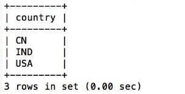
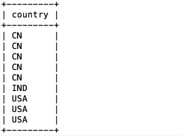
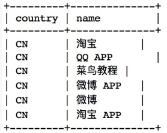

#### and和or的区别
- 区别1：
  - and是与运算；or是或运算。
- 区别2：
  - and运算要前后两个运算对象都为真是，and运算结果才为真；
  - or运算是两个运算对象中有一个为真，or运算结果就为真。
- 区别3：
  - and运算中如果第一个条件和第二个条件都成立，则and运算符显示一条记录。
  - or运算中如果第一个条件和第二个条件中只要有一个成立，则or运算符显示一条记录。
- 区别4：
  - 对于SQL语句要执行的动作来说，无论是事务还是查询，and运算符连接的所有条件都必须为true。
  - 对于SQL语句要执行的动作来说，无论是事务还是查询，or运算符连接的所有条件中只需要有一个为true即可。

#### order by
- ORDER BY 关键字用于对结果集进行排序。
- ORDER BY 关键字用于对结果集按照一个列或者多个列进行排序。
- ORDER BY 关键字默认按照升序对记录进行排序。如果需要按照降序对记录进行排序，您可以使用 DESC 关键字。

- SQL ORDER BY 语法
```sql
SELECT column_name,column_name FROM table_name ORDER BY column_name,column_name ASC|DESC;
```

  - 演示数据库

  | id | name       | url                     | alexa | country |
  |----|------------|-------------------------|-------|---------|
  | 1  | Google     | https://www.google.cm/  | 1     | USA     |
  | 2  | 淘宝        | https://www.taobao.com/ | 13    | CN      |
  | 3  | 菜鸟教程    | http://www.runoob.com/  | 4689  | CN      |
  | 4  | 微博        | http://weibo.com/       | 20    | CN      |
  | 5  | Facebook   | https://www.facebook.com/| 3     | USA     |

  - 从 "Websites" 表中选取所有网站，并按照 "alexa" 列排序：
  ```sql
  SELECT * FROM Websites ORDER BY alexa;
  ```
  - 从 "Websites" 表中选取所有网站，并按照 "alexa" 列降序排序
  ```sql
  SELECT * FROM Websites ORDER BY alexa DESC;
  ```
  - 从 "Websites" 表中选取所有网站，并按照 "country" 和 "alexa" 列排序：
  ```sql
  SELECT * FROM Websites ORDER BY country,alexa;
  ```
  - 如果在order by字段后直接输入数字，则数字的值表示要排序表的列数，比如要排序"Websites"表的第一列也可以写成:
  ```sql
  SELECT * FROM Websites ORDER BY 1; 
  ```

#### union
- SQL UNION 操作符合并两个或多个 SELECT 语句的结果。
- 请注意，UNION 内部的每个 SELECT 语句必须拥有相同数量的列。列也必须拥有相似的数据类型。同时，每个 SELECT 语句中的列的顺序必须相同。

- SQL UNION 语法
```sql
SELECT column_name(s) FROM table1 UNION SELECT column_name(s) FROM table2;
注释：默认地，UNION 操作符选取不同的值。如果允许重复的值，请使用 UNION ALL。

SELECT column_name(s) FROM table1 UNION ALL SELECT column_name(s) FROM table2;
注释：UNION 结果集中的列名总是等于 UNION 中第一个 SELECT 语句中的列名。
```

#### 演示数据库
- "Websites" 表的数据：

| id | name         | url                       | alexa | country |
|----|--------------|---------------------------|-------|---------|
| 1  | Google       | https://www.google.cm/    | 1     | USA     |
| 2  | 淘宝          | https://www.taobao.com/   | 13    | CN      |
| 3  | 菜鸟教程      | http://www.runoob.com/    | 4689  | CN      |
| 4  | 微博          | http://weibo.com/         | 20    | CN      |
| 5  | Facebook     | https://www.facebook.com/ | 3     | USA     |
| 7  | stackoverflow | http://stackoverflow.com/ |   0 | IND     |

- "apps" APP 的数据：

| id | app_name   | url                     | country |
|----|------------|-------------------------|---------|
|  1 | QQ APP     | http://im.qq.com/       | CN      |
|  2 | 微博 APP | http://weibo.com/       | CN      |
|  3 | 淘宝 APP | https://www.taobao.com/ | CN      |

- 从 "Websites" 和 "apps" 表中选取所有不同的country（只有不同的值）：

```sql
SELECT country FROM Websites UNION SELECT country FROM apps ORDER BY country;
```

- 执行以上 SQL 输出结果如下：

- UNION 不能用于列出两个表中所有的country。如果一些网站和APP来自同一个国家，每个国家只会列出一次。UNION 只会选取不同的值。请使用 UNION ALL 来选取重复的值！

- 使用 UNION ALL 从 "Websites" 和 "apps" 表中选取所有的中国(CN)的数据（也有重复的值）：
```sql 
SELECT country FROM Websites UNION ALL SELECT country FROM apps ORDER BY country;
```
- 执行以上 SQL 输出结果如下：


- 使用 UNION ALL 从 "Websites" 和 "apps" 表中选取所有的中国(CN)的数据（也有重复的值）：
```sql
SELECT country, name FROM Websites WHERE country='CN' UNION ALL SELECT country, app_name FROM apps WHERE country='CN' ORDER BY country;
```
- 执行以上 SQL 输出结果如下：



#### 其他函数介绍
- concat()
  - CONCAT 函数 添加两个或多个字符或字符串以在结果中形成一个新字符串。如果您在函数中只传递一个字符串，那么它会在输出中显示错误。因此，CONCAT() 函数至少需要两个字符串。
  - 语法1：此语法使用带有 SQL 表的两个或多个列名的 CONCAT 函数：
  ```sql
  SELECT CONCAT(Column_Name1, column_Name2, Column_Name3,....... Column_NameN) AS Alias_Name FROM Table_Name;  
  ```
- group_concat()
  - 将字段拼接成字符串，并且用逗号隔开 
- user()
- database()
- version()


information_schema
information_schema.tables
information_schema.columns


table_name
table_schema
column_name
