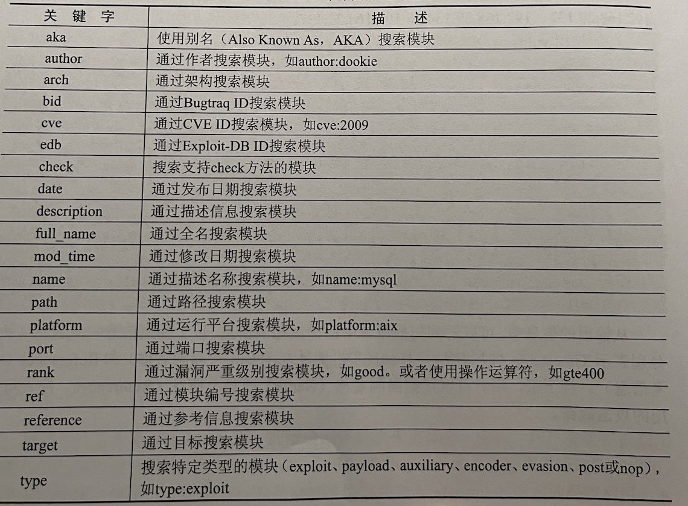

#### Metasploit初始化
- 在Kali Linux-中Metasploit主要使用PosteresQL数据库存储数据。所以，在使用Metasploit 框架时，需要启动 PostgreSQL 数据库。执行命令如下：
```shell
systemctl start postgresql
```
- 启动Postgresql数据库之后，还需要使用msftdb init 命令创建和初始化数据库。
执行命令如下：
```shell
root@Kali:~# msfdb init

#如果当前系统已经初始化 Metasploit， 将会列出下面的提示：
Metasploit running on Kali Linux as root,using system 
databaseA database appears to be already configured, skipping initialization
```
#### 创建工作区
- 为了区分不同的扫描任务，可以创建多个工作区，用来保存不同扫描任务的各种信息。其中，不同工作区之间的信息相互独立，避免数据混淆。创建工作区的语法格式如下：
```shell
#查看当前所在工作区
msf5 > workspace
* default

#创建新的工作区
msf5 > workspace -a test
[*] Added workspace: test
[*] Workspace: test

#切换当前工作区
msf5 > workspace default
[*] Workspace: default
```
#### 导入扫描报告
当用户准备好工作区后，就可以执行渗透测试任务了。此时，用户可以导入一些第三方扫描报告，来获取主机信息。其中，导入扫描报告的语法格式如下：
```shell
#导入Openvas 生成的扫描报告文件 openvas.xml
msf5 > db import /root/openvas.xml
```
#### 查询渗透测试模块
- 漏洞利用主要是通过Metasploit的渗透测试结果來实现的。所以，用户需要根据漏洞查找对应的渗透测试模块。在Metasploit中，可以使用search命令快速查找渗透测试模块，用户还可以到一些第三方网站查找渗透测试模块，并导入Metasploit中实施漏洞利用。
  - 1.预分析扫描报告
    - 在前面用户己成功导入了扫描报告。此时，用户可以对该扫描报告进行分析，找出目标系统中的漏洞。然后，根据该漏洞查找可以利用该漏洞的渗透测试模块，并实施攻击。
    ```shell
    #使用hosts命令查看报告的主机信息
    msf5 > hosts
    #使用 vulns 命令查看漏洞信息
    msf5 > vulns
   ```
#### 手动查找攻击载荷
- 当用户确定目标系统中存在的漏洞后，可以在Metasploit中查找渗透测试模块，以选择可以利用其漏洞的渗透测试模块，进而实施渗透测试。下面将介绍使用 search 命令手动查找渗透测试模块的方法。查找渗透测试模块的语法格式如下：
```shell
search [options] <keywords>
# -h：显示帮助信息。
# -o <file>：指定输出信息的保存文件，格式为 CSV
3 -S <string>：指定搜索的字符串
3 -u：指定搜索模块
```
- search命令支持的关键字


```shell
#手动查找CVE漏洞为2019年的渗透测试模块
msf5 > search cve:2019

#查找漏洞名称为 MS17-010 SMB RCEDetection 的渗透测试模块
msf5 > search name:MS17-010 SMB RCE Detection

#选择名为exploit/windows/smb/mS17_010_eteralblue 的渗透测试模块
msf5 > exploit/windows/smb/ms17 010 eternalblue
msf5 exploit (windows/smb/ms17 010 eternalblue) >
```

- 攻击载荷分类:
  - 正向连接（bind_tcp）
    - 攻击机主动连接目标机，常用于目标不出网的情况
      - 正向连接指被攻击的目标机器通过正向的payload打开一个端口，攻击者的机器去连接目标机器的这个端口，从而建立连接如果把攻击机器比喻成你，目标机器比喻成妹子，正向连接相当于你去追妹子，最后建立了连接，两者可以互相通信
    - 使用场景
      - 如果⽬标处于深层⽹络，不能直接连通外⽹，也不能通过其他机器连通则可以使用正向，相当于妹子在家里宅着天天不出门，你为了追到手，只有去他家拜访一下

  - 反向连接（reverse_tcp）
      - 反向指攻击者的机器打开一个端口，目标机器运行反向payload来连接攻击机器的端口，从而建立连接。用上面的比喻，反向连接相当于妹子来追你，最后建立了连接，相互通信
    - 使用场景
      - 目标机主动连接攻击机，常用于机器出网的情况

#### 通过三方网站查找漏洞
- 如果用户在Metasploit中找不到有效的渗透测试模块时。还可以从第三方网站查。如CVE漏洞站和exploitDB等。另外，Measploit 还支特导入第三方模块，并实施渗透测试。
## 1.通过CVE漏洞网站查找
  - CVE漏洞网站的地址为https:/www.cvedetails.com/。在搜索框中输入 Microsoft，然后单击Search按钮，即可显示搜索结果
     - 从该界面可以看到搜索到的 Microsoft 相关统计信息。此时，选择 Vulnerabilities (6328)选项，即可显示漏洞的详细信息
     - 从该界面可以看到所有的漏洞信息，包括 CVE ID、漏洞类型、发布日期、更新日期及评分等。
## 2.通过exploitDB漏洞网站查找
  - exploitDB 漏洞网站的地址为https://www.exploit-db.com
    - 在该界面输入攻击载荷的一些关键宇，即可搜索到对应的渗透测试模块。在搜索时，用户还可以选择 Verifred 和 Has App 复选框，过滤已验证过和容易攻击的应用程序渗透测试模块。例如，搜索 Windows 系统的渗透测试模块
    
    - 在输出的信息中包括8列，分別表示 Date（发布日期）、D（下载渗透攻击载荷〉、A（可利用的应用程序）、V（己被验证）、Title（漏洞标题）、Type（类型）、Platform（平合）和Author（作者）。这里，用户可以选择下载及查看漏洞的详细信息。如果想要下载该渗透测试模块，则单击D列的下载按钮，如果想要想要查看该漏洞的详细信息，单击其漏洞标题名称即可。例如，查看该界面显示的第一个漏洞详细信息。
    
    - 用户还可以从该网站下载一些渗透测试模块，并手动导入 Metasploit中

## 3.手动导入第三方模块
- Metasploit 自带的模块己经很丰富了，但有时候也不能完全满足用户的需求。对于一些比较新的漏洞或者没有官方模块支持的漏洞，用户只能自己手动编写或者导入第三方模块。对于一般用户来说，通过直接导入第三方模块来使用更方便，而且也不容易出错。
- 导入从exploitDB 网站下载的第三方模块，并使用该模块实施渗透测试。这里将以Icecast 2.0.1 (Windows x86) - Header Overwrite本地提权模块为例，下载文件名为16736.rb。具体操作步骤如下:
```shell
#将模块文件16736.rb 复制到 Metasploit 对应的模块位置。其中，Metasploit 
#模块的默认位置为/usr/share/metasploit-framework/modules
#为了方便区分模块，用户可以按照模块的分类创建对应的文件夹，用来保
#存不同类型的模块。本例中将导入一个渗透攻击模块，所以这里将创建名为exploits 的文件夹
root@daxueba : ~# mkdir /usr/share/metasploit-framework/modules/exploits

#执行以上命令后，将不会有任何信息输出。这里为方便记忆或查找模块的位置，再创建一个test目录然后将攻击载荷文件复制进去
root@daxueba:>~# cd /usr/share/metasploit-framework/modules/exploits
root@daxueba:>~# mkdir test
root@daxueba:>~# cd test /
root@daxueba:>~# ls
ftc.rb

#如果您已经运行了msfconsole，请使用reload_all命令来获取新模块
msf5 > reload_all 

#重新启动Metasploit工具，可以看到已经加载的工具
root@daxueba:~# msfconsole

#选择ftc模块，并查看模块的选项。
msf5 > use exploit/test/16736
msf5 exploit (test/16736) > show options

#从输出的信息可以看到，显示16737模块的所有选项。以上信息共包括 4列，分
#別表示 Name（选项名称）、Current Setting （当前设置）、Reouired（是否必须没置）和
#pesoription(描述）。从输出的信息可 以看到，RHOSTS 必须配置选项，但目前还没有#设置。
#设置 RHOSTS 选项
msf5 exploit (test/16736) > set RHOSTS 192.168.29.141
RHOSTS => 192.168.29.141
```