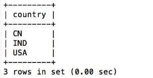
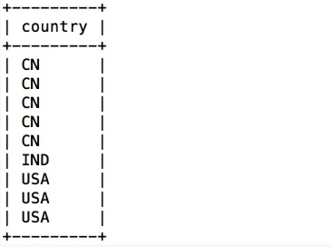
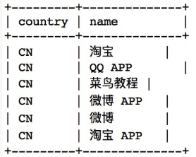

#### and和or的区别
- 区别1：
  - and是与运算；or是或运算。
- 区别2：
  - and运算要前后两个运算对象都为真是，and运算结果才为真；
  - or运算是两个运算对象中有一个为真，or运算结果就为真。
- 区别3：
  - and运算中如果第一个条件和第二个条件都成立，则and运算符显示一条记录。
  - or运算中如果第一个条件和第二个条件中只要有一个成立，则or运算符显示一条记录。
- 区别4：
  - 对于SQL语句要执行的动作来说，无论是事务还是查询，and运算符连接的所有条件都必须为true。
  - 对于SQL语句要执行的动作来说，无论是事务还是查询，or运算符连接的所有条件中只需要有一个为true即可。

- order by
  - ORDER BY --> 关键字用于对结果集进行排序。
  - ORDER BY --> 关键字用于对结果集按照一个列或者多个列进行排序。
  - ORDER BY --> 关键字默认按照升序对记录进行排序。如果需要按照降序对记录进行排序，您可以使用 DESC 关键字。


```sql
#SQL ORDER BY 语法:
SELECT column_name,column_name FROM table_name ORDER BY column_name,column_name ASC|DESC;
```

  - 演示数据库
```shell
#创建数据库
create database sqltest;

#使用数据库
use sqltest;

#创建数据表
create table websites (id INT(11) PRIMARY KEY,name VARCHAR(100),url VARCHAR(100),alexa INT(100),country VARCHAR(100));

#查看表字段
desc websites；


#插入数据
insert into webistes values(1,'google','http://www.google.com',1,'USA');

#删除某条数据
DELETE FROM users WHERE id = 1;

#修改某一条数据
UPDATE students SET score = 90 WHERE student_id = '20210001';

```


  | id | name       | url                     | alexa | country |
  |----|------------|-------------------------|-------|---------|
  | 1  | Google     | https://www.google.cm/  | 1     | USA     |
  | 2  | 淘宝        | https://www.taobao.com/ | 13    | CN      |
  | 3  | 菜鸟教程    | http://www.runoob.com/  | 4689  | CN      |
  | 4  | 微博        | http://weibo.com/       | 20    | CN      |
  | 5  | Facebook   | https://www.facebook.com/| 3     | USA     |

  - 从 "Websites" 表中选取所有网站，并按照 "alexa" 列排序：
  ```sql
  SELECT * FROM Websites ORDER BY alexa;
  ```
  - 从 "Websites" 表中选取所有网站，并按照 "alexa" 列降序排序
  ```sql
  SELECT * FROM Websites ORDER BY alexa DESC;
  ```
  - 从 "Websites" 表中选取所有网站，并按照 "country" 和 "alexa" 列排序：
  ```sql
  SELECT * FROM Websites ORDER BY country,alexa;
  ```
  - 如果在order by字段后直接输入数字，则数字的值表示要排序表的列数，比如要排序"Websites"表的第一列也可以写成:
  ```sql
  SELECT * FROM Websites ORDER BY 1; 
  ```

#### union
- SQL UNION 操作符合并两个或多个 SELECT 语句的结果。
- 请注意，UNION 内部的每个 SELECT 语句必须拥有相同数量的列。列也必须拥有相似的数据类型。同时，每个 SELECT 语句中的列的顺序必须相同。

- SQL UNION 语法
```sql
SELECT column_name(s) FROM table1 UNION SELECT column_name(s) FROM table2;
注释：默认地，UNION 操作符选取不同的值。如果允许重复的值，请使用 UNION ALL。

SELECT column_name(s) FROM table1 UNION ALL SELECT column_name(s) FROM table2;
注释：UNION 结果集中的列名总是等于 UNION 中第一个 SELECT 语句中的列名。
```

#### 演示数据库
- "Websites" 表的数据：

| id | name         | url                       | alexa | country |
|----|--------------|---------------------------|-------|---------|
| 1  | Google       | https://www.google.cm/    | 1     | USA     |
| 2  | 淘宝          | https://www.taobao.com/   | 13    | CN      |
| 3  | 菜鸟教程      | http://www.runoob.com/    | 4689  | CN      |
| 4  | 微博          | http://weibo.com/         | 20    | CN      |
| 5  | Facebook     | https://www.facebook.com/ | 3     | USA     |
| 7  | stackoverflow | http://stackoverflow.com/ |   0 | IND     |

- "apps" APP 的数据：

| id | app_name   | url                     | country |
|----|------------|-------------------------|---------|
|  1 | QQ APP     | http://im.qq.com/       | CN      |
|  2 | 微博 APP | http://weibo.com/       | CN      |
|  3 | 淘宝 APP | https://www.taobao.com/ | CN      |

- 从 "Websites" 和 "apps" 表中选取所有不同的country（只有不同的值）：

```sql
SELECT country FROM Websites UNION SELECT country FROM apps ORDER BY country;
```

- 执行以上 SQL 输出结果如下：

- UNION 不能用于列出两个表中所有的country。如果一些网站和APP来自同一个国家，每个国家只会列出一次。UNION 只会选取不同的值。请使用 UNION ALL 来选取重复的值！

- 使用 UNION ALL 从 "Websites" 和 "apps" 表中选取所有的中国(CN)的数据（也有重复的值）：
```sql 
SELECT country FROM Websites UNION ALL SELECT country FROM apps ORDER BY country;
```
- 执行以上 SQL 输出结果如下：


- 使用 UNION ALL 从 "Websites" 和 "apps" 表中选取所有的中国(CN)的数据（也有重复的值）：
```sql
SELECT country, name FROM Websites WHERE country='CN' UNION ALL SELECT country, app_name FROM apps WHERE country='CN' ORDER BY country;
```
- 执行以上 SQL 输出结果如下：



#### 其他函数介绍
- concat()
  - CONCAT 函数 添加两个或多个字符或字符串以在结果中形成一个新字符串。如果您在函数中只传递一个字符串，那么它会在输出中显示错误。因此，CONCAT() 函数至少需要两个字符串。
  - 语法1：此语法使用带有 SQL 表的两个或多个列名的 CONCAT 函数：
  ```sql
  SELECT CONCAT(Column_Name1, column_Name2, Column_Name3,....... Column_NameN) AS Alias_Name FROM Table_Name;  
  ```
- group_concat()
  - 将字段拼接成字符串，并且用逗号隔开 
- user()
- database()
- version()

## Mysql(Mariadb)内部函数和表介绍
- information_schema: MySQL数据库中的一个特殊数据库，它包含了用于描述数据库结构和元数据的系统表。它提供了一种访问和查询数据库元数据的方法，包括表名、列名、索引、触发器等信息。
- information_schema.tables: information_schema数据库中的一个表，它包含了当前数据库中所有表的信息。通过查询这个表，可以获取有关表的详细信息，如表名、表所属的数据库、表的类型（例如表、视图等）以及其他元数据信息。
- information_schema.columns: information_schema数据库中的另一个表，它包含了当前数据库中所有表的列信息。通过查询这个表，可以获取有关表中列的详细信息，如列名、列的数据类型、是否允许为空、默认值等。
- 以下是这些表中常用的列名和它们的含义：
  - table_name：表的名称。
  - table_schema：表所属的数据库名称。
  - column_name：列的名称。
  - 其他列名和含义根据具体的表结构可能有所不同，但通常还包括数据类型、是否允许为空、默认值等列的信息。

## Sql注入原理:
- SQL注入原理
  - 就是通过把恶意的sql命令插入web表单递交给服务器，或者输入域名或页面请求的查询字符串递交到服务器，达到欺骗服务器，让服务器执行这些恶意的sql命令，从而让攻击者，可以绕过一些机制，达到直接访问数据库的一种攻击手段。

- SQL注入产生的原因
  - SQL 注入漏洞存在的原因，就是拼接SQL参数。也就是将用于输入的查询参数，直接拼接在SQL语句中，导致了SQL注入漏洞。web 开发人员无法保证所有的输入都已经过滤攻击者利用发送给服务器的输入参数构造可执行的 SQL 代码（可加入到 get 请求、 post 谓求、 http 头信思、 cookie 中）


- SQL注入分类
  - 数字型        
  - 字符型       
  - 报错注入     
  - Boollean注入                
  - 时间注入

- SQL注入思路
  - 判断是否存在注入，注入是字符型还是数字型
  - 猜解SQL查询语句中的字段数
  - 确定回显位置
  - 获取当前数据库
  - 获取数据库中的表
  - 获取表中的字段名
  - 得到数据

## Sql注入防护
#### PDO
- PDO（PHP Data Objects）是PHP中的一个数据库抽象层，用于连接和操作不同类型的数据库，而无需直接使用特定数据库扩展（如MySQLi、SQLite等）。PDO提供了一种一致的接口，允许开发者编写可移植的数据库代码，而不必担心数据库后端的变化。
- PDO（PHP Data Objects）通过使用预处理语句和参数绑定来防止SQL注入攻击。以下是PDO如何实现这种防护的详细说明：
  - 预处理语句：PDO支持预处理语句，这是SQL查询的一种形式，其中查询中的值被替代为占位符（通常是问号 ? 或命名占位符如 :username）。查询中的实际值在执行查询之前不会直接与SQL语句组合。
  - 参数绑定：在预处理语句中，您将占位符与变量绑定在一起。这些变量的值会在查询执行之前被安全地绑定到占位符上。在参数绑定过程中，PDO会自动转义或转换输入值，以确保它们不会破坏查询的结构或被误解为恶意代码。

```php
#以下是一个简单的PDO预处理语句和参数绑定示例：
$username = $_POST['username'];
$password = $_POST['password'];

// 创建PDO连接
$pdo = new PDO("mysql:host=localhost;dbname=mydatabase", "username", "password");

// 创建预处理语句
$sql = "SELECT * FROM users WHERE username = :username AND password = :password";
$stmt = $pdo->prepare($sql);

// 将变量与占位符绑定
$stmt->bindParam(':username', $username, PDO::PARAM_STR);
$stmt->bindParam(':password', $password, PDO::PARAM_STR);

// 执行查询
$stmt->execute();


#在这个示例中，$username 和 $password 的值会被安全地绑定到相应的占位符上，PDO会处理任何必要的转义或编码以确保查询的安全性。因此，即使用户输入包含恶意SQL代码，也不会对数据库造成危害，因为输入会被视为普通文本。
#总之，PDO的预处理语句和参数绑定机制是一种有效的防止SQL注入攻击的方法，因为它们确保用户输入在进入数据库查询之前被正确处理和隔离。这有助于保护数据库免受恶意注入的影响。
```

