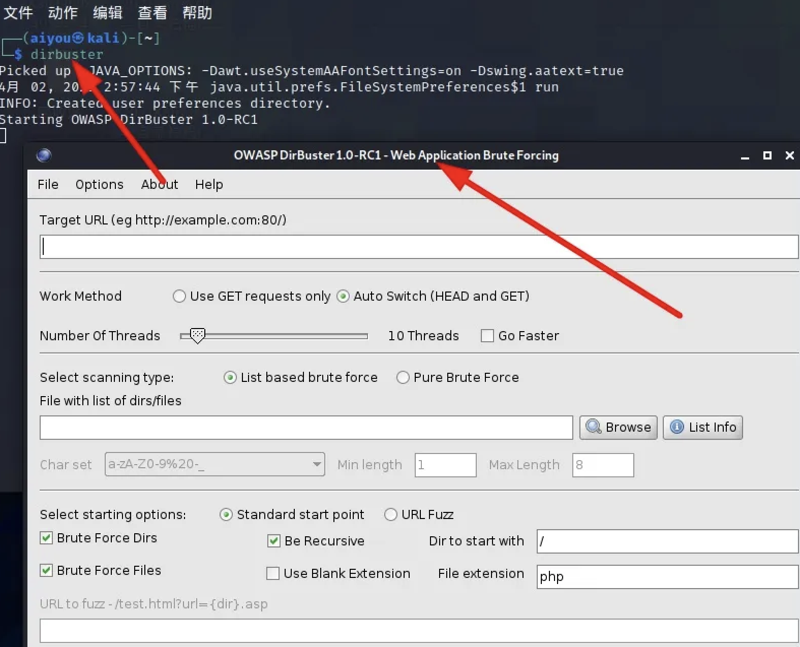
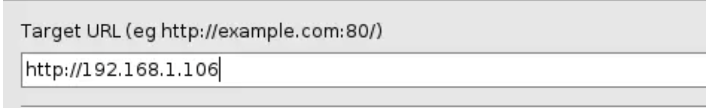
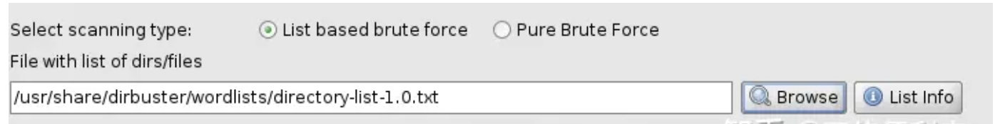
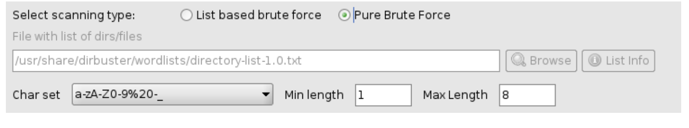
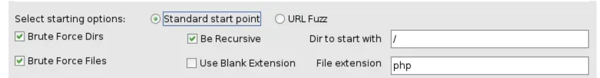
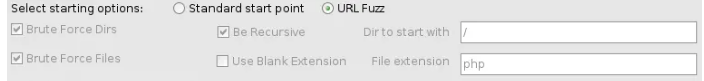
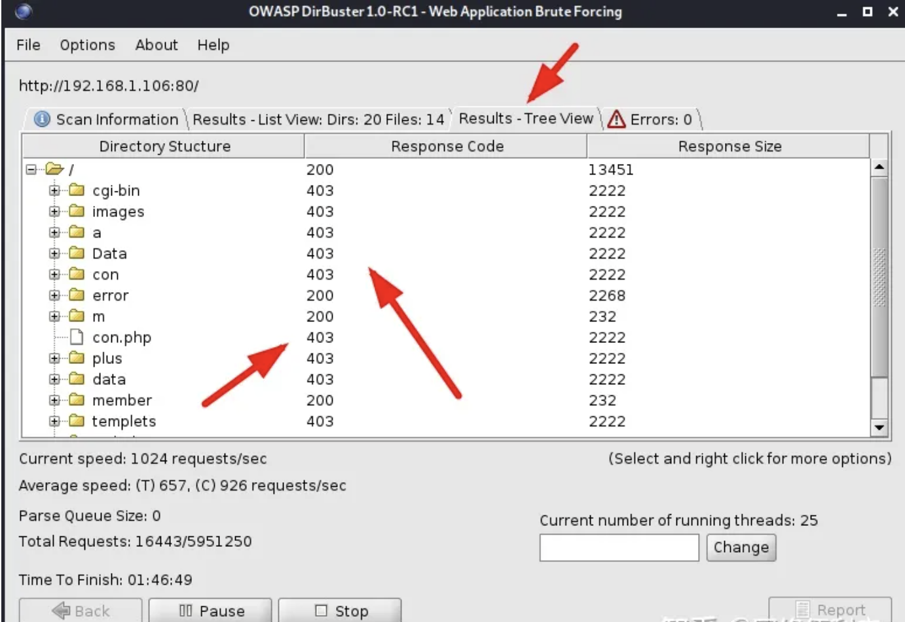
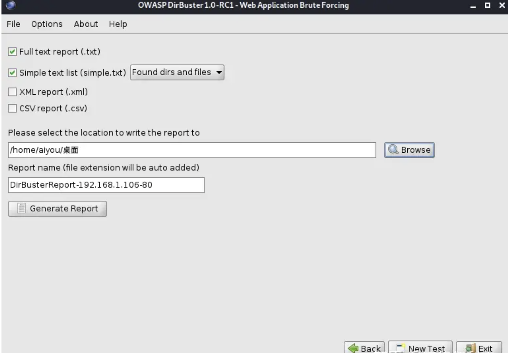
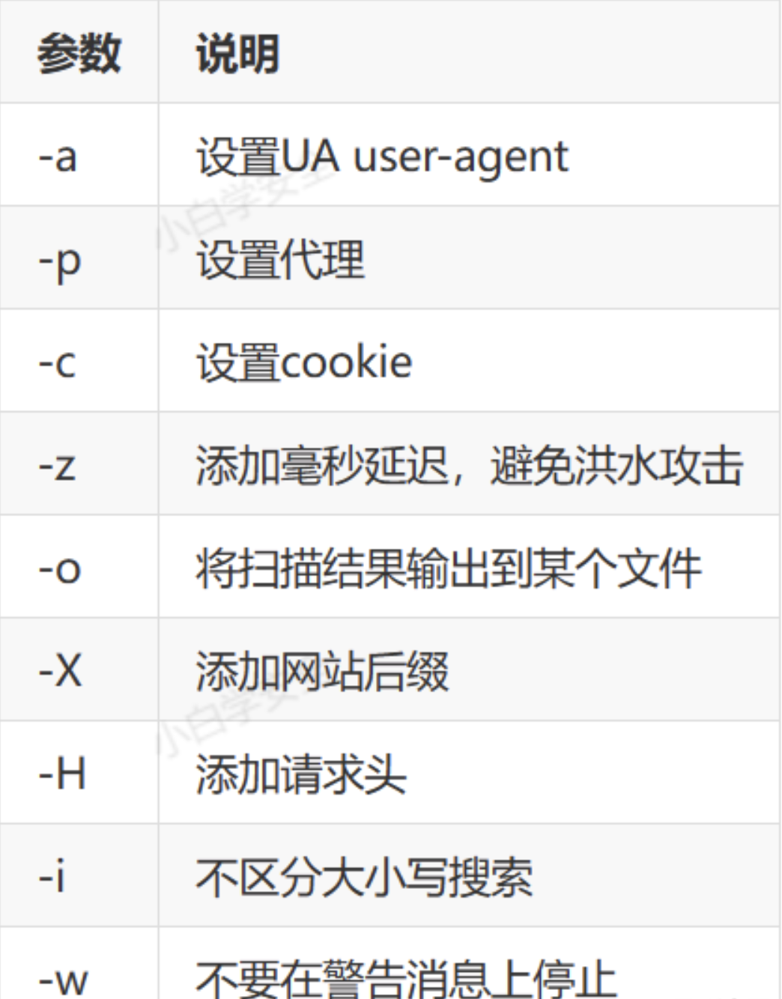

## 什么是文件上传漏洞?
- 文件上传（File Upload）是大部分Web应用都具备的功能，例如用户上传附件、修改头像、分享图片/视频等。正常的文件一般是文档、图片、视频等，Web应用收集之后放入后台存储，需要的时候再调用出来返回；

- 如果恶意文件如PHP、ASP等执行文件绕过Web应用，并顺利执行，则相当于黑客直接拿到了Webshell，则可以拿到Web应用的数据，删除Web文件，本地提权，进一步拿下整个服务器甚至内网；

## 文件上传攻击原理图:
<center>


</center>

## 文件上传漏洞形成的原因:
- 文件上传漏洞，通常是由于对上传文件的类型、内容没进行严格的审查、过滤，使得攻击者可以通过上传木马获取服务器的webshell权限。

## 文件上传漏洞利用条件:
- 木马上传成功
- 知道木马的路径
- 木马能够正常运行


## 网站目录扫描工具
- Dirb（Web Content Scanner）：
  - 扫描原理：Dirb基于字典进行目录扫描。它通过与指定的字典中的路径组合进行匹配，尝试发现目标网站上存在的隐藏目录和文件。它发送HTTP请求并根据响应代码和内容进行判断。
  - 使用场景：Dirb适用于简单的目录扫描任务，例如探测常见的目录结构、寻找隐藏的管理员页面、寻找备份文件等。
- DirBuster：
  - 扫描原理：DirBuster提供了多种扫描方式。其中一种是基于字典的暴力破解，它尝试使用字典中的路径组合进行访问，以发现目标网站上的隐藏目录和文件。另一种是基于爬虫的扫描，它通过模拟用户的点击行为，递归地访问网站的链接。
  - 使用场景：DirBuster适用于需要更精确控制扫描过程的情况。它提供了GUI界面和高级配置选项，可以针对特定的目标网站进行更深入的扫描。
- FFUF（Fuzz Faster U Fool）：
  - 扫描原理：FFUF是一个快速的内容发现工具，它可用于目录和子域名扫描。它使用自定义的字典进行扫描，并利用并发线程进行高效的扫描。FFUF发送大量的HTTP请求，并根据响应代码和内容进行判断。
  - 使用场景：FFUF适用于复杂和高并发的扫描任务。它具有快速、可定制的特点，可以在大型目标范围内进行快速的目录和子域名扫描。它还支持过滤器、正则表达式匹配和自定义HTTP头等高级功能。
- 总结:
  - Dirb适合简单的目录扫描任务，使用基于字典的匹配进行扫描。
  - DirBuster提供更多的扫描方式和配置选项，适合需要更精确控制扫描过程的情况。
  - FFUF是一个快速、可定制的内容发现工具，适用于复杂和高并发的扫描任务。


## dirbuster扫描教程
- 启动dirbuster，在终端输入dirbuster


- 目标ip地址或域名，默认80端口，特殊端口需要加到后面


- 请求方式，用get方式或者HEAD加GET自动切换


- 选择线程数，用于执行暴力破解的线程数完全取决于计算机的硬件


- 选择字典类型，字典列表， /usr/share/dirbuster/wordlists


- 自动生成


- 选择扫描方式


- 如果用URL Fuzz，可以指定目录，指定扫描admin目录下面的所有文件,dir代表字典的每一行


- 查看结果
  - Scan Information：扫描信息
  - Results - List View：结果列表
  - Results - Tree View：结果树
  - Errors：错误



- 为确定文件是否存在，最常见的响应如下所示：
  - 200：文件存在
  - 404：服务器中不存在该文件
  - 301：这是重定向到给定的URL
  - 401：访问此文件需要身份验证
  - 403：请求有效但服务器拒绝响应

- 导出结果


## dirb工具扫描网站目录



```shell
#直接扫描
dirb http://192.168.84.1/dedecms/

#将扫描结果保存在当前目录中的dir.txt
dirb http://192.168.84.1/dedecms/ -o ./dir.txt   

#指定网站脚本类型
dirb http://192.168.84.1/dedecms/ -X .php 

#指定字典进行扫描 
dirb http://192.168.84.1/dedecms/  ./dir1.txt -w
```


## ffuf目录扫描工具
```shell
#基础用法
#-u 扫描目标
#-w 字典
ffuf -u "http://192.168.242.62/dvwa/FUZZ"  -w ./top7000.txt

#递归扫描
#字典内开头不要有 / 不然不会进行递归的
ffuf -u "http://192.168.242.62/FUZZ"  -w test.txt  -x "http://127.0.0.1:8080"  -recursion "2"
```
