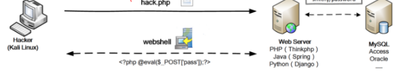

## 什么是文件上传漏洞?
- 文件上传（File Upload）是大部分Web应用都具备的功能，例如用户上传附件、修改头像、分享图片/视频等。正常的文件一般是文档、图片、视频等，Web应用收集之后放入后台存储，需要的时候再调用出来返回；

- 如果恶意文件如PHP、ASP等执行文件绕过Web应用，并顺利执行，则相当于黑客直接拿到了Webshell，则可以拿到Web应用的数据，删除Web文件，本地提权，进一步拿下整个服务器甚至内网；

## 文件上传攻击原理图:

## 文件上传漏洞形成的原因:
- 文件上传漏洞，通常是由于对上传文件的类型、内容没进行严格的审查、过滤，使得攻击者可以通过上传木马获取服务器的webshell权限。

## 文件上传漏洞利用条件:
- 木马上传成功
- 知道木马的路径
- 木马能够正常运行