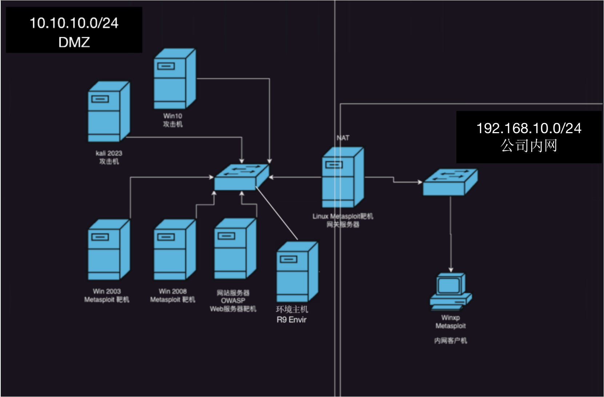

## 渗透测试实验环境拓扑结构
- 渗透测试目标实验环境网络拓扑结构如图0-1所示，包括两个网段，其中172.16.10.0/24网段中部署了网站服务器、后台服务器与网关服务器，并为渗透测试者提供两台攻击机(Kali和Win 10)
- 192.168.200.0/24网段中包含Windows XP 系统。

图0-1

## 渗透测试实验环境中的虚拟机镜像如表0-1所示:

表0-1

| 虚拟机镜像名称                        | 虚拟机镜像类型       |虚拟机镜像类型       |  
| ----------------------------------- | ------------------ | ------------------ |
| Kali                                | Linux 攻击机        | Debian 6       |
| Win10                                | Windows 攻击机     |  Win10 Cn    |
| OWASP BWA v0.94                     | Web服务器靶机        | Ubuntu 10.04    |
| R9 Envir                            | 环境主机             | Rocky Linux9.2  |
| Win2K3 Metasploitable               | Windows 靶机        | Win2K3 En |
| Linux Metasploitable                 | Linux 靶机       | Ubuntu 8.04 |
| Win2k8 Metasploitable                 | Windows 靶机       | Win2008 Cn |
| WinXP Metasploitable                 | Windows 靶机       | WinXP En |

## 渗透测试环境中各虚拟机配置情况如表0-2所示:

表0-2

| 虚拟机镜像名称                        | 主机类型             |     IP地址         |     域名           |  
| ----------------------------------- | ------------------ | ------------------ | ------------------ |
| Kali                                | 攻击机             | 172.16.10.100/24(dhcp)    |  attacker1.czlgj.com |
| Win10                                | 攻击机            |  172.16.10.101/24(dhcp)     | attacker2.czlgj.com |
| OWASP BWA v0.94                     | 门户网站服务器      | 172.16.10.102/24(dhcp)     | www.czlgj.com       |
| R9 Envir                              |环境主机            | 172.16.10.231/24           |  envir.czlgj.com |
| Win2K3 Metasploitable               | 后台服务器1         | 172.16.10.103/24(dhcp)  |    server1.czlgj.com |
| Win2k8 Metasploitable                 | 后台服务器2       | 172.16.10.104/24(dhcp)  |   server2.czlgj.com  |
| Linux Metasploitable                 | 网关服务器         | 172.16.10.254/24(GW)(dhcp)  | gw.czlgj.com |
|                                       |                 |  192.168.200.254(GW)（手工） | gw.czlgj.com |
| WinXP Metasploitable                 | 内网客户端主机      | 192.168.200.128/24(手工) |  inner.czlgj.com |
|                                      |                   | 192.168.200.254/24(GW)     |               |

- 利用上述虚拟机镜像，就可以在一台高性能的 PC 机或笔记本电脑上构建出相当完整的渗透测试实验环境，从而满足全部渗透测试技术进行学习和实践的需求。根据宿主机操作系统的不同，可以相应地选择使用 VMware Workstation for Windows、VMware Workstation for Linux 或 VMware Fusion for Mac os ×，来作为渗透测试实验环境的底层虚拟化软件支持。
- 在安装完 VMware Workstation 或 VMware Fusion 软件之后，会发现 VMware 添加了两块虛拟网卡 VMnet1 和 VMnet8，作为宿主主机上分别以 Host-only（宿主机）模式和 NAT模式提供给虚拟机进行连接的网络接口，此外VMware 虛拟出来的 VMneto 网络会绑定到宿主主机物理网卡上，以桥接模式为连接该虚拟网络的虛拟机提供直接外网访问。
- 如图0-1中所示，将攻击机镜像（Kali和Win10）、门户网站服务器镜像(OWASP BWA）、后台服务器镜像（Win2K3 Metasploitable&&Win2K8 Metasploit）和网关服务器镜像 (Linux Metasploitable)以 NAT模式连接至 VMnet8 虛拟网段中，使得攻击机可以直接对这4个服务器进行扫描探测与渗透攻击测试。为了演示Metasploit在实施内网渗透攻击所具有的多种技术，我们将网关服务器镜像 (Linux Metasploitable)设置为连接 VMnet8 网段和宿主机模式 VMnet1网段的网关，并将 VMnet1 网段模拟为内网，其中包含若干个WinxP Metasploitable 终端靶机，攻击机无法直接访问和攻击到这些靶机，而只能采用被动渗透方式，在终端靶机访问172.16.0.0/24网段时对其实施攻击，或者在攻陷网关服务器之后利用其作为跳板，对 VMnet1 内网环境中的靶机进行内网拓展攻击。

