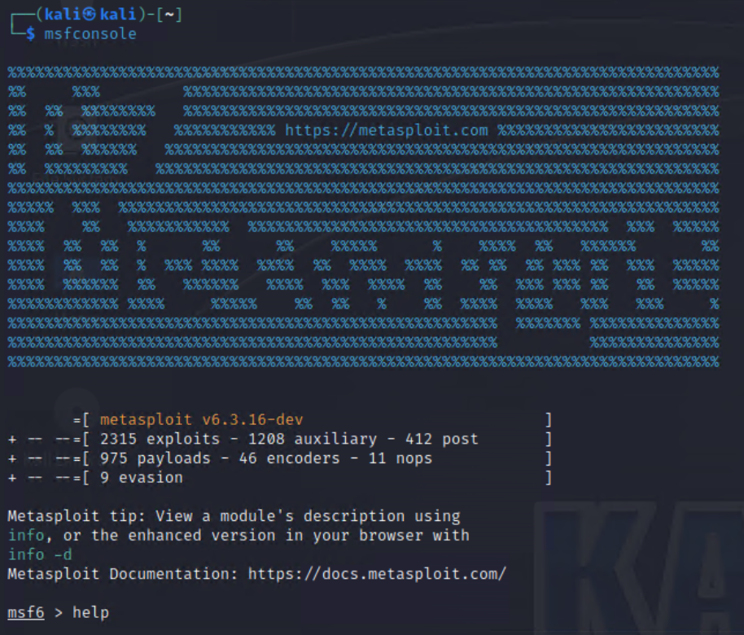
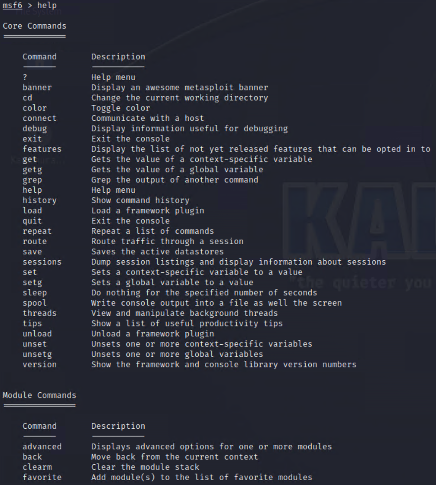
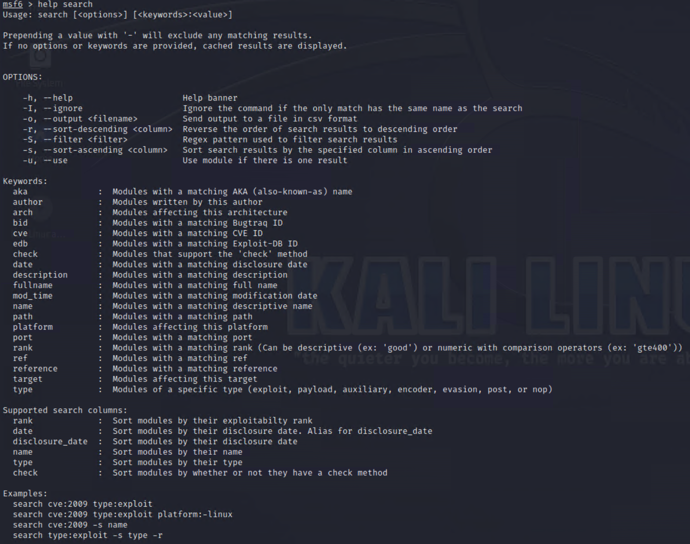
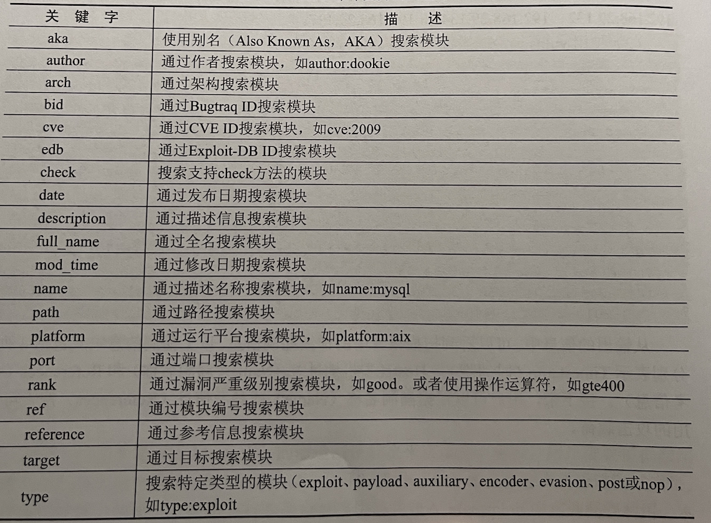
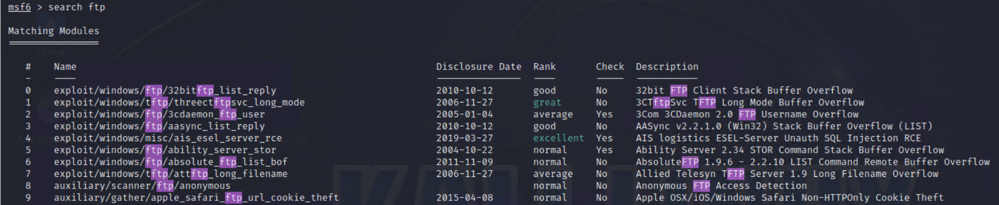
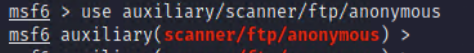
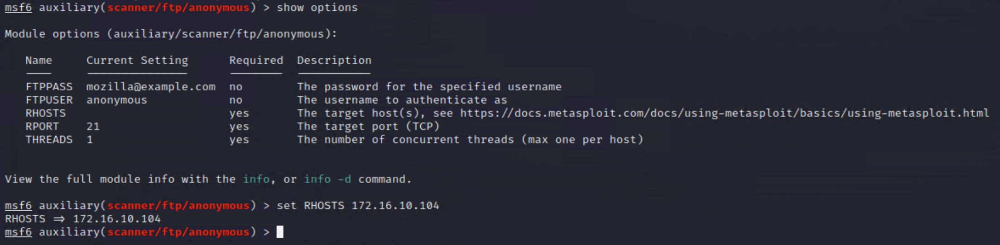
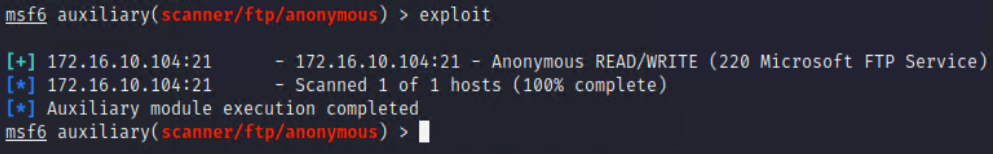

#### Metasploit的界面  
- Metasploit 框架提供了两种界面，分别是图形界面和终端模式。之前，还提供了一种命令行模式的界面，但是已经废弃。
#### Metasploit的终端模式Msfconsole
- MSF 终端(Msfconsole）是目前 Metasploit框架最为流行的用户接口，而且MSF 终端是metasploit框架中最灵活、功能最丰富，以及支持最好的工具之一。MSP终端提供了一站式接口，能设置Metasploit框架中几乎每一个选项和配置。用户可以使用MSF终端做任何事情，包括发起一次渗透攻击、装载辅助模块、实施查点、创建监听器，或是对整个网络进行自动化渗透攻击等。
  ```shell
  启动Metasploit 的终端模式。执行命令如下：
  root@daxueba: ~# msfconsole
  ```
- 执行以上命令后，即可成功启动Metasploit的终端模式




- 看到命令行提示符显示为msf6>，则表示成功启动了Metasploit的終端模式。从输出的信息可以看到支持的攻击模块及对应的数量。例如，渗透攻击模块有2315个，辅助模块1208个，后渗透攻击模块有412个，攻击载何模块有975个，编码模块有46个，空指令模块有11个，规避模块有9个。接下来，用户就可以使用这些攻击载荷实施渗透测试了。

- 可以首先输人help命令列出 MSF 终端所支持的命令列表，包括核心命令集和后端数据库命令集。




- 对于其中的大部分命令，你可以输人help〔COMMAND〕，进一步查看该命令的使用帮助信息。对于查找模块的 search 命令希望了解如何使用，就可以在 MSF 终端中输人help search，MSF 终端将会显示该命令的参数列表，包括每个参数的含义及可能的取值。

  

  - search 命令手动查找渗透测试模块的方法。查找渗透测试模块的语法格式如下：

  ```shell
  search [options] <keywords>
  # -h：显示帮助信息。
  # -o <file>：指定输出信息的保存文件，格式为 CSV
  3 -S <string>：指定搜索的字符串
  3 -u：指定搜索模块
  ```
  - 此外search命令还支持的关键字

  

  ```shell
  #手动查找CVE漏洞为2019年的渗透测试模块
  msf6 > search cve:2019

  #查找漏洞名称为 MS17-010 SMB RCEDetection 的渗透测试模块
  msf6 > search name:MS17-010 SMB RCE Detection

  #选择名为exploit/windows/smb/mS17_010_eteralblue 的渗透测试模块
  msf6 > exploit/windows/smb/ms17 010 eternalblue
  msf6 exploit (windows/smb/ms17 010 eternalblue) >
  ```

- 由于Metasploit 框架仍在活跃地发展中，MSF 终端所支持的命令也在不断扩展与增加，但核心命令是相对稳定的。

#### 使用扫描模块实例演示
- 使用Metasploit中的ftp匿名扫描模块扫描Win2k8 Metasploit环境中的ftp服务是否开启匿名访问
  - 首先使用search命令从Metasploit目前庞大的库中找到扫描ftp匿名访问的模块,如下所示，结果列出了一些列的模块，从中找到anonymous扫描模块，模块名称为:auxiliary/scanner/ftp/anonymous。



- 接下来时使用指令"use"来运行模块，在msf6>中输入"use auxiliary/scanner/ftp/anonymous"按下回车。



- 执行“show options〞 来查看需要设置哪些配置参数，结果显示我们只需要设置 RHOSTS 为目标靶机IP 地址，而RPORT 目标端口、等参数都可以使用默认值即可



- 在 MSF 终端中实施扫描和渗透攻击的指令非常简单，只需要输人 “exploit” 命令就会马上启动，当你输出完回车时，就可以在MSF终端中看到扫描信息。



- 扫描信息显示Win2K8 Metasploit的ftp服务开启了匿名登录。

#### 创建工作区
- 在 Metasploit 中创建工作区（Workspace）是对渗透测试或安全评估项目进行逻辑隔离的一种方法。工作区的作用是将相关的渗透测试活动、扫描结果、漏洞利用数据等组织在一个独立的环境中，以便更好地管理和分析数据，并确保在不同项目之间不会产生混淆。
- 创建工作区的语法格式如下：

```shell
#查看当前所在工作区
msf6 > workspace
* default

#创建新的工作区
msf6 > workspace -a test
[*] Added workspace: test
[*] Workspace: test

#切换当前工作区
msf6 > workspace default
[*] Workspace: default
```

#### 导入三方的扫描报告
- 用户也可以导入一些第三方扫描报告，来获取主机信息。其中，导入扫描报告的语法格式如下：

```shell
#导入Openvas 生成的扫描报告文件 openvas.xml
msf6 > db import /root/openvas.xml
```

- 此时，用户可以对该扫描报告进行分析，找出目标系统中的漏洞。然后，根据该漏洞查找可以利用该漏洞的渗透测试模块，并实施攻击。
  
```shell
#使用hosts命令查看导入报告的主机信息
msf6 > hosts
#使用 vulns 命令查看导入报告漏洞信息
msf6 > vulns
```
#### 手动导入第三方Metasploit模块
- Metasploit 自带的模块己经很丰富了，但有时候也不能完全满足用户的需求。对于一些比较新的漏洞或者没有官方模块支持的漏洞，用户只能自己手动编写或者导入第三方模块。对于一般用户来说，通过直接导入第三方模块来使用更方便，而且也不容易出错。
- 导入从exploitDB 网站下载的第三方模块，并使用该模块实施渗透测试。这里将以Icecast 2.0.1 (Windows x86) - Header Overwrite本地提权模块为例，下载文件名为16736.rb。具体操作步骤如下:
```shell
#将模块文件16736.rb 复制到 Metasploit 对应的模块位置。其中，Metasploit 
#模块的默认位置为/usr/share/metasploit-framework/modules
#为了方便区分模块，用户可以按照模块的分类创建对应的文件夹，用来保
#存不同类型的模块。本例中将导入一个渗透攻击模块，所以这里将创建名为exploits 的文件夹
root@daxueba : ~# mkdir /usr/share/metasploit-framework/modules/exploits

#执行以上命令后，将不会有任何信息输出。这里为方便记忆或查找模块的位置，再创建一个test目录然后将攻击载荷文件复制进去
root@daxueba:>~# cd /usr/share/metasploit-framework/modules/exploits
root@daxueba:>~# mkdir test
root@daxueba:>~# cd test /
root@daxueba:>~# ls
ftc.rb

#如果您已经运行了msfconsole，请使用reload_all命令来获取新模块
msf5 > reload_all 

#重新启动Metasploit工具，可以看到已经加载的工具
root@daxueba:~# msfconsole

#选择ftc模块，并查看模块的选项。
msf5 > use exploit/test/16736
msf5 exploit (test/16736) > show options

#从输出的信息可以看到，显示16737模块的所有选项。以上信息共包括 4列，分
#別表示 Name（选项名称）、Current Setting （当前设置）、Reouired（是否必须没置）和
#pesoription(描述）。从输出的信息可 以看到，RHOSTS 必须配置选项，但目前还没有#设置。
#设置 RHOSTS 选项
msf5 exploit (test/16736) > set RHOSTS 192.168.29.141
RHOSTS => 192.168.29.141
```
