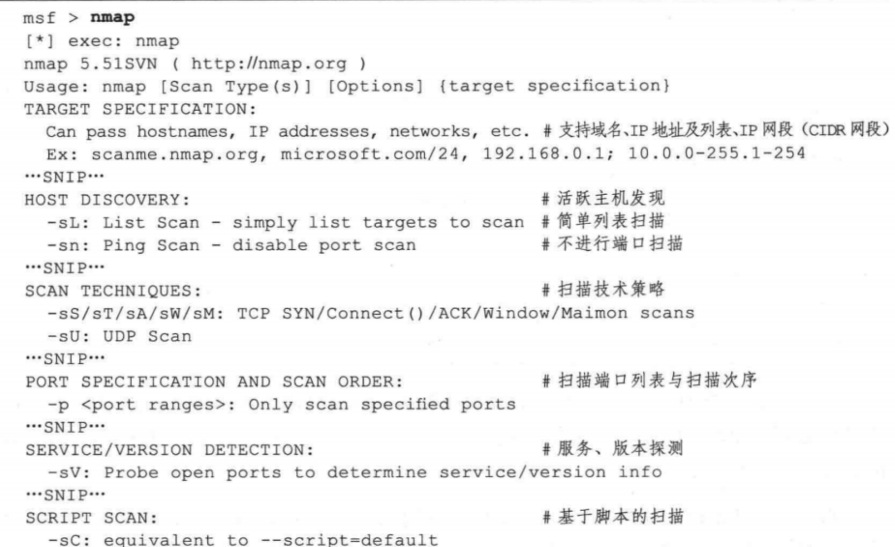
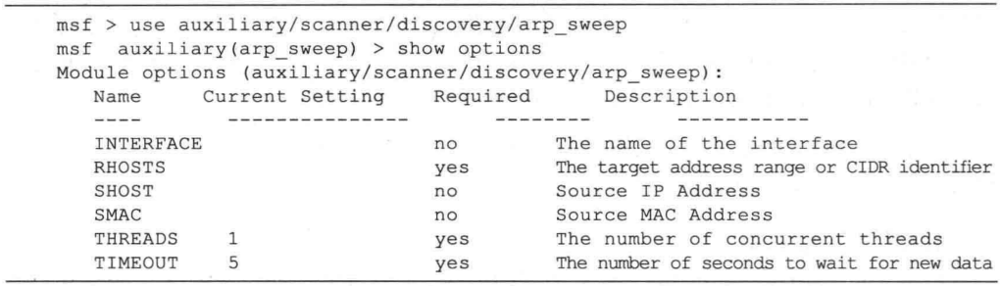
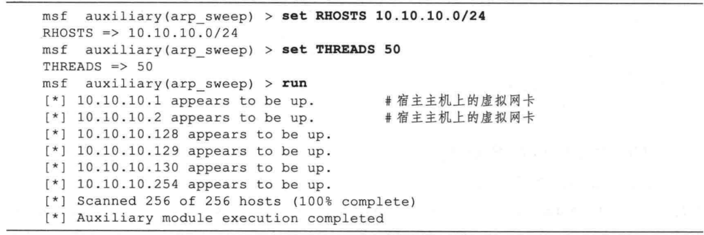

## 主机扫描技术
- 主机扫描的目的是确定在目标网络上的主机是否可达。这是信息收集的初级阶段，其效果直接影响到后续的扫描。
- 常用的传统扫描手段有:
  - ICMP Echo扫描
  - ICMP Sweep扫描
  - Broadcast ICMP扫描
  - Non-Echo ICMP扫描

#### 使用 Nmap 进行主机探测
- Nmap (Network mapper）是目前最流行的网络扫描工具，它不仅能够准确地探测单台主机的详细情况，而且能够高效率地对大范围的 IP 地址段进行扫描。使用 Nmap 能够得知目标网络上有哪些主机是存活的，哪些服务是开放的，甚至知道网络中使用了何种类型的防火墙设备等。Nmap 版本支持包括 Windows 在内的多种操作系统，在 Kali 也集成了 Nmap，可以直接在 MSF 终端中运行。

- 在MSF终端中运行Nmap扫描工具


- Nmap 的参数和选项繁多，功能非常丰富。先来看一下 Nmap 命令的基本使用方法。通
常一个 Nmap 命令格式如下所示：


```shell
nmap ＜扫描选项＞＜扫描目标＞
```

#### ICMP echo扫描
- 实现原理: Ping的实现机制，在判断在一个网络上主机是否开机时非常有用。向目标主机发送 ICMP Echo Request (type 8)数据包，等待回复的ICMP Echo Reply 包(type 0）。如果能收到，则表明目标系统可达，否则表明目标系统己经不可达或发送的包被对方的设备过滤掉。
  - 优点：简单，系统支持
  - 缺点：很容易被防火墙限制

```shell
#ping扫描
nmap -sP 10.10.10.231
```

#### ICMP sweep扫描
- 使用ICMP ECHO轮询多个主机称为ICMP SWEEP(或者Ping Sweep).
- 对于小的或者中等网络使用这种方法来探测主机是一种比较可接受的行为，但对于一些大的网络如CLASS A，B，这种方法就显的比较慢，原因是Ping在处理下一个之前将会等待正在探测主机的回应。

```shell
#示例
nmap -sn 10.10.10.1-254
```

#### Broadcast ICMP扫描
- 实现原理：将ICMP请求包的目标地址设为广播地址或网络地址，则可以探测广播域或整个网络范围内的主机。
- 缺点:
  - 这种扫描方式容易引起广播风暴

```shell
#示例
nmap -sn 10.10.10.0/24

#使用nmap脚本发起Broadcast ICMP扫描
nmap --script broadcast-ping 
```

#### Non-Echo ICMP扫描
- 一些其它 ICMP类型包也可以用于对主机或网络设备的探测，如：
  - Stamp Request (Type 13)
  - Reply (Type 14)
  - Information Request (Type 15)
  - Reply (Type 16)
  - Address Mask Request (Type 17)
  - Reply (Type 18)

```shell
#示例:
nmap -P0 10.10.10.231 
#P0参数表示不发送icmp

#使用hping实现Non-Echo icmp扫描
sudo hping3 --icmp --icmptype [icmp包类型] [ip地址]
```
#### 主机扫描技术一高级技术
- 防火墙和网络过滤设备常常导致传统的探测手段变得无效。为了突破这种限制，必须采用一些非常规的手段，利用ICMP协议提供网络间传送错误信息
的手段，往往可以更有效的达到目的：
  - 异常的IP包头
  - 在IP头中设置无效的字段值
  - 错误的数据分片
  - 通过超长包探测内部路由器
  - 反向映射探测
  - ARP扫描
## Metasploit介绍和使用，回lesson2

## 使用ARP扫描发现主机,绕过防火墙
- 当firewall关闭了icmp协议之后，ping扫描就不能发现主机了

#### Rocky Linux防火墙基本指令
```
# 进程与状态相关
systemctl start firewalld.service										#启动防火墙
systemctl stop firewalld.service										#停止防火墙
systemctl status firewalld												  #查看防火墙状态
systemctl enable firewalld												  #设置防火墙随系统启动
systemctl disable firewalld												  #禁止防火墙随系统启动
firewall-cmd --state													      #查看防火墙状态
firewall-cmd --reload													      #更新防火墙规则
firewall-cmd --list-ports												    #查看所有打开的端口
firewall-cmd --list-services											  #查看所有允许的服务
firewall-cmd --get-services												  #获取所有支持的服务

# 区域相关
firewall-cmd --list-all-zones											  #查看所有区域信息
firewall-cmd --get-active-zones											#查看活动区域信息
firewall-cmd --set-default-zone=public							


#设置public为默认区域
firewall-cmd --get-default-zone											#查看默认区域信息
 
 
# 接口相关
firewall-cmd --zone=public --add-interface=eth0							  #将接口eth0加入区域public
firewall-cmd --zone=public --remove-interface=eth0						#从区域public中删除接口eth0
firewall-cmd --zone=default --change-interface=eth0						#修改接口eth0所属区域为default
firewall-cmd --get-zone-of-interface=eth0								      #查看接口eth0所属区域
 
# 端口控制
firewall-cmd --query-port=8080/tcp										              #查询端口是否开放
firewall-cmd --add-port=8080/tcp --permanent							          #永久添加8080端口例外(全局)
firewall-cmd --remove-port=8800/tcp --permanent							        #永久删除8080端口例外(全局)
firewall-cmd --add-port=65001-65010/tcp --permanent						      #永久增加65001-65010例外(全局)
firewall-cmd  --zone=public --add-port=8080/tcp --permanent				  #永久添加8080端口例外(区域public)
firewall-cmd  --zone=public --remove-port=8080/tcp --permanent			#永久删除8080端口例外(区域public)
firewall-cmd  --zone=public --add-port=65001-65010/tcp --permanent	#永久增加65001-65010例外(区域public)

#禁用icmp协议
firewall-cmd --add-icmp-block=echo-request --permanent
firewall-cmd --add-icmp-block=echo-reply --permanent
firewall-cmd --reload

#启用icmp协议
firewall-cmd --remove-icmp-block=echo-request --permanent
firewall-cmd --remove-icmp-block=echo-reply --permanent
firewall-cmd --reload
``` 
##### Metasploit 的主机发现模块
- Metasploit 中提供了一些辅助模块可用于活跃主机的发现，这些模块位于 Metasploit 源码路径的 modules/auxiliary/scanner/discovery/ 目录中，主要有以下几个：arp sweep、ipv6 multicast_ping, ipv6_neighbor, ipv6_neighbor_router_advertisement, udp_probe. udp_sweep。其中两个常用模块的主要功能为：
  - arp_sweep 使用 ARP 请求枚举本地局城网络中的所有活跃主机。
  - udp_sweep 通过发送 UDP 数据包探查指定主机是否活跃，并发现主机上的 UDP 服务。
- 在TCP/IP 网络环境中，一台主机在发送数据帧前需要使用 ARP (Address Resolution Protocol，地址解析协议）将目标IP地址转换成 MAC 地址，这个转换过程是通过发送一个 ARP 请求来完成的。如 IP 为A 的主机发送一个 ARP 请求获取 IP 为 B 的MAC 地址，此时如果 IP 为 B 的主机存在，那么它会向 A 发出一个回应。因此，可以通过发送 ARP 请求的方式很容易地获取同一子网上的活跃主机情况，这种技术也称为 ARP扫描。Metasploit 的 arp_sweep模块便是一个 ARP 扫描器，下面演示了使用方法。
- Metasploit中的arp_sweep模块使用方法

 

- 首先需要输人 RHOSTS 来对扫描目标进行设置。在Metasploit 中，大部分 RHOSTS 参数均可设置为一个或多个IP 地址，多个 IP 地址可使用连字符号（-）表示（如10.10.10.1-10.10.10.100），或使用无类型域间选路地址块(CIDR） 表示（如10.10.10.0/24)。此外值得提醒的是，在所有的扫描类操作中，均可以通过将THREAD 参数设置成一个较大的值来增加扫描线程以提高扫描速度，或者设置为较小的值让扫描过程更加隐秘。
- 设置好 RHOSTS 和 THREADS 参数后，输人run 命令启动扫描器.

 

- 从代码中可以看到，arp_sweep模块很快发现了 10.10.10.0/24网段上的活跃主机，分别为10.10.10.1、10.10.10.2、 10.10.10.128、10.10.10.129、10.10.10.130、10.10.10.254。arp_ sweep 模块只能探测同一子网中的活跃主机，对于远程网络，可以使用更为强大的 Nmap 扫描器进行探测。

