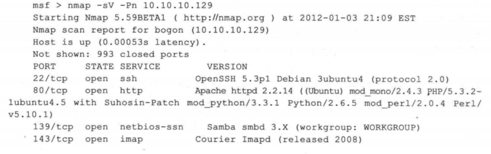

## 端口简介
- 在计算机中，“端口”的英文是Port。在网络技术中，端口有好几种意思。这里所指的端口不是物理意义上的端口，而是特指TCP/IP协议中的端口。它是逻辑意义上的端口。在TCP/IP协议中，最常用的协议是TCP和UDP协议。由于TCP和UDP两个协议是独立的，因此各自的端口号也相互独立。例如，TCP有235端口，UDP也可以有235 端口，两者并不冲突。下面将介绍端口的作用及常用的端口。
- 1.端口的作用
  - 用户都知道一台主机对应一个IP地址，可以提供多个服务，如web服务和FTP服务等。如果只有一个IP地址，是无法区分不同的网络服务，所以使用“IP+端口号”来区分不同的服务。
- 2.端口的定义
  - 端口号是标识主机内唯一的一个进程，“IP+端口号”就可以标识网络中的唯一进程。在网络开发的Socket编程中，IP+端口号就是套接字。端口号是由16位二进制数字编号，范围是0~65535。但是，这些端口并不是可以随便使用的，一些端口己经被占用。例如，Web服务器的端口为80，FTP服务的端口为21等。所以，端口被进行了分类，并规定了用户可以使用的端口范围。
- 3.端口的分类
  - 端口的分类方法很多，这里将按照是服务端使用还是客户端使用进行分类。其中，服务端使用的端口号又可以分为预留端口号和注册端口号。如下：
    - 预留端口号：该类端口的取值范围为 0-1023。其中，这些端口在用户编程的时候不能使用，是一些程序固定使用的。只有超级用户权限的应用才允许被分配一个预留端口号。例如，www服务默认端口为80，FTP 服务默认端口为21等。不过，用户也可以为这些网络服务指定其他端口号。但是有些系统协议使用固定的端口号，是不能被改变的。例如，139端口专门用于NetBIOS与TCP/IP之间的通信，不能被手动改变。
     - 注册端口号：该类端口的范围为 1024-49151，就是用户平时编写服务器使用的端口号范围。这些端口在没有被服务器资源占用的时候，也可以供用户端动态选用。客户端使用的端口号又叫临时端口号，取值范围为49152-65535。其中，这部分是客户端进程运行时动态选择的范围。
- 4.常用端口
  - 在前面提到，一些网络服务的端口都是固定的，所以将列出一些常见的 TCP/IP端口:
  
  

## 使用Nmap进行端口扫描
- 大部分扫描器会对所有的端口分为 open（开放）或closed（关闭）两种类型，而 Nmap 对端口状态的分析粒度更加细致，共分为六个状态：open（开放）.closed（关闭）、filtered（被过滤）、unfiltered（末过滤）、openlfiltered（开放或被过滤）、closedlfiltered（关闭或被过滤）。
下面对这几种端口状态进行说明：
    - open（开放的）：应用程序正在该端口接收TCP 连接或者 UDP 报文。安全意识强的人们知道，每个开放的端口都是攻击的入口。攻击者或者入侵测试者想要发现开放的端口，而管理员则试图关闭它们或者用防火墙保护它们以免妨碍合法用户使用。非安全扫描可能对开放的端口也感兴趣，因为它们显示了网络上哪些服务可供使用。
    - closed（关闭的）：关闭的端口对于 Nmap 也是可访问的（它接收 Nmap 的探测报文并作出响应），但没有应用程序在其上监听。它们可以显示该IP地址（主机发现或者ping扫描）的主机正在运行，也对部分操作系统的探测有所帮助。因为关闭的端口是可访问的，也许过一会儿有一些端口又开放了。系统管理员可能会用防火墙封锁这样的端口。这样，它们就会被显示为被过滤的状态。
    - filtered（被过滤的）：由于包过滤阻止探测报文到达端口，Nmap 无法确定该端口是否开放。过滤可能来自专业的防火墙设备、路由器规则或者主机上的软件防火墙。有时候它们响应ICMP错误消息，如类型3代码13（无法到达目标:通信被管理员禁止），但更普遍的是过滤器只是丢弃探测帧，不做任何响应。Nmap 会重试若干次，检测探测包是否是由于网络阻塞而丢弃的。这会导致扫描速度明显变慢。
    - unfiltered（未被过滤的）：未被过滤状态意味着端口可访问，但Nmap不能确定它是开放还是关闭。用户只有通过映射防火墙规则集的ACK扫描，才会把端口分类到这种状态。使用其他类型的扫描（如窗口扫描、SYN扫描或者FIN 扫描来扫描未被过滤的端口，可以帮助确定端口是否开放。
    - open/filtered开放或者被过滤的）：当无法确定端口是开放还是被过滤的时，Nmap就把该端口划分成这种状态。开放的端口不响应就是这种况。没有响应也可能意味着报文过滤器丟弃了该坏测报文及引起的任何响应报文。因此，Nmap 无法确定该端口是开放的还是被过滤的。UDP、IP 协议、FIN、Null 和 Xmas 扫描可 能把端口归入此类。
    - closed/filtered（关闭或者被过滤的）：该状态用于Nmap不能确定端口是关闭的还是被过滤的。它只会出现在IPID Idle扫描中。

  - 常用的 Nmap 扫描选项有：
    - -Pn：在扫描之前，不发送ICMP echo 请求测试目标是否活跃。
    - -O: 启用对于TCP/IP 协议栈的指纹特征扫描以获取远程主机的操作系统类型等信息。
    - -F: 快速扫描模式，只扫描在 nmap-services 中列出的端口。
    - -p <端口范围>: 可以使用这个参数指定希望扫描的端口，也可以使用一段端口范围（例如 1~1023）。在 IP 协议扫描中（使用-sO 参数），该参数的意义是指定想要扫描的协议号(0~ 255)。

- 下图是使用 Nmap 对网站服务器主机进行一次端口扫描的结果，其中使用到了-sS选项，该选项指定使用 TCP SYN 扫描，这种扫描方式不等待打开一个完全的 TCP 连接，所以执行速度会更快，而且这种扫描通常不会被 IDS等设备记录。如果想要同时列出 UDP 端口，可以加上-sU，但执行速度就会变得比较慢。

  

- 通过上面的端口扫描，已经得到了一些关于端口上开放哪些服务的简单信息，不过实际上 Nmap 只是简单地将开放的端口号与该端口上常见服务进行了一个映射，如果想要获取更加详细的服务版本等信息，需要使用-sV 选项，如下所示。

  
  

- Nmap 工具将网站服务器上各个开放服务的指纹信息（fingerprint）与现有的指纹库进行比对，列出了它能够识别服务的详细信息，甚至包含了 Apache 中已安装的模块。对于指纹库中没有的服务，它会将其指纹信息列举出来，并允许用户提供他们所了解的服务信息，以补充 Nmap 工具的服务指纹数据库（如本例中的 5001 端口）。

- Nmap其它使用命令
```shell
#目标主机 192.168.29.136 实施端口扫描
nmap 192.168.29.136
#Nmap工具默认扫描了1000个端口。

#指定端口范围为 1~50，对目标主机实施端口扫描;
nmap -p 1-50 192.168.29.136

#指定扫描目标主机的21和23端口
nmap -p 21,23 192.168.29.136
```
## 端口扫描技术
- 当确定了且标主机可达后，就可以使用端口扫描技术，发现具台指描技术苞括以下元种：
  - 全扫描
    - 会产生大量的审计数据，容易被对方发现，但其可靠性高。
  - 半扫描
    - 隐蔽性和可靠性介于全扫描和秘密扫描之间。
  - 秘密扫描
    - 能有效的避免对方入侵检测系统和防火墙的检测，但使用的数据包在通过网络时容易被丢弃从而产生错误的探测信息。 

#### 全扫描
- 全TCP连接是TCP端口扫描的基础。
- 扫描主机尝试（使用三次握手）与目标主机的某个端口建立正规的连接。
- 连接由系统调用connect()开始。如果端口开放，则连按將建立成功；否则，返回-1，则表示端口关闭。

#### 全扫描一一全扫描过程（成功）
- TCP Connect端口扫描服务端与客户端建立连接成功（目标端口开放）的过程：
  - Client端发送SYN；
  - Server端返回SYN/ACK，表明端口开放：
  - Client端返回ACK，表明连接己建立；
  - Client端主动断开连接。

#### 全扫描一一全扫描过程（未成功）
- TCP Connect端口扫描服务端与客户端末建立连接成功 （目标端口关闭）过程：
  - client端发送SYN;
  - Server端返回RST/ACK,表明端口未开放。

#### 全扫描一一全扫描特点
- 优点:
  - 优点是实现简单，对操作者的权限没有严格要求（有些类型的端口扫描需要操作者具有root权限），系统中的任何用户都有权力使用这个调用。
  - 另一优点是扫描速度快。如果对每个目标端口以线性的方式，使用单独的connect(）调用，可以通过同时打开多个套接字，从而加速扫描。
- 缺点:
  - 这种扫描方法很容易被检测出来，在日志文件中会有大量密集的连接和错误记录
  - 并容易被防火墙发现和屏蒰

```shell
nmap -sT 10.10.10.231
```

## 半扫描(TCP SYN扫描)
- 在这种技术中，扫描主机向目标主机的选择端口发送SYN数据段。
  - 如果应答是RST，那么，说明端口是关闭的，按照设定继续探听其他端口；
  - 如果应答中包含SYN和ACK，说明目标端口处于监听状态。
- 由于SYN扫描时，全连接尚末建立。所以，这种技术通常被称为“半连接”扫描。

#### TCP SYN扫描 --过程（成功）


#### TCP SYN扫描 --过程（失败）


#### 半开扫描特点
- SYN扫描的优点:
  - 即使日志中对于扫描有所记录，但是尝试进行连接的记录也要比全扫描的记录少的多。
SYN扫描缺点:
  - 在大部分操作系统中，发送主机需要构造适用于这种扫描的IP包，通常情况下，构造SYN数据包需要超级用户或者得到授权的用户，才能访问专门的系统调用。

```shell
nmap -sS 10.10.10.231
```
## 秘密扫描(TCP FIN扫描)
- TCP FIN扫描技术使用FIN数据包探测端口：
  - 当一个FIN数据包到达一个关闭的端口，数据包会被丢掉，且返回一个RST数据包。
  - 当一个FIN数据包到达一个打开的端口，数据包只是简单丟掉（不返回RST数据包）。
- 由于这种技术不包含标准的丁CP三次握手协议的任何部分，所以无法被记录下来，从而比SYN扫描隐蔽的多。
- FIN数据包能通过监测SYN包的包过滤器TCP FIN扫描又称作秘密扫描。

#### TCP FIN扫描一一过程（成功）
- 扫描主机向目标主机发送FIN数据包来探听端口，若FIN数据包到达的是一个打开的端口，数据包则被简单的丢掉，并不返回任何信息，如图所示：


#### TCP FIN扫描一一过程（失败）
- 当FIN数据包到达一个关闭的端口，TCP会把它判断成是错误，数据包会被丢掉，并且回返回一个RST数据包，如图所示：


#### TCP FIN扫描--特点
- 秘密扫描能躲避IDS、防火墙、包过滤器和日志审计，从而获取目标端口的开放或关闭的信息。
- 和SYN扫描类似，秘密扫描也需要构造自己的IP包。

```shell
nmap -sF 10.10.10.231
```

## TCP FIN扫描的两个变种(Xmas和Null)
- Xmas和Null扫描是秘密扫描的两个变种
  - xmas扫描打开FIN、URG和PSH标记
  - 而Null扫描关闭所有标记
- 使用这些组合的目的是为了通过所谓的FIN标记监测器的过滤。

#### NUll扫描
- 扫描主机将TCP数据包中的ACK（确认）FIN(结束连接）、RST（重新设定连接）、SYN （连接同步化要求）、URG（紧急）、PSH(接收端将数据转由应用处理)标志位置空后发送给目标主机。
- 若目标端口开放，目标主机将不返回任何信息，如图所示：


- 若目标主机返回RST信息，则表示端口关闭，如图所示：


```shell
nmap -sN 10.10.10.231
```

#### XMAS扫描
- xMAS扫描原理和NULL扫描的类似，将TCP数据包中的ACK、FIN、RST、SYN、URG、PSH标志位置1后发送给目标主机。
- 若目标端口开放目标主机将不返回任何信息，如图所示：


- 若目标主机返回RST信息，则表示端口关闭，如图所示：


#### 识别服务
- 识别服务主要是探测服务的版本信息。通常情况下，在一些旧版本中可能存在漏洞。如果存在漏洞，用户可以对该主机实施渗透，进而获取其他重要信息

##### 使用Nmap工具
- 在Nmap工具中提供了一个-sV选项，可以用来识别服务的版本。
```shell
#以上语法中的选项-sV表示实施服务版本探测
nmap -sV 192.168.29.136
```
