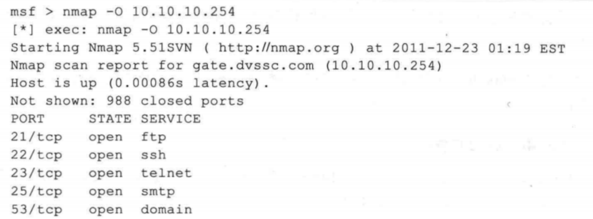
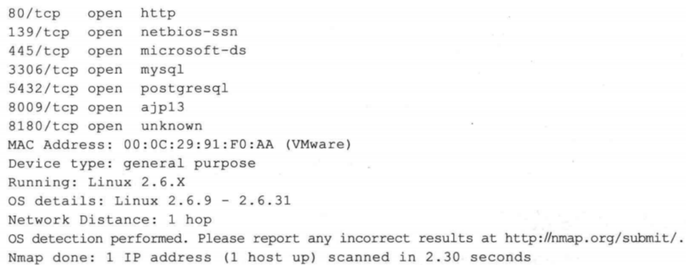
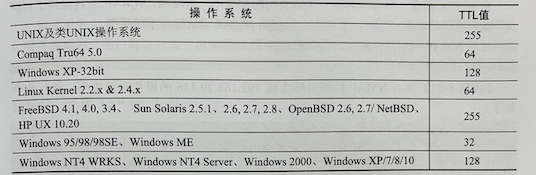

## 识别操作系统
- 获取了网络中的活跃主机之后，你最关注的事情可能就是这些主机安装了什么操作系统。要知道，网络中不仅会存在安装了各种通用操作系统的主机，还会有打印机、路由器、无线 AP，甚至是PS 等游戏主机。准确区别出这些设备使用的操作系统对于后续渗透流程的确定和攻击模块的选择非常重要。进行操作系统辨识有着以下实际的意义：
  - 漏洞扫描器得到的扫描结果中一般会存在误报的现象，而准确的操作系统识别能让你排除这些误报项目。举例来说，扫描器得到的“Windows IIS 缓冲区溢出”漏洞绝不会在Solaris 系统上出现：在Metasploit 中，攻击载荷针对不同的操作系统设计，不知道操作系统的类型，很难对其实施攻击：一些网络设备存在安全缺陷，例如很多网络设备均会有默认的管理员口令且很少有人对它们进行修改，一些廉价的网络设备具有一些先天的安全缺陷，可以通过对网络主机上的操作系统进行探测，了解网络上是否存在这种类型的脆弱设备。
- 有时候操作系统识别的结果甚至可用于社会工程学的攻击。举例来说，在渗透测试目标的网络上扫描发现了视频会议服务器，那么你很有希望能够伪装成该设备厂商的售后人员，通过电话或电子邮件与该系统管理员取得联系并得到其信任。

## 远程主机OS指纹识别
#### 基本原理
- 操作系统 (Operating System，简称OS）识别是入侵或安全检测需要收集的重要信息，是分析漏洞和各种安全隐患的基础。
  - 只有确定了远程主机的操作系统类型、版本，才能对其安全状况作进一步的评估。
  - 利用TCP/IP堆栈作为特殊的“指纹”，以确定系统的技术----远程主机OS指纹识别。
    - 主动协议栈指纹识别
    - 被动协议栈指纹识别

#### 主动指纹识别
- 由于TCP/IP协议栈技术只是在RFC文档中描述，各个公司在编写应用于自己的OS的 TCP/IP 协议栈的时候，对RFC文档做出了不尽相同的诠释。
  - 造成了各个OS在TCP/IP协议的实现上的不同。
  - 通过对不同的OS的TCP/IP协议栈存在的些微差异的鉴别来判定OS类型。

#### 主动协议栈指纹识别主要技术:
- FIN探測
  - 通过向目标主机上的一个打开的端口发送一个FIN分组，然后等待回应；许多系统如：WINNT、CISCO IOS、HP/UX、IRIX的TCP/IP协议栈实现将返回一个Reset.
- ISN采样探测
  - 这是寻找初始化序列长度模板与特定的OS匹配的方法，这样可以区分一些0S，如早些的UNIX系统是64 K长度。而一些新的UNIX系统则是随机增加长度，如Solaris、IRIX、FreeBSD、Digital Unix、Cray等.
- Don't Fragment位探測
  - 一些操作系统会设置工P头部“Don't Fragment位”（不分片位）以改善性能，监视这个位就可以判定区分远程OS。 
- TCP初始窗口的大小检测
  - 简单检查返回的包里包含的窗口大小。某些OS在 TCP/IP 协议栈的实现中，这个值是独特的。如AIX是0×3F25， NT和BSD是0x402E，可以增加指纹鉴别的准确度。 
- ACK值探测
  - 不同的OS对TCP/IP协议栈实现在ACK包的序列号的值的选择上存在差异，有些OS发回所确认的TCP包的序列号，另外一些则发回所确认的TCP包的序列号加1。
- ICMP出錯消息抑制
  - 有些OS限制ICMP出错消息的速率，通过某个随机选定的高端口发送UDP包，可能统计出在某个给定时间段内接受的不可达出错消息的数目。 
- ICMP出借消息回射完整性
  - 某些OS对TCP/IP协议栈的实现在返回ICMP出错消息的时候会修改所引用的IP头，检测对IP头的改动的类型可以粗略判断OS。 
- TOS服务类型
  - 检测工CMP端口不可到达消息的TOS字段，多数OS会是0，而另一些则不是。 
- 片断处理
  - 不同的TCP/IP协议栈实现对重叠的片断处理上有差异。有些在重组时会用到后到达的新数据覆盖旧日数据，有些则相反。 

#### 被动协议栈指纹识别
- 被动协议栈指纹识别在原理上和主动协议栈指纹识别相似，但是它从不主动发送数据包，只是被动的捕获远程主机返回的包来分析其OS类型版本，一般可以从4个反面着手：
  - TTL值：这个数据是操作系统对出站的信息包设置的存活时间。
  - Windows Size: 操作系統没置的TCP窗口大小，这个窗口大小是在发送FIN信息包时包含的选项。
  - DF：可以查看操作系统是否设置了不准分片位。（Windows和Linux默认都不允许位分片）
  - TOS：操作系统是否设置了服务类型。

#### 使用nmap识别操作系统
- 可以使用-O 选项让 Nmap 对目标的操作系统进行识别。下图列出了对服务器(Ubuntu Metasploitable）的扫描结果。

- 上面显示主机是 Linux 系统，其内核版本为 2.6.x，这些信息有时候是不够的，可以加上-sV 参数对其服务的版本进行辨识，一些特定版本的服务通常只会运行在特定的操作系统上，这样有助于你更加准确地得到操作系统的类型。

#### 基于TTL识别
- TTL (Time To Live， 生存时间），该字段指定IP包被路由器丢弃之前允许通过的最大网段数量。其中，不同操作系统类型响应的TTL值不同。所以，用户可以使用ping命令进行系统识别。为了使用户能够快速地确定一个目标系统的类型，这里将给出各个操作系统的初始TTL值列表：

