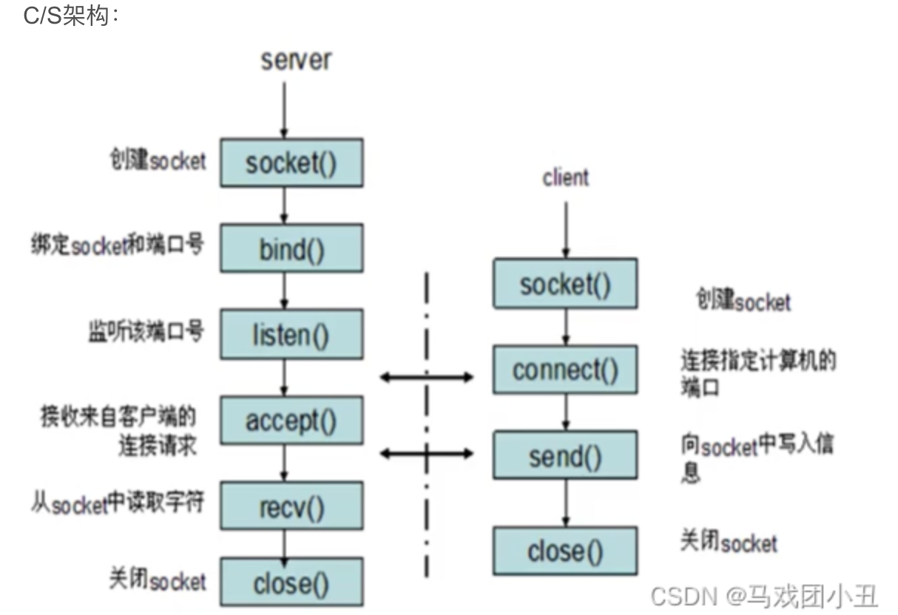
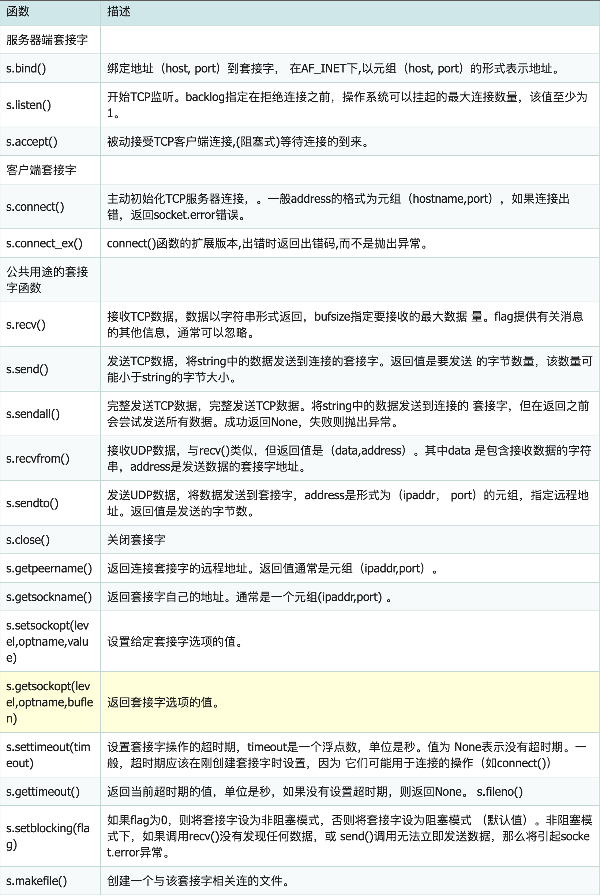

#### socket概念
- socket又称“套接字”，应用程序通常通过“套接字”向网络发出请求或者应答请求。使主机间或者一台计算机上的进程间可以通讯。



#### socket基本用法
- Python 中，使用socket()函数来创建套接字，语法格式如下:
```python
import socket
socket.socket(family, type)
```

- 函数socket.socket创建一个socket套接字，该函数带有两个参数：
  - 参数⼀：family(地址簇)，可供选择的有socket.AF_INET(默认) 为IPv4，socket.AF_INET6,为IPv6，还有socket.AF_UNIX，为UNIX域协议族，只能够⽤于单⼀的Unix系统进程间通信
  - 参数⼆：type（socket类型），如socket.SOCK_STREAM为TCP(默认)，SOCK_DGRAM为UDP

- 服务器端套接字函数
  - s.bind()绑定地址(host,port)到套接字（传入的参数为元组）
  - s.listen()开始tcp监听
  - s.accept()被动接收tcp客户端链接
- 客户端套接字函数
  - s.connect() 主动初始化tcp服务器链接
  - s.connect_ex()上个函数的扩展版本，出错返回错误码而不是报异常

- 创建tcp套接字
```python
import socket 
# 创建tcp的套接字 
s = socket.socket(socket.AF_INET, socket.SOCK_STREAM)
# ...这⾥是使⽤套接字的功能（省略）... 
# 关闭套接字
s.close()
```

- 创建udp套接字
```python
import socket  
# 创建udp的套接字 
s = socket.socket(socket.AF_INET, socket.SOCK_DGRAM) 
# ...这⾥是使⽤套接字的功能（省略）... 
# 不⽤的时候，关闭套接字 
s.close()
```

#### socket内建方法



#### 编写简单的客户端和服务器
- 服务端：
```python
#!/usr/bin/env python
#--*-- coding:utf-8 --*--

import socket #导入socket模块
s = socket.socket(socket.AF_INET,socket.SOCK_STREAM) #创建套接字
#host = socket.gethostname() #获取本地主机名
host = '0.0.0.0'  #设置绑定地址为xx.xx.xx.xx
port = 8888 #设置绑定端口
s.bind((host, port))    #绑定主机地址与监听端口
s.listen(5) #开始监听，并且设置最大连接数为5

while True:
    client, addr = s.accept() #接受到客户端的连接请求，建立连接
    print ('connect from:',addr) #打印客户端的地址
    client.send('welcome to lgj'.encode()) #向客户端发送数据
    client.close() #关闭连接，必须操作
```

- 客户端:
```python
#!/usr/bin/python
# encoding:utf-8

import socket
c = socket.socket(socket.AF_INET,socket.SOCK_STREAM)
server_host = '127.0.0.1'
server_port = 8888
c.connect((server_host,server_port))
print (c.recv(1024).decode())
c.close()
```

#### 编写端口扫描
- 所谓端口扫描，就是对指定服务器地址的指定端口进行扫描，通过扫描结果就可以知道一台计算机上都开放了哪些端口，如果你懂一些漏洞知识或者黑客攻击的话，就可以通过开放端口进行攻击，甚至有些很厉害的黑客，通过一个不起眼的端口，就能造成整个局域网内所有的主机沦陷。当然，我们学习的目的，不是为了攻击。
- 端口扫描的原理：向远端指定服务器的某一个端口提出建立一个连接的请求，如果对方有此项服务，就会应答，如果对方没有此项服务时，对方就无应答。利用这个原理，我们可以指定一些端口，然后针对这些接口分别建立连接，并获取对方是否应答，便可知道对方哪些端口是开放的。
- socket.connect_ex((ip, port))，调用该函数对指定ip和端口发出连接请求，如果返回0则证明该端口是开放的，返回错误代码说明该接口是不开放的。

- 判断端口是否开放。直接请求该端口，connect_ex请求错误时会返回ture

```python
#!/usr/bin/python
# encoding:utf-8

import socket
c=socket.socket(socket.AF_INET,socket.SOCK_STREAM)
host = '127.0.0.1'
port = 80
if c.connect_ex((host,port)) == 0:
	(print "%s:%d is open" % (host,port))
c.close()
```

- 一个socket对应一个connect，上述代码如果检测到一个端口开放就不会继续扫描，因为已经connect上了。所以创建套接字也要放入循环中
```python
#!/usr/bin/python
# encoding:utf-8

import socket
import sys
host = sys.argv[1] #接收命令行后的第二个参数，用空格分离


for port in range(1,65536):
	c = socket.socket(socket.AF_INET,socket.SOCK_STREAM)
	if c.connect_ex((host,port)) == 0:
		print ("%s:%d is open" % (host,port))
	c.close()
```

- 现在就是65535个端口全扫啦，下面加入多线程
```python
#!/usr/bin/python
# encoding:utf-8

import socket
import sys
import threading
import queue

def scan():
	while not q.empty():
		port = q.get()
		c = socket.socket(socket.AF_INET,socket.SOCK_STREAM)
		if c.connect_ex((host,port)) == 0:
			print ("%s:%d is open" % (host,port))
		c.close()

if __name__=="__main__":
	host = sys.argv[1]
	thread_num = sys.argv[2]
	q = queue.Queue()
	for port in range(1,65536):
		q.put(port)
	
	for i in range(int(thread_num)):
		t = threading.Thread(target=scan)
		t.start()
		t.join()#子线程全部运行完了结束进程，以免线程卡死

```

#### python中if name == ‘main’的作用
- 在Python中，if __name__ == "__main__" 是一个常见的约定，用于确定Python脚本是作为主程序运行还是作为模块被导入到其他程序中。它的主要作用是允许您编写一个可重用的模块，同时也可以将其作为独立的脚本执行，这在开发中非常有用。
- 让我举一个例子来说明其作用。假设您有一个名为 example.py 的Python脚本，其中包含以下内容：
```python
def add(a, b):
    return a + b

if __name__ == "__main__":
    result = add(5, 3)
    print("The result is:", result)
```

- 在这个例子中，有两部分代码：
  - def add(a, b): 定义了一个函数 add，用于将两个数字相加。
  - if __name__ == "__main__": 是一个条件语句，检查当前脚本是否作为主程序执行。如果脚本是主程序执行，它将执行 if 语句块中的代码，否则，如果脚本被导入到其他脚本中，if 语句块中的代码将不会执行。
- 当您运行 example.py 作为主程序时，它会执行 if __name__ == "__main__": 语句块内的代码，这将计算两个数字的和并打印结果：
```python
$ python example.py
The result is: 8
```
- 但如果您将 example.py 作为模块导入到另一个脚本中，if __name__ == "__main__": 语句块内的代码将不会执行，这允许您在其他脚本中使用 add 函数而不执行脚本的主要操作。
- 这种做法有助于使Python脚本更加模块化和可重用，同时还提供了一种在需要时执行特定代码块的灵活方式。

