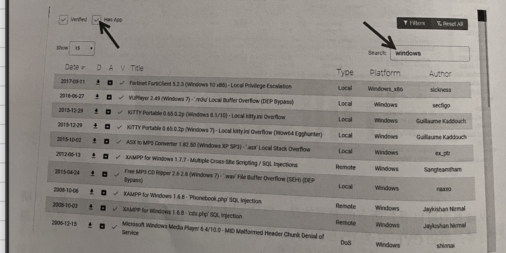
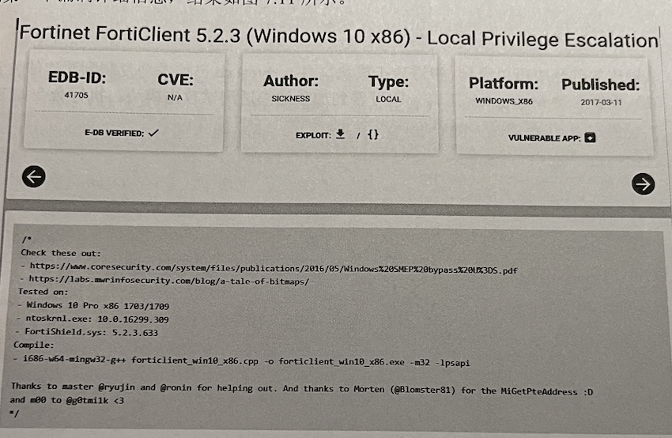

## 漏洞扫描原理
- 漏洞扫描主要通过以下两种方法来检查目标主机是否存在漏洞：
  - 基于漏洞库的特征匹配：通过端口扫描得知目标主机开启的端口以及端口上的网络服务后，将这些相关信息与网络漏洞扫描系统提倛的漏洞库进行匹配，查看是否有满足匹配条件的漏洞存在；
  - 基于模拟攻击：通过模拟黑客的攻击手段，编写攻击模块，对目标主机系统进行攻击性的安全漏洞扫描，如测试弱势口令等，若模拟攻击成功，则表明目标主机系统存在安全漏洞。

## 漏洞扫描一一分类和实现方法
- 基于网络系统漏洞库，漏洞扫描大体包括CGI漏洞扫描、POP3漏洞扫描、FTP漏洞扫描、SSH漏洞扫描、HTTP漏洞扫描等。这些漏洞扫描是基于漏洞库，将扫描结果与漏洞库相关数据匹配比较得到漏洞信息；
- 漏洞扫描还包括没有相应漏洞库的各种扫描，比如Unicode遍历目录漏洞探测、FTP弱势密码探测、OPENRelay邮件转发漏洞探测等，这些扫描通过使用插件 （功能模块技术）进行模拟攻击，测试出目标主机的漏洞信息。

#### 基于漏洞库的规则匹配
- 基于网络系统漏洞库的漏洞扫描的关键部分就是它所使用的漏洞库。通过采用基于规则的匹配技术，即根据安全专家对网络系统安全漏洞、黑客攻击案例的分析和系统管理员对网络系统安全配置的实际经验，可以形成一套标淮的网络系统漏洞库，然后再在此基础之上构成相应的匹配规则，由扫描程序自动的进行漏洞扫描的工作。
- 漏洞库信息的完整性和有效性决定了漏洞扫描系统的性能，漏洞库的修订和更新的性能曲会影响漏洞扫描系统运行的时间。因此，漏洞库的编制不仅要对每个存在安全隐患的网络服务建立对应的漏洞库文件，而且应当能满足前面所提出的性能要求。

#### 基于模拟攻击
- 将模拟攻击的模块做成插件的形式，插件是由脚本语言编写的子程序，扫描程序可以通过调用它来执行漏洞扫描，检测出系统中存在的一个或多个漏洞。添加新的插件就可以使漏洞扫描软件增加新的功能，扫描出更多的漏洞。插件编写规范化后，甚至用户自己都可以用perl、c或自行设计的脚本语言编写的插件来扩充漏洞扫描软件的功能。
- 这种技术使漏洞扫描软件的升级维护变得相对简单，而专用脚本语言的使用也简化了编写新插件的编程工作，使漏洞扫描软件具有强的扩展性。

## 常用扫描工具
- Nessus（收费）
- OpenVas(开源)
- 第三方网站查找

### 通过三方网站查找漏洞
- 如果用户在Metasploit中找不到有效的渗透测试模块时。还可以从第三方网站查。如CVE漏洞站和exploitDB等。另外，Measploit 还支特导入第三方模块，并实施渗透测试。
## 1.通过CVE漏洞网站查找
  - CVE漏洞网站的地址为https:/www.cvedetails.com/。在搜索框中输入 Microsoft，然后单击Search按钮，即可显示搜索结果
     - 从该界面可以看到搜索到的 Microsoft 相关统计信息。此时，选择 Vulnerabilities (6328)选项，即可显示漏洞的详细信息
     - 从该界面可以看到所有的漏洞信息，包括 CVE ID、漏洞类型、发布日期、更新日期及评分等。
## 2.通过exploitDB漏洞网站查找
  - exploitDB 漏洞网站的地址为https://www.exploit-db.com
    - 在该界面输入攻击载荷的一些关键宇，即可搜索到对应的渗透测试模块。在搜索时，用户还可以选择 Verifred 和 Has App 复选框，过滤已验证过和容易攻击的应用程序渗透测试模块。例如，搜索 Windows 系统的渗透测试模块

    

    - 在输出的信息中包括8列，分別表示 Date（发布日期）、D（下载渗透攻击载荷〉、A（可利用的应用程序）、V（己被验证）、Title（漏洞标题）、Type（类型）、Platform（平合）和Author（作者）。这里，用户可以选择下载及查看漏洞的详细信息。如果想要下载该渗透测试模块，则单击D列的下载按钮，如果想要想要查看该漏洞的详细信息，单击其漏洞标题名称即可。例如，查看该界面显示的第一个漏洞详细信息。
    
    
