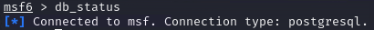
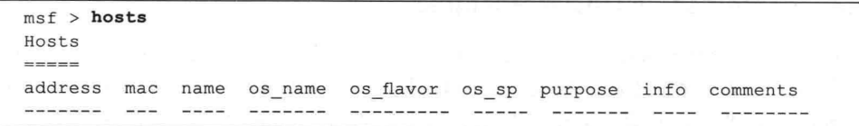
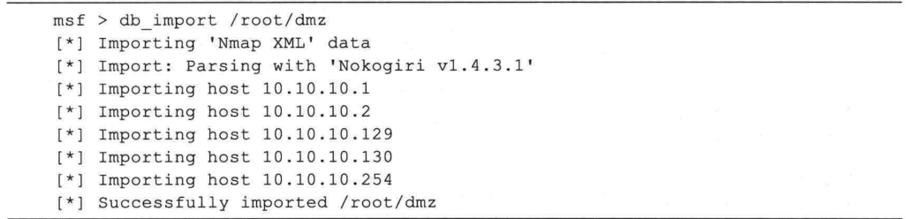

## 概述
- 在针对本实验环境的信息搜集过程中，已经得到了各种类型数量众多的探测和扫描结果，你已经开始犯愁了：这么多的信息，我怎样才能把它们整理好并保存起来?最后怎么体现在要提交的渗透测试报告中呢？
- 你的担忧真的很有必要，因为在渗透测试中无论是你孤身一人还是团队作战，都应该将每个步骤获取的信息很好地保存下来，需要在后续工作中参考这些数据，还可能与队友分享它们，而且在最后撰写渗透测试报告时也离不开它们。
- 如果你在信息搜集过程中完整记录每一步操作的结果，并按照逻辑清晰地分类并将它们保存下来，那么渗透测试小组中其他有经验的成员能够在你工作的基础上顺利地将工作
继续下去；相反，如果没有很好地记录这些信息，那么后续的工作可能会一团糟。
- Metasploit 为你考虑到这一点，它支持使用数据库保存渗透测试过程中获取的各种数据,我们把这个数据库称为渗透测试信息数据库。在最新的 Metasploit ，提供了多种工具的数据库集成方案和数据导人接口，可以方便地使用这些功能将信息搜集的结果保存在Metasploit 的数据库中。 

### 使用渗透测试信息数据库的优势
- 使用渗透测试信息数据库比其他记录方式具有至少以下两种好处。
- 首先是使用方便。Metasploit 中的大量模块都使用了数据库接口，结果能够自动存人数据库中。Metasploit 提供了 db_nmap 命令，它能够将 Nmap 扫描结果直接存人数据库中，此外还提供db_import 命令，支特多达近 20 种扫描器扫描结果的导人。
- 其次是支持网络共享。Metasploit 支持通过 MSF RPC 服务共享数据，也支持通过网络数据库共享数据。使用共享的数据库可以保证在渗透测试过程中每个小组成员使用的Metasploit 数据是实时同步的。

### 使用PostgreSQL数据库，初始化Metasploit

- 在Kali Linux-中Metasploit主要使用PosteresQL数据库存储数据,其中包括:
  - 漏洞和漏洞利用模块：Metasploit 包含大量的漏洞信息和漏洞利用模块。这些模块描述了各种不同软件、服务和系统中存在的已知安全漏洞。PostgreSQL 负责存储这些模块的元数据、漏洞描述、利用代码等信息。
  - 会话数据：当成功利用漏洞并获取对目标系统的控制权后，Metasploit 会创建会话，其中包含与受攻击系统的连接。这些会话数据包括从目标系统收集的信息、权限级别等，都会被保存在 PostgreSQL 数据库中。
  - 扫描和信息收集数据：Metasploit 还提供了扫描器和信息收集工具，用于收集有关目标系统的信息。这些数据也会被存储在 PostgreSQL 数据库中。
  - 模块选项和参数：Metasploit 模块通常包含可配置的选项和参数。例如，对于一个特定的漏洞利用模块，用户可能需要指定目标主机的 IP 地址、目标端口、Payload 等。这些用户自定义的选项值也会被保存在数据库中。
- 初始化步骤 
```shell
#启动Postgresql数据库
root@Kali:~# systemctl start postgresql

#使用msftdb init 命令创建和初始化数据库。
root@Kali:~# msfdb init

#如果当前系统已经初始化 Metasploit， 将会列出下面的提示：
Metasploit running on Kali Linux as root,using system database appears to be already configured, skipping initialization
```
- 运行 msfconsole 时，kali 中的Metasploit 会创建名称为 msf 的 PostgresQL 数据库，并生成保存渗透测试数据所需的数据表，然后使用名称为 msf的用户，自动连接到 msf 数据库。启动msfconsole 后，可以输人 db_status 命令，查看数据库的连接状态。
- 如果出现如下输出消息，那么说明数据库连接是正常的:

  

- 每次msfeonsole 启动时，会自动连接到msf3dev 数据库，如果想要连接到其他数据库，应当使用 db_connect 命令连接到数据库。
- 如果 db_connect 命令中的数据库不存在，那么Metasploit 会自动新建一个数据库，并建立好需要使用的数据表，如果数据库已存在，则不会输出任何信息，直接返回到msf6>的提示界面。db_connect 命令的基本格式为:```db_connect 用户名：口令回服务器地址：端口/ 数据库名称```

- 连接到数据库后，可以使用```hosts```命令查看数据库是否可以正常使用，具体代码如下:
  

- 使用 ```services``` 命令查看服务列表
- 若要查看有关特定主机或服务的详细信息，可以使用 hosts 或 services 命令的选项:
 - ```hosts -v <主机ID>```
 - ```services -v <服务ID>```

#### Nmap 与渗透测试数据库
- Nmap 能够很好地与 Metasploit 渗透测试数据库集成在一起，可以方便地在 Metasploit 终端中使用 db nmap，如：
```msf6> db_nmap -Pn -sV 10.10.10.0/24```
- 该命令是 Nmap 的一个封装，与Nmap 使用方法完全一致，不同的是其执行结果将自动输人到数据库中。
- 也可以将 Nmap 扫描结果导出为一个输出文件，并导人渗透测试数据库中。使用方法很简单，只需要在 Nmap 命令中加人-oX 参数，如：
```msf6> nmap -Pn -sV -oX dmz 10.10.10.0/24```
- 扫描结束后，在当前目录下将生成名称为 dmz 的扫描结果文件，可以在 MSF 终端中使用 db_import 命令将扫描结果导人数据库中，配置如下所示。

  

