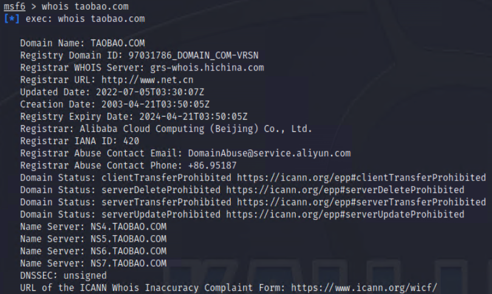
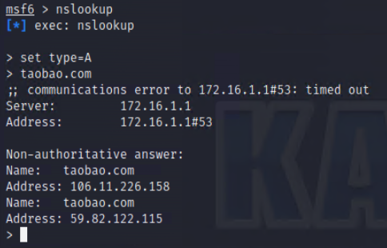
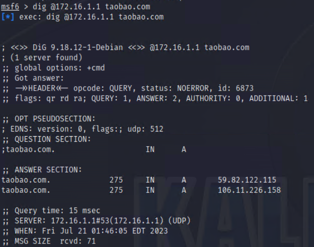

#### DNS（域名系统)
- 它的功能是将难记的互联网 IP 地址转成好记的具有一定含义的名字，而且能够将互联网上或企业内部的服务器等资产清晰地按层次组织起来，如www.taobao.com 等。


#### DNS查询
- 如果渗透测试任务书中所有关于测试目标的信息只有一个域名或者，那么可以使用指令来进行域名信息的查询。
- 1.whois 域名注册信息查询
  - whois 是一个用来查询域名注册信息数据库的工具，一般的域名注册信息会包含域名所有者、服务商、管理员邮件地址、域名注册日期和过期日期等，这些信息往往是非常有价值的。可以直接通过在 MSF 终端中使用 whois 命令对域名注册信息进行查询，下面对taobao.com 进行一次查询，如代码如下所示。
  

- 2.DMitry 信息收集工具
  - DMitry 是一个一体化的信息收集工具。使用该工具可以收集WHOIS主机IP和域名信息、子域名、域名中包含的邮件地址等。其中，用于获取 WHOIS 信息的语法格式如下：
   ```shell
   dmitry -w baidu.com
   #对指定的域名实施WHOIS查询。
   ```

- 3.nslookup 与 dig 域名查询
  - nslookup 与 dig 两个工具功能上类似，都可以查询指定域名所对应的IP地址，所不同的是dig 工具可以从该域名的官方 DNS 服务器上查询到精确的权威解答，而 nslookup 只会得到 DNS 解析服务器保存在 Cache 中的非权威解答。
  - 下面显示了在 Kali 中使用nslookup 工具对 taobao.com 进行查询的结果。
  
  - 使用 set type=A 可以对其 IP 地址进行解析，查询结果显示 taobao.com 域名被解析至106.11.226.158 和 59.82.122.115 这两个IP地址。还可以使用set type=MX 来查找其邮件转发 (Mail Exchange)服务器。有些 DNS 服务器开放了区域传送，可以在nslookup 中使用 ls -d example.com 命令来查看其所有的 DNS 记录，这些信息往往会暴露大量网络的内部拓扑信。
  - 下面使用dig工具对taobao.com进行查询
   - dig 命令的使用更为灵活，比如可以在 dig 中指定使用哪台 DNS 解析服务器进行查询，同时采用dig 命令将会触发 DNS 解析服务器向官方权威 DNS 服务器进行一次递归查询，以获得权威解答。其基本的使用方法为：
   
   ```shell
   dig @<DNS 服务器＞＜待查询的域名＞
   ```
   
   - 可以在待查询域名后面加上A、NS、MX等选项以查找特定类型的 DNS 记录（默认为A)。而对于一些采用了分布式服务器和CDN 技术的大型网站，使用nslookup 查询到的结果往往会和 dig 命令查询到的权威解答不一样，在不同网络位置进行查询将有助于你发现这些大型网站所使用的 IP 地址列表，从而确定所使用的服务器集群范围。下面列出了使用dig命令查询baidu.com的结果。 
  

- 4.使用Dnsenum工具
  - Dnsenum是一款域名信息收集工具，它能够通过谷歌或者字典文件猜测可能存在的域名，以及对一个网段进行反向查询。它可以查询网站的主机地址信息、域名服务器和邮件交换记录等。其中，使用该工具收集域名信息语法格式如下:
    ```shell
    dnsenum -w baidu.com
    ```

- 5.查询子域名
  - 子域名又称为子域(Subdomain），在域名系统等级中，它属于更高一层域的域。例如www.baidu.com和map.baidu.com是baidu.com的两个子域，而baidu.com 则是顶级域.com 的子域。通常情况下，一个子域名会包含主机名。例如，www.baidu.com 域名中,com是顶级域名；baidu.com 是一级域名；www 是主机名，用来标识服务器。所以，baidu.com建立WWW服务器就是www.baidu.com。因此，通过查找子域名的方式，可以发现对应的主机。
  - 使用Dmitry工具
    - Dmitry工具可以用来查找子域名。但是，该工具是通过 Google 搜索引擎来杳找子域名的。所以，对于国内的用户来说，需要使用 VPN 代理来实现（使用此工具需要翻墙）。 
    - 使用Dmitry工具查找子域名的语法格式如下：
    ```shell
    dmitry -s baidu.com -o subdomain
    #-s：实施子域名查询
    #-o：指定保存输出结果的文件
    ```

#### IP地址地理位置查询
- 有些时候，你不仅希望得到目标的IP地址，还希望进一步了解目标所处的地理位置，地理位置的信息可能会暴露关于目标更加私密的信息，比如确定目标主机是某公司资产的一部分还是个人资产等。
- 一些网站提供了 IP 到地理位置的查询服务.比如可以在https://ip.900cha.com网站上查询对应IP地址的地理位置。下面是对taobao.com的IP地址59.82.122.115的结果查询。

- 当然还有一些更加精确的网站可以提供地理位置精度和纬度，比如GeoIP。地址为http://www.maxmind.com。我们可以通过查询到的精纬度参数，利用Google Maps或者百度地图，进行进一步查询。
