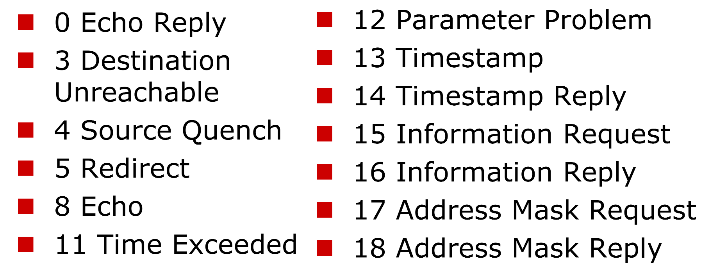

## 扫描技术概述
#### 什么是扫描器
- 扫描器是一种自动检测远程或本地主机安全性弱点的程序。它集成了常用的各种扫描技术，能能自动发送数据包去探测和攻击远端或本地的端口和服务，并自动收集和记录目标主机的反馈信息，从而发现目标主机是否存活、目标网络内所使用的设备类型与软件版本、服务器或主机上各TCP/UDP端口的分配、所开放的服务、所存在的可能被利用的安全漏洞。据此提供一份可靠的安全性分析报告，报告可能存在的脆弱性。

#### 网络扫描器是一把双刃剑
- 安全评估工具
  - 系统管理员保障系统安全的有效工具
- 网络漏洞扫描器
  - 网络入侵者收集信息的重要手段
- 扫描器是一把“双刃剑”

#### 完整扫描步骤:
- 一个完整的扫描分为三个阶段：
  - 第一阶段：发现目标主机或网络
  - 第二阶段：发现目标后进一步搜集目标信息，包括操作系统类型、运行的服务以及服务软件的版本等。如果目标是一个网络，还可以进一步发现该网络的拓扑结构、路由设备以及各主机的信息
  - 第三阶段：根据收集到的信息判断或者进一步测试系统是否存在安全漏洞

- 网络安全扫描技术包括PING担描、操作系统探测、穿透防火墙探测、端口扫描、漏洞扫描等
  - PING扫描用于扫描第一阶段，
  - 识别系统是否活动口OS探测、穿透防火墙探测、端口扫描用于扫描第二阶段
    - OS探测是对目标主机运行的OS进行识别
    - 穿透防火墙探测用于荻取被防火墙保护的网络资料
    - 端口扫描是通过与具标系统的TCP/IP端口连接，并查看该系统处于监听或运行状态的服务
  - 漏洞扫描用于安全扫描第三阶段通常是在端口扫描的基础上，进而检演出目标系统存在的安全漏洞

#### 一个典型的扫描案例

#### 常见的扫描技术
- 主机扫描
- 端口扫描
  - 全扫描
  - 半扫描
  - 秘密扫描
  - 认证(ident)扫描
  - FTP代理扫描
- 远程主机OS指纹识别
- 漏洞扫描

## TCP/IP相关知识
#### TCP报文格式

#### TCP控制位
- URG:
  - 为紧急数据标志。如果它为1，表示本数据包中包含紧急数据。此时紧急数据指针有效。
- ACK:
  - 为确认标志位。如果为1，表示包中的确认号是有效的。否则，包中的确认号无效。
- PSH:
  - PSH（Push）标志位是一个用于控制数据传输的标志位，它的作用是告诉接收端立即将接收到的数据交给应用程序，而不需要等待缓冲区填满或者等待一定数量的数据。PSH标志位通常与TCP的紧急指针字段一起使用，用于在特殊情况下优化数据传输。
- RST:
  - RST（Reset）标志位是用于中断TCP连接的标志位，它的作用是告诉对方立即终止连接，清除连接的状态信息，无需经过正常的连接终止过程。RST标志位通常在以下情况下使用：
    - 连接复位：当某一端意识到连接出现了严重问题，不再想继续通信时，它可以发送一个带有RST标志位的TCP段，以中断连接。这通常是在发生错误或不可恢复的问题时使用的。
    - 拒绝连接：当目标主机收到一个来自远程主机的连接请求（SYN包），但由于某种原因（例如，端口未打开或者访问策略限制）不能接受连接时，它可以发送一个带有RST标志位的TCP段，以拒绝连接请求。这被称为拒绝连接（Connection Refused）。
    - 处理孤儿数据包：有时，网络中可能会存在一些“孤儿”数据包，即在已关闭或不存在的连接上收到的数据包。目标主机可以使用RST标志位来响应这些孤儿数据包，以通知发送端连接已关闭。
- SYN:
  - SYN标志位用来建立连接，让连接双方同步序列号。如果SYN=1而ACK=0，则表示该数据包为连接请求，如果SYN=1而ACK=1则表示接受连接。
- FIN:
  -  表示发送端已经没有数据要求传输了，希望释放连接。

#### TCP通信过程
- 建立TCP连接

- TCP（传输控制协议）的三次握手是建立TCP连接的过程，它确保了通信双方都愿意进行通信并建立了可靠的连接。以下是TCP三次握手的过程：

  - 第一步：客户端发起连接请求
    - 客户端首先向服务器发送一个特殊的TCP报文，这个报文包含了一个用于建立连接的初始序列号（ISN）。
    - 客户端设置SYN标志位（Synchronize），表示要建立连接。
    - 客户端选择一个初始序列号（ISN），通常是一个随机数，用于标识数据流的起始位置。
    - 客户端选择一个初始的序列号后，等待服务器的响应。

  - 第二步：服务器确认连接请求
    - 服务器收到客户端的连接请求报文后，如果愿意接受连接，就会发送一个响应报文。
    - 服务器设置SYN和ACK标志位，表示同意建立连接，并确认客户端的初始序列号。
    - 服务器也会选择一个自己的初始序列号，作为响应中的序列号字段。
    - 服务器发送完响应后，就进入了ESTABLISHED（已建立连接）状态，等待客户端的确认。

  - 第三步：客户端确认连接请求
    - 客户端收到服务器的响应后，也要发送一个确认报文给服务器。
    - 客户端设置ACK标志位，并将序列号字段设置为服务器的初始序列号加1（表示已收到服务器的数据，下一次发送的数据从这个序号开始）。
    - 这个确认报文告诉服务器，客户端已经接受了服务器的响应，连接建立成功。

- 此时，客户端和服务器都进入ESTABLISHED状态，可以开始进行数据传输。完成了这个三次握手过程后，TCP连接就建立成功，双方可以安全地传输数据。这个过程的关键点是确保客户端和服务器都同意建立连接并且彼此已知对方的序列号，以便后续的数据传输能够按照正确的顺序进行。如果有一个步骤失败或超时，连接建立就会失败，需要重新尝试建立连接。三次握手的过程保证了连接的可靠性和完整性。

 
 
 

- 断开TCP连接

- TCP（传输控制协议）的四次挥手是用于终止一个已建立的TCP连接的过程。在通信结束时，客户端和服务器都需要执行四次挥手来确保数据的完整性和可靠性。以下是TCP四次挥手的过程：

  - 第一步：客户端发起关闭请求
    - 客户端首先决定要关闭连接，它发送一个带有FIN（Finish）标志位的TCP报文给服务器。
    - FIN标志位表示客户端已经没有数据要发送了，但仍愿意接受来自服务器的数据。
    - 客户端继续等待服务器的确认。

  - 第二步：服务器确认关闭请求
    - 服务器收到客户端的FIN报文后，会向客户端发送一个带有ACK（Acknowledge）标志位的确认报文。
    - 这个ACK报文表示服务器已经收到了客户端的关闭请求，但是还没有准备好关闭自己的连接，因为可能还有数据要发送。
    - 服务器进入了半关闭状态，它不再接受来自客户端的新数据，但仍然可以向客户端发送数据。
    
  - 第三步：服务器关闭数据传输
    - 如果服务器已经没有数据要发送，它会发送一个带有FIN标志位的报文给客户端。
    - 这个FIN报文告诉客户端，服务器已经完成了数据的发送，现在也准备关闭连接。
    - 服务器进入了等待客户端确认的状态。

  - 第四步：客户端确认关闭数据传输
    - 客户端收到服务器发送的FIN报文后，会发送一个带有ACK标志位的确认报文给服务器。
    - 这个ACK报文表示客户端已经接受了服务器的关闭请求，连接将被终止。
    - 客户端和服务器都进入了CLOSED（已关闭）状态，连接完全终止。

- 完成了这个四次挥手过程后，TCP连接就被彻底关闭了。这个过程确保了双方在终止连接时都有机会完成未完成的数据传输，从而保证了数据的完整性和可靠性。需要注意的是，在第二步和第三步之间，服务器可能仍然需要一些时间来处理未发送完的数据，因此挥手过程中可能会有一些延迟。这种四次挥手的方式保证了连接的优雅终止。

## ICMP协议相关知识

#### ICMP协议
- Internet Control Message Protocol 是IP的一部分，在IP协议栈中必领实现。
- 用途:
  - 网关或者目标机器利用ICMP与源通讯
  - 当出现问题时，提供反馈信息用于报告错误
- 特点:
  - 其控制能力并不用于保证传输的可靠性
  - 它本身也不是可靠传输的
  - 并不用来反映ICMP报文的传输情况

#### ICMP报文类型

