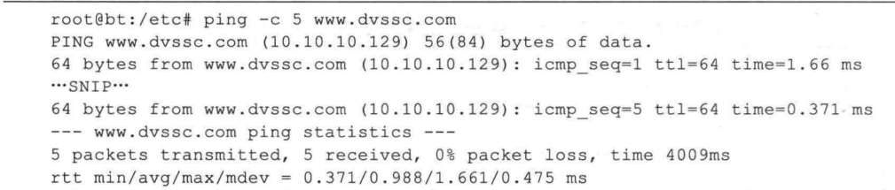

#### 发现主机
  - 发现主机用来探测哪些主机是活动的，进而获取主机的信息。用户可以使用主动扫描的方式发现主机，也可以采用被动监听的方式发现主机跃是网络管理员最常做的一件事，不过作为网络管理员，一般只需要使用 ICMP Ping 进行探测就能够满足需求，但是作为一名渗透测试者，对你的要求就会更高一些。通常网络上会有很多已关闭电源的主机或空闲（没有主机使用）的1段，需要首先从大范围的 IP 地址段中寻找出活跃的主机，然后进一步筛选出你感兴趣的目标主机。
  - 除了使用 Ping 命令，也可以使用 Metasploit 中的主机发现辅助模块，或是老牌的网络探测分析软件 Nmap，下面逐一进行介绍。

- 1.ICMP PING命令
  - Ping (Packet Internet Grope， 因特网包探素器）是一个用于测试网络连接的程序，由于它在网络管理维护工作中使用频率非常高，几乎所有操作系统都集成了这个程序。Ping 程序会发送一个ICMP echo 请求消息给目的主机，并报告应答情况，如果 Ping 后面跟的是域名，那么它首先会尝试将域名解析，然后向解析得到的 IP 地址发送数据包。本实验环境中，我们可以通过nslookup指令在Kali攻击上获取 www.czlgj.com 的 IP 地址为 172.16.10.102，我们可以使用ping命令来测试主机连通性。

  


### 1.确定网络范围
- 了解需要探测的主机所在的IP段，遵循IP地址规则
### 2.确定拓扑
- 在渗透时需要确定所要攻击的目标是内网还是外网，使用traceroute工具来进行目标网段追踪

#### 扫描主机
##### 使用Nmap工具
- 使用如下命令探测主机是否存在
```shell
#探测一个网段
nmap -sP 192.168.107.0/24 
#探测一台主机
nmap -sP 192.168.107.10
```
##### Netdiscover
- Netdiscover 是一个支持主动和被动两种模式的ARP侦查工具。使用该工具可以在网络上扫描IP地址，检查在线主机。
  - 语法格式如下：
  `netdiscover -r [range]`
- 以上语法中的选项 -r [range]用来指定扫描的网络范围。如果用户没有指定目标，将自动选择目标网络实施扫描

- 使用 Netdiscover 工具扫描 192.168.1.0/24网段内在线主机,执行命令如下：
  
  
  
  - 在以上输出信息中共显示了5列，分别是IP（IP地址）、At MAC Address (MAC 地址）、Count（包数）、Len（长度）、MAC Vendor/Fostname （MAC 地址生产厂商/主机名）。通过分析捕获到的包，可以知道当前局域网中活动的主机IP 地址、MAC 地址及 MAC地址的生产厂商等。从1列可以看到在线主机的地址。其中，在线的主机地址为 192.168.1.1、192.168.1.3 和 192.168.1.43。而且，在输出信息的左上角可以看到，当前的扫描状态为Finished， 即扫描完成。此时，按 Ctrl+C 组合键即可退出 Netdiscover 工具的扫描界面。用户也可以不指定扫描范围，尽可能地发现多个在线主机。执行命令如下：
  
  
  
  - 从输出的信息可以看出扫描到的活动主机。在输出信息的左上角可以看到，目前正在扫描 192.168.171.0/16网段的主机。
 
#### 监听发现主机
- 监听就是不主动向目标发送数据包，仅监听网络中的数据包。在局域网中，一些协议将自动广播数据包，如 ARP 广播和 DHCP 广播。而广播包是局域网中的所有用户都可以接收到的数据包。因此，用户通过对这些数据包进行监听，可以探测网络中活动的主机。
##### ARP监听
  - ARP (Address Resolution Protocol， 地址解析协议）是根据IP地址获取物理地址的一个TCP/IP协议。主机发送信息时，将包含目标 IP 地址的ARP请求广播到网络上的所有主机，并接收返回消息，以此确定目标的物理地址。所以，通过实施 ARP 监听，即可发现局域网中活动的主机。下面将介绍使用 Neidiscover 工具的被动模式实施 ARP 监听，以此来发现在线主机。其中，Netdiscover 工具实施被动扫描的语法格式如下：
    ```shell
    netdiscover -p
    ```
  - 执行以上命令后，将显示如下信息：
  
  
  
  - 从输出的第1行信息中，可以看到正在使用被动模式 (passive）实施扫描。从第2行信息中，可以看到嗅探到的包数、主机数及包大小。第3行以下的信息，则是嗅探到的包信息。从IP列可以看到探测到的在线主机。其中，在线的主机地址分别是192.168.1.1、192.168.1.3、192.168.1.43
##### DHCP监听
 - DHCP (Dynamic Host Configuration Protocol，动态主机配置协议）是一个局域网的网络协议，其主要作用是实现内部网或网络服务供应商自动分配IP地址。当一个客户端需要获取一个 IP 地址时，将会发送广播包。然后，收到请求的 DHCP 服务器会提供一个可用的IP地址给客户端。所以，用户可以实施 DHCP 监听来判断网络中的在线主机。下面将介绍通过 Nmap 的 broadcast-dhcp-discover 脚本实施 DHCP 监听来发现主机。Nmap的broadcast-dhcp-discover 脚本能够用来发送一个 DHCP Discover 广播包，并显示响应包的具体信息。通过对响应包的信息进行分析，能够找到可分配的卫 地址。其中，使用该脚本实施被动扫描的语法格式如下：
  ```shell
  nmap --scirpt broadcast-dhcp-discover
  ```
#### 域名分析
- 域名（Domain Name）是由一串用点分隔的名字，用来表示Internet上某一台计算机或计算机组名称。它可以在数据传输时标识计算机的方位。通常情况下，外网的主机都是使用域名来标识的。如果要对外网的主机实施渗透测试，则需要对域名进行分析，以获取该域名的详细信息，如域名所有者信息、子域名、服务器地址等。
- 域名基础信息
  - 当一个域名注册完成后，包含的基本信息，如域名是否己经被注册、域名注册商、域名所有者等。通过查看域名的WHOIS信息，即可获取到该域名的基础信息。下面将介绍
##### 域名的基础信息
- 1. 使用WHOIS工具
   - WHOIS 工具是用来查找并显示指定账号（或域名）的用户相关信息。其中，使用该工具查询域名信息的语法格式如下：
    ```shell
    whois baidu.com
    ```
  - 2.DMitry 是一个一体化的信息收集工具。使用该工具可以收集WHOIS主机IP和域名信息、子域名、域名中包含的邮件地址等。其中，用于获取 WHOIS 信息的语法格式如下：
   ```shell
   dmitry -w baidu.com
   #对指定的域名实施WHOIS查询。
   ```
##### 查询子域名
- 子域名又称为子域(Subdomain），在域名系统等级中，它属于更高一层域的域。例如www.baidu.com和map.baidu.com是baidu.com的两个子域，而baidu.com 则是顶级域.com 的子域。通常情况下，一个子域名会包含主机名。例如，www.baidu.com 域名中,com是顶级域名；baidu.com 是一级域名；www 是主机名，用来标识服务器。所以，baidu.com建立WWW服务器就是www.baidu.com。因此，通过查找子域名的方式，可以发现对应的主机。
  - 1.使用Dmitry工具
    - Dmitry工具可以用来查找子域名。但是，该工具是通过 Google 搜索引擎来杳找子域名的。所以，对于国内的用户来说，需要使用 VPN 代理来实现。否则，将会出现网络连接错误的提示。如下：
    
     
    
    - 使用Dmitry工具查找子域名的语法格式如下：
    ```shell
    dmitry -s baidu.com -o subdomain
    #-s：实施子域名查询
    #-o：指定保存输出结果的文件
    ```
  - 2.在线查询
  - 通过以下网站查询子域名:
    - https://phpinfo.me
##### 发现服务器
- 域名虽然方便人们记忆，但是网络中的计算机之间只能互相认识IP地址。所以，就需要根据域名查询对应的主机。在域名服务器中，通过域名记录来标识不同的主机，如A记录、MX 记录、NS 记录等。其中，A记录表示一台主机；MX记录表示邮件服务器;NS表示DNS服务器。其中，每个域名记录都包含一个IP地址。用户通过探测域名服务器，可以确定域名对应的IP地址。下面将介绍发现服务器的方法。
  - 1. 使用Dnsenum工具
    - Dnsenum是一款域名信息收集工具，它能够通过谷歌或者字典文件猜测可能存在的域名，以及对一个网段进行反向查询。它可以查询网站的主机地址信息、域名服务器和邮件交换记录等。其中，使用该工具收集域名信息语法格式如下:
    ```shell
    dnsenum -w baidu.com
    ```
  - 2. 使用Nslookup工具
    - Nslookup是由微软发布的用于对DNS服务器进行检测和排错的命令工具。该工具可以用来查询DNS记录，验证域名解析是否正常。在发生网络故障的时候，该工具还可以用来诊断网络问题。通过实施域名解析，可以获取对应服务器的IP地址。其中，该工具的语法格式如下：
    ```shell
    nslookup www.baidu.com
    ```
    - 使用Nslookup实施域名查询时，默认查询的是A记录。用户还可以在交互模式，使用set type=value指定查询的域名记录值。其中，指定的域名记录值可以是 A、NS、Mx、CNAME 和PTR等。使用 Nslookup 获取域名 baidu.com 的 NS 名字服务器记录，操作如下：
    ```shell
    #(1）启动Nslookup 工具进入交互模式。执行命令如下：
    root@edaxueba: ~# nslookup
    >
    #看到命令行提示符显示为>，则表示成功进入了Nslookup的交互模式。
    #(2）设置查询的类型为NS记录。执行命令如下：
    > set type=ns
    #（3）输入要查询的域名。执行命令如下：
    > baidu.com
    ```

#### 扫描端口
通过扫描端口，可以发现目标主机中运行的程序。然后，再对这些程序进行信息收集，以获取其漏洞信息，并实施渗透测试。
##### 端口简介
- 在计算机中，“端口”的英文是Port。在网络技术中，端口有好几种意思。这里所指的端口不是物理意义上的端口，而是特指TCP/IP协议中的端口。它是逻辑意义上的端口。在TCP/IP协议中，最常用的协议是TCP和UDP协议。由于TCP和UDP两个协议是独立的，因此各自的端口号也相互独立。例如，TCP有235端口，UDP也可以有235 端口，两者并不冲突。下面将介绍端口的作用及常用的端口。
- 1.端口的作用
  - 用户都知道一台主机对应一个IP地址，可以提供多个服务，如web服务和FTP服务等。如果只有一个IP地址，是无法区分不同的网络服务，所以使用“IP+端口号”来区分不同的服务。
- 2.端口的定义
  - 端口号是标识主机内唯一的一个进程，“IP+端口号”就可以标识网络中的唯一进程。在网络开发的Socket编程中，IP+端口号就是套接字。端口号是由16位二进制数字编号，范围是0~65535。但是，这些端口并不是可以随便使用的，一些端口己经被占用。例如，Web服务器的端口为80，FTP服务的端口为21等。所以，端口被进行了分类，并规定了用户可以使用的端口范围。
- 3.端口的分类
  - 端口的分类方法很多，这里将按照是服务端使用还是客户端使用进行分类。其中，服务端使用的端口号又可以分为预留端口号和注册端口号。如下：
    - 预留端口号：该类端口的取值范围为 0-1023。其中，这些端口在用户编程的时候不能使用，是一些程序固定使用的。只有超级用户权限的应用才允许被分配一个预留端口号。例如，www服务默认端口为80，FTP 服务默认端口为21等。不过，用户也可以为这些网络服务指定其他端口号。但是有些系统协议使用固定的端口号，是不能被改变的。例如，139端口专门用于NetBIOS与TCP/IP之间的通信，不能被手动改变。
     - 注册端口号：该类端口的范围为 1024-49151，就是用户平时编写服务器使用的端口号范围。这些端口在没有被服务器资源占用的时候，也可以供用户端动态选用。客户端使用的端口号又叫临时端口号，取值范围为49152-65535。其中，这部分是客户端进程运行时动态选择的范围。
- 4.常用端口
  - 在前面提到，一些网络服务的端口都是固定的，所以将列出一些常见的 TCP/IP端口:
  
  

##### 端口扫描
- 当用户对端口的概念了解清楚后，就可以实施端口扫描了。
- 1. 使用Nmap工具
  - 使用 Nmap工具实施端口扫描，可以识别6种端口状态，分别是open(开放的）、closed(关闭的）、filtered（被过滤的）、unfiltered（未被过滤的）、open/filtered（开放或者被过滤的）和closed/filtered（关闭或者被过滤的）。如果要使用 Nmap 工具实施端口扫描则需要了解每个端口状态的含义。
    - open（开放的）：应用程序正在该端口接收TCP 连接或者 UDP 报文。安全意识强的人们知道，每个开放的端口都是攻击的入口。攻击者或者入侵测试者想要发现开放的端口，而管理员则试图关闭它们或者用防火墙保护它们以免妨碍合法用户使用。非安全扫描可能对开放的端口也感兴趣，因为它们显示了网络上哪些服务可供使用。
    - closed（关闭的）：关闭的端口对于 Nmap 也是可访问的（它接收 Nmap 的探测报文并作出响应），但没有应用程序在其上监听。它们可以显示该IP地址（主机发现或者ping扫描）的主机正在运行，也对部分操作系统的探测有所帮助。因为关闭的端口是可访问的，也许过一会儿有一些端口又开放了。系统管理员可能会用防火墙封锁这样的端口。这样，它们就会被显示为被过滤的状态。
    - filtered（被过滤的）：由于包过滤阻止探测报文到达端口，Nmap 无法确定该端口是否开放。过滤可能来自专业的防火墙设备、路由器规则或者主机上的软件防火墙。有时候它们响应ICMP错误消息，如类型3代码13（无法到达目标:通信被管理员禁止），但更普遍的是过滤器只是丢弃探测帧，不做任何响应。Nmap 会重试若干次，检测探测包是否是由于网络阻塞而丢弃的。这会导致扫描速度明显变慢。
    - unfiltered（未被过滤的）：未被过滤状态意味着端口可访问，但Nmap不能确定它是开放还是关闭。用户只有通过映射防火墙规则集的ACK扫描，才会把端口分类到这种状态。使用其他类型的扫描（如窗口扫描、SYN扫描或者FIN 扫描来扫描未被过滤的端口，可以帮助确定端口是否开放。
    - open/filtered开放或者被过滤的）：当无法确定端口是开放还是被过滤的时，Nmap就把该端口划分成这种状态。开放的端口不响应就是这种况。没有响应也可能意味着报文过滤器丟弃了该坏测报文及引起的任何响应报文。因此，Nmap 无法确定该端口是开放的还是被过滤的。UDP、IP 协议、FIN、Null 和 Xmas 扫描可 能把端口归入此类。
    - closed/filtered（关闭或者被过滤的）：该状态用于Nmap不能确定端口是关闭的还是被过滤的。它只会出现在IPID Idle扫描中。
    ```shell
    # (1) 目标主机 192.168.29.136 实施端口扫描
    nmap 192.168.29.136
    #Nmap工具默认扫描了1000个端口。

    #(2) 指定端口范围为 1~50，对目标主机实施端口扫描;
    nmap -p 1-50 192.168.29.136

    #(3) 指定扫描目标主机的21和23端口
    nmap -p 21,23 192.168.29.136
    ```
- 2. 使用DMitry工具
  - DMitry工具提供了一个-p选项，可以实施端口扫描
  - 使用 DMitry 扫描目标主机192.168.29.136上开放的端口
  ```shell
  dmitry -p 192.168.29.136
  ```
#### 识别操作系统
- 通过识别操作系统，可以确定目标主机的系统类型。这样，渗透测试者可以有针对性地对目标系统的程序实施漏洞探测，以节省不必要浪费的时间。
#### 基于TTL识别
- TTL (Time To Live， 生存时间），该字段指定IP包被路由器丢弃之前允许通过的最大网段数量。其中，不同操作系统类型响应的TTL值不同。所以，用户可以使用ping命令进行系统识别。为了使用户能够快速地确定一个目标系统的类型，这里将给出各个操作系统的初始TTL值列表：


#### 使用NMAP识别
- 由于TTL只是一种模糊判断，所以得出的结果不一定准确。NMAP工具提供了可以探测操作系统的功能。
- 使用 NMAP 探测目标主机192.168.29.136的操作系统类型
`nmap -O 192.168.29.136`;


- 从输出的信息可以看到，识别出日标主机的操作系统类型为 Microsoft Windows7/2008/8.1。虽然无法确定具体是哪个版本，但是显示了更接近的系统版本。

#### 识别服务
- 识别服务主要是探测服务的版本信息。通常情况下，在一些旧版本中可能存在漏洞。如果存在漏洞，用户可以对该主机实施渗透，进而获取其他重要信息
##### 使用Nmap工具
- 在Nmap工具中提供了一个-sV选项，可以用来识别服务的版本。
```shell
#以上语法中的选项-sV表示实施服务版本探测
#以上语法中的选项-sV 表示实施服务版本探测
nmap -SV 192.168.29.136
```
##### 使用 Amap工具
- Amap是一款识别网络服务的渗透测试工具集，包括amap和amapcrap 两个工具。
   - amap 工具用来尝试识别非常用端口上运行的应用程序
   - amapcrap 工具通过发送触发数据包，并在响应宇符串列表中查找响应来识别基于非ASCIT编码的应用程序
- 1. 使用amapcrap工具
  - amapcrap工具可以将随机数据发送到UDP、TCP或SSL端口，来获取非法响应信息。其中，获取到的信息将写入到appdefs.trig和appdefs.resp文件，便于Amap下一步检测。
  ```shell
  #使用amapcrap工具探测80端口的应用程序
  amapcrap -n 20 -m a 192.168.29.137 80 -v
  #-n<connects>：设置最大连接数，默认为无限制
  #-m Oab：设置发送的伪随机数。其中，0表示空字节；a 表示字母+空格；6表示二进制
  #-V：详细模式
  ```
- 2. 使用amap工具
  - amap 工具可以尝试识别一些运行在非正常端口上的应用程序
  ```shell
  #使用amap 工具对目标主机 192.168.29.137 上的 80号端口服务实施扫描。
  amap -bqv 192.168.29.137 80
  #-b：显示接收的服务标识信息
  #-q：不显示关闭端口
  #-v：输出详细信息
  ```
