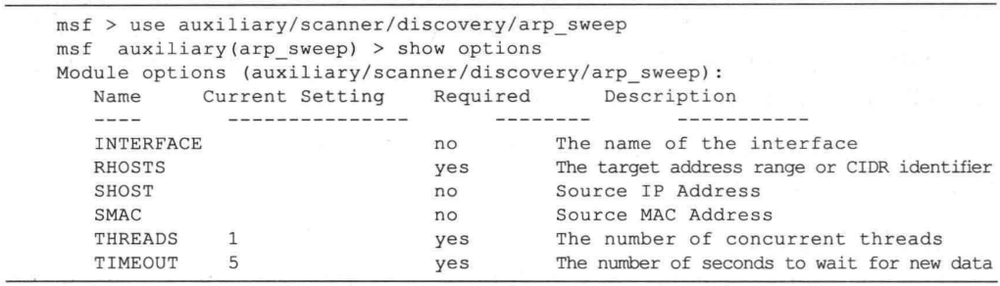
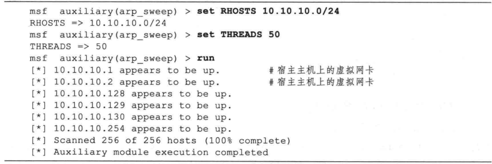
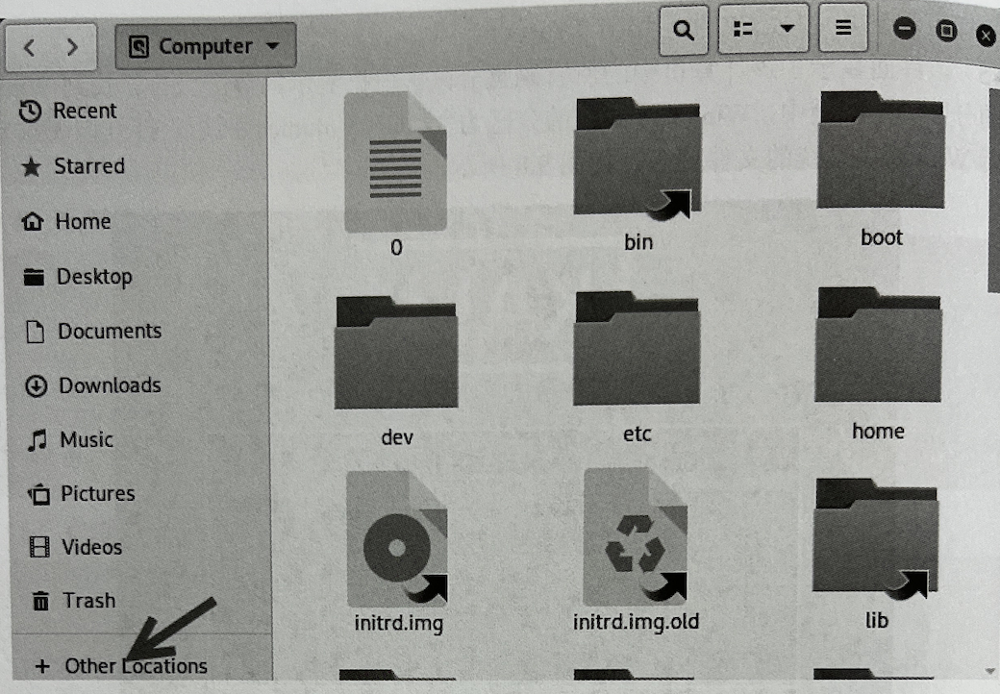

#### 发现主机
  - 发现主机用来探测哪些主机是活动的，进而获取主机的信息。用户可以使用主动扫描的方式发现主机，也可以采用被动监听的方式发现主机跃是网络管理员最常做的一件事，不过作为网络管理员，一般只需要使用 ICMP Ping 进行探测就能够满足需求，但是作为一名渗透测试者，对你的要求就会更高一些。通常网络上会有很多已关闭电源的主机或空闲（没有主机使用）的1段，需要首先从大范围的 IP 地址段中寻找出活跃的主机，然后进一步筛选出你感兴趣的目标主机。
  - 除了使用 Ping 命令，也可以使用 Metasploit 中的主机发现辅助模块，或是老牌的网络探测分析软件 Nmap，下面逐一进行介绍。

##### ICMP PING命令
- Ping (Packet Internet Grope， 因特网包探素器）是一个用于测试网络连接的程序，由于它在网络管理维护工作中使用频率非常高，几乎所有操作系统都集成了这个程序。Ping 程序会发送一个ICMP echo 请求消息给目的主机，并报告应答情况，如果 Ping 后面跟的是域名，那么它首先会尝试将域名解析，然后向解析得到的 IP 地址发送数据包。本实验环境中，我们可以通过nslookup指令在Kali攻击上获取 www.dvssc.com 的 IP 地址为 10.10.10.129，我们可以使用ping命令来测试主机连通性。

  

- 当firewall关闭了icmp协议之后，ping扫描就不能发现主机了

```
#查看区域的规则
firewall-cmd --list-all

#指定查看区域规则
firewall-cmd --list-all --zone=public

#查询区域是否允许某服务
firewall-cmd --zone=public --query-service=ssh

#重启防火墙
firewall-cmd --reload 

#关闭icmp协议
firewall-cmd --remove-icmp-block=echo-request --permanent
firewall-cmd --remove-icmp-block=echo-reply --permanent
firewall-cmd --reload
#开启icmp协议
firewall-cmd --add-icmp-block=echo-request --permanent
firewall-cmd --add-icmp-block=echo-reply --permanent
firewall-cmd --reload
``` 
##### Metasploit 的主机发现模块
- Metasploit 中提供了一些辅助模块可用于活跃主机的发现，这些模块位于 Metasploit 源码路径的 modules/auxiliary/scanner/discovery/ 目录中，主要有以下几个：arp sweep、ipv6 multicast_ping, ipv6_neighbor, ipv6_neighbor_router_advertisement, udp_probe. udp_sweep。其中两个常用模块的主要功能为：
  - arp_sweep 使用 ARP 请求枚举本地局城网络中的所有活跃主机。
  - udp_sweep 通过发送 UDP 数据包探查指定主机是否活跃，并发现主机上的 UDP 服务。
- 在TCP/IP 网络环境中，一台主机在发送数据帧前需要使用 ARP (Address Resolution Protocol，地址解析协议）将目标IP地址转换成 MAC 地址，这个转换过程是通过发送一个 ARP 请求来完成的。如 IP 为A 的主机发送一个 ARP 请求获取 IP 为 B 的MAC 地址，此时如果 IP 为 B 的主机存在，那么它会向 A 发出一个回应。因此，可以通过发送 ARP 请求的方式很容易地获取同一子网上的活跃主机情况，这种技术也称为 ARP扫描。Metasploit 的 arp_sweep模块便是一个 ARP 扫描器，下面演示了使用方法。
- Metasploit中的arp_sweep模块使用方法

 

- 首先需要输人 RHOSTS 来对扫描目标进行设置。在Metasploit 中，大部分 RHOSTS 参数均可设置为一个或多个IP 地址，多个 IP 地址可使用连字符号（-）表示（如10.10.10.1-10.10.10.100），或使用无类型域间选路地址块(CIDR） 表示（如10.10.10.0/24)。此外值得提醒的是，在所有的扫描类操作中，均可以通过将THREAD 参数设置成一个较大的值来增加扫描线程以提高扫描速度，或者设置为较小的值让扫描过程更加隐秘。
- 设置好 RHOSTS 和 THREADS 参数后，输人run 命令启动扫描器.

 

- 从代码中可以看到，arp_sweep模块很快发现了 10.10.10.0/24网段上的活跃主机，分别为10.10.10.1、10.10.10.2、 10.10.10.128、10.10.10.129、10.10.10.130、10.10.10.254。arp_ sweep 模块只能探测同一子网中的活跃主机，对于远程网络，可以使用更为强大的 Nmap 扫描器进行探测。

##### 使用 Nmap 进行主机探测
- Nmap (Network mapper）是目前最流行的网络扫描工具，它不仅能够准确地探测单台主机的详细情况，而且能够高效率地对大范围的 IP 地址段进行扫描。使用 Nmap 能够得知目标网络上有哪些主机是存活的，哪些服务是开放的，甚至知道网络中使用了何种类型的防火墙设备等。Nmap 版本支持包括 Windows 在内的多种操作系统，在 Kali 也集成了 Nmap，可以直接在 MSF 终端中运行。

- 在MSF终端中运行Nmap扫描工具


- Nmap 的参数和选项繁多，功能非常丰富。先来看一下 Nmap 命令的基本使用方法。通
常一个 Nmap 命令格式如下所示：


```shell
nmap ＜扫描选项＞＜扫描目标＞
```

- 其中扫描选项用来指定扫描的方式，扫描目标一般是用1表示的一个或一段IP地址。
如果仅对一台主机进行扫描，那么可以使用一个卫地址作为扫描范围；如果是多个 IP 地址，可以使用逗号分隔开；如果是一段连续的 IP 地址，可以使用连字符号 - 表示，如192.168.1.1-192.168.1.100，或使用无类型域间选路地址块(CIDR）表示，如192.168.1.0/24。虽然Nmap 的选项繁多，在实际的渗透测试任务中，只要掌握了几种重要类型的扫描，就基本上能够顺利地开展工作了。

- 在不使用任何扫描选项的情况下，Nmap扫描器会使用与 Ping 命令一样的机制，向目标网络发送ICMP 的echo 请求，同时会测试目标系统的 880 和 443 端口是否打开。如果你的任务仅是在一个内部网中发现存活主机，那么可以使用-sP，这个选项会使用 ICMP 的 Ping 扫描获取网络中的存活主机情况，而不会进一步探测主机的详细情况。

```shell

#扫描内部主机存活情况
nmap -sP 172.16.10.0/24

```
- 如果是在Internet 环境中，推荐使用-Pn 选项，它会告诉Nmap 不要使用 Ping 扫描，因为 ICMP 数据包通常无法穿透Internet 上的网络边界（通常是被防火墙设备过滤掉了)。
- 在Internet 环境中，可以使用nmap -PU 通过对开放的 UDP 端口进行探测以确定存活的主机，其功能类似 Metasploit 中的udp_sweep 辅助模块。Nmap 在进行 UDP 主机探测时，默认会列出开放的TCP 端口，如果想加快扫描速度，可以使用-sn 告诉 Nmap 仅探测存活主机，不对开放的TCP 端口进行扫描。


##### 主机发现实战流程

- 1.确定网络范围
  - 了解需要探测的主机所在的IP段，遵循IP地址规则
- 2.确定拓扑
  - 在渗透时需要确定所要攻击的目标是内网还是外网，使用traceroute工具来进行目标网段追踪

- 扫描主机
  - 使用Nmap工具
    - 使用如下命令探测主机是否存在
    ```shell
    #探测一个网段
    nmap -sP 10.10.10.0/24 
    #探测一台主机
    nmap -sP 10.10.10.1
    ```

### 其他主机发现工具
##### Netdiscover
- Netdiscover 是一个支持主动和被动两种模式的ARP侦查工具。使用该工具可以在网络上扫描IP地址，检查在线主机。
  - 语法格式如下：
  `netdiscover -r [range]`
- 以上语法中的选项 -r [range]用来指定扫描的网络范围。如果用户没有指定目标，将自动选择目标网络实施扫描

- 使用 Netdiscover 工具扫描 192.168.1.0/24网段内在线主机,执行命令如下：
  
  
  
  - 在以上输出信息中共显示了5列，分别是IP（IP地址）、At MAC Address (MAC 地址）、Count（包数）、Len（长度）、MAC Vendor/Fostname （MAC 地址生产厂商/主机名）。通过分析捕获到的包，可以知道当前局域网中活动的主机IP 地址、MAC 地址及 MAC地址的生产厂商等。从1列可以看到在线主机的地址。其中，在线的主机地址为 192.168.1.1、192.168.1.3 和 192.168.1.43。而且，在输出信息的左上角可以看到，当前的扫描状态为Finished， 即扫描完成。此时，按 Ctrl+C 组合键即可退出 Netdiscover 工具的扫描界面。用户也可以不指定扫描范围，尽可能地发现多个在线主机。执行命令如下：
  
  
  
  - 从输出的信息可以看出扫描到的活动主机。在输出信息的左上角可以看到，目前正在扫描 192.168.171.0/16网段的主机。
 
#### 监听发现主机
- 监听就是不主动向目标发送数据包，仅监听网络中的数据包。在局域网中，一些协议将自动广播数据包，如 ARP 广播和 DHCP 广播。而广播包是局域网中的所有用户都可以接收到的数据包。因此，用户通过对这些数据包进行监听，可以探测网络中活动的主机。

##### ARP监听
  - ARP (Address Resolution Protocol， 地址解析协议）是根据IP地址获取物理地址的一个TCP/IP协议。主机发送信息时，将包含目标 IP 地址的ARP请求广播到网络上的所有主机，并接收返回消息，以此确定目标的物理地址。所以，通过实施 ARP 监听，即可发现局域网中活动的主机。下面将介绍使用 Neidiscover 工具的被动模式实施 ARP 监听，以此来发现在线主机。其中，Netdiscover 工具实施被动扫描的语法格式如下：
    ```shell
    netdiscover -p
    ```
  - 执行以上命令后，将显示如下信息：
  
  
  
  - 从输出的第1行信息中，可以看到正在使用被动模式 (passive）实施扫描。从第2行信息中，可以看到嗅探到的包数、主机数及包大小。第3行以下的信息，则是嗅探到的包信息。从IP列可以看到探测到的在线主机。其中，在线的主机地址分别是192.168.1.1、192.168.1.3、192.168.1.43

##### DHCP监听
 - DHCP (Dynamic Host Configuration Protocol，动态主机配置协议）是一个局域网的网络协议，其主要作用是实现内部网或网络服务供应商自动分配IP地址。当一个客户端需要获取一个 IP 地址时，将会发送广播包。然后，收到请求的 DHCP 服务器会提供一个可用的IP地址给客户端。所以，用户可以实施 DHCP 监听来判断网络中的在线主机。下面将介绍通过 Nmap 的 broadcast-dhcp-discover 脚本实施 DHCP 监听来发现主机。Nmap的broadcast-dhcp-discover 脚本能够用来发送一个 DHCP Discover 广播包，并显示响应包的具体信息。通过对响应包的信息进行分析，能够找到可分配的卫 地址。其中，使用该脚本实施被动扫描的语法格式如下：
  ```shell
  nmap --scirpt broadcast-dhcp-discover
  ```
