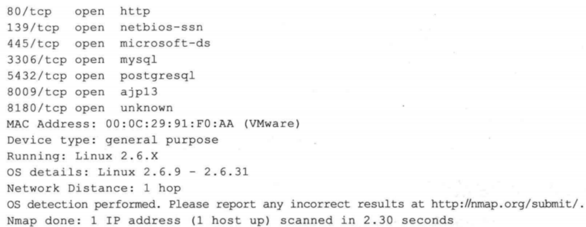
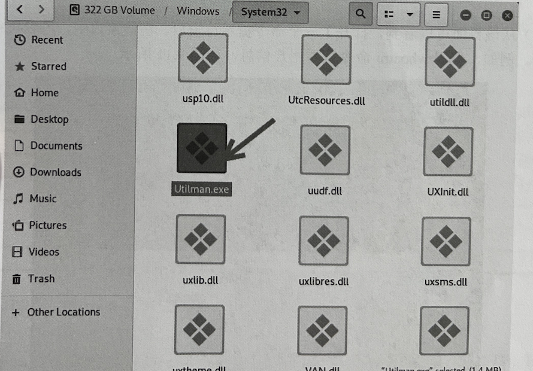

### 识别操作系统
- 获取了网络中的活跃主机之后，你最关注的事情可能就是这些主机安装了什么操作系统。要知道，网络中不仅会存在安装了各种通用操作系统的主机，还会有打印机、路由器、无线 AP，甚至是PS 等游戏主机。准确区别出这些设备使用的操作系统对于后续渗透流程的确定和攻击模块的选择非常重要。进行操作系统辨识有着以下实际的意义：
  - 漏洞扫描器得到的扫描结果中一般会存在误报的现象，而准确的操作系统识别能让你排除这些误报项目。举例来说，扫描器得到的“Windows IIS 缓冲区溢出”漏洞绝不会在Solaris 系统上出现：在Metasploit 中，攻击载荷针对不同的操作系统设计，不知道操作系统的类型，很难对其实施攻击：一些网络设备存在安全缺陷，例如很多网络设备均会有默认的管理员口令且很少有人对它们进行修改，一些廉价的网络设备具有一些先天的安全缺陷，可以通过对网络主机上的操作系统进行探测，了解网络上是否存在这种类型的脆弱设备。
- 有时候操作系统识别的结果甚至可用于社会工程学的攻击。举例来说，在渗透测试目标的网络上扫描发现了视频会议服务器，那么你很有希望能够伪装成该设备厂商的售后人员，通过电话或电子邮件与该系统管理员取得联系并得到其信任。

#### 使用nmap识别操作系统
- 可以使用-O 选项让 Nmap 对目标的操作系统进行识别。下图列出了对服务器(Ubuntu Metasploitable）的扫描结果。

- 上面显示主机是 Linux 系统，其内核版本为 2.6.x，这些信息有时候是不够的，可以加上-sV 参数对其服务的版本进行辨识，一些特定版本的服务通常只会运行在特定的操作系统上，这样有助于你更加准确地得到操作系统的类型。

#### 基于TTL识别
- TTL (Time To Live， 生存时间），该字段指定IP包被路由器丢弃之前允许通过的最大网段数量。其中，不同操作系统类型响应的TTL值不同。所以，用户可以使用ping命令进行系统识别。为了使用户能够快速地确定一个目标系统的类型，这里将给出各个操作系统的初始TTL值列表：

