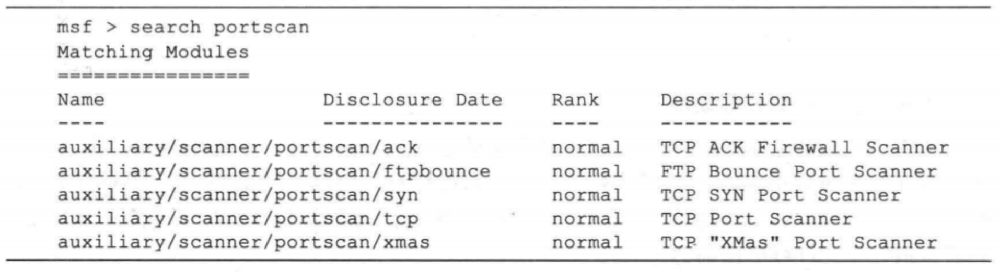
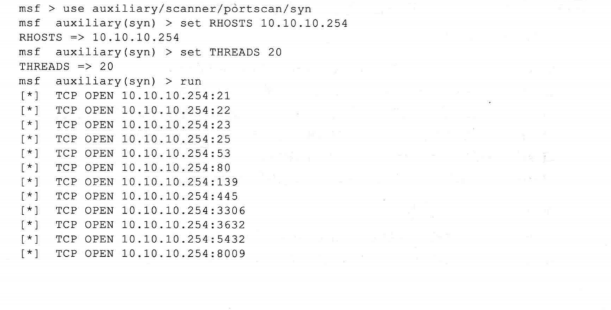
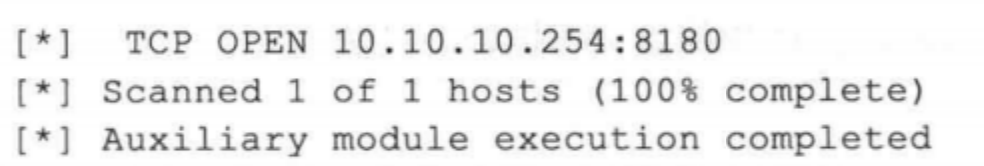
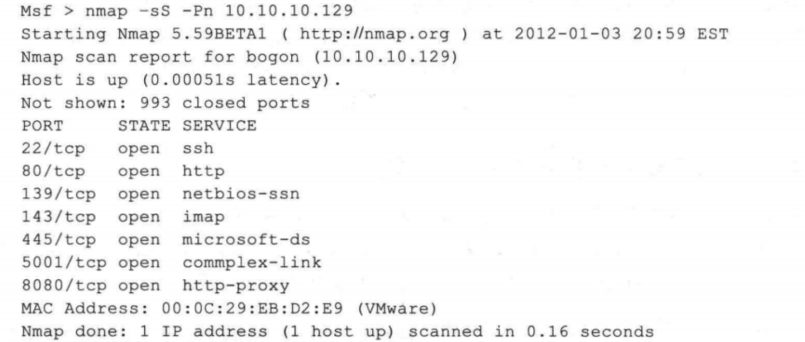
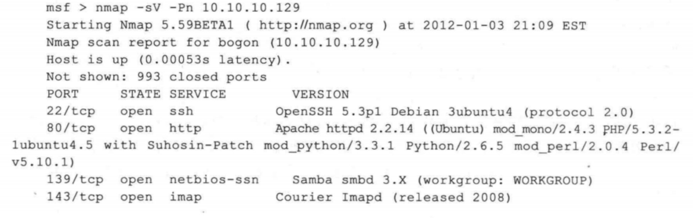
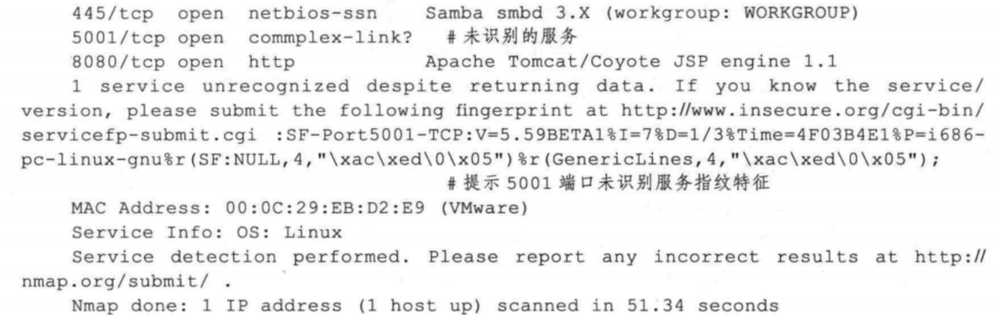

### 端口简介
- 在计算机中，“端口”的英文是Port。在网络技术中，端口有好几种意思。这里所指的端口不是物理意义上的端口，而是特指TCP/IP协议中的端口。它是逻辑意义上的端口。在TCP/IP协议中，最常用的协议是TCP和UDP协议。由于TCP和UDP两个协议是独立的，因此各自的端口号也相互独立。例如，TCP有235端口，UDP也可以有235 端口，两者并不冲突。下面将介绍端口的作用及常用的端口。
- 1.端口的作用
  - 用户都知道一台主机对应一个IP地址，可以提供多个服务，如web服务和FTP服务等。如果只有一个IP地址，是无法区分不同的网络服务，所以使用“IP+端口号”来区分不同的服务。
- 2.端口的定义
  - 端口号是标识主机内唯一的一个进程，“IP+端口号”就可以标识网络中的唯一进程。在网络开发的Socket编程中，IP+端口号就是套接字。端口号是由16位二进制数字编号，范围是0~65535。但是，这些端口并不是可以随便使用的，一些端口己经被占用。例如，Web服务器的端口为80，FTP服务的端口为21等。所以，端口被进行了分类，并规定了用户可以使用的端口范围。
- 3.端口的分类
  - 端口的分类方法很多，这里将按照是服务端使用还是客户端使用进行分类。其中，服务端使用的端口号又可以分为预留端口号和注册端口号。如下：
    - 预留端口号：该类端口的取值范围为 0-1023。其中，这些端口在用户编程的时候不能使用，是一些程序固定使用的。只有超级用户权限的应用才允许被分配一个预留端口号。例如，www服务默认端口为80，FTP 服务默认端口为21等。不过，用户也可以为这些网络服务指定其他端口号。但是有些系统协议使用固定的端口号，是不能被改变的。例如，139端口专门用于NetBIOS与TCP/IP之间的通信，不能被手动改变。
     - 注册端口号：该类端口的范围为 1024-49151，就是用户平时编写服务器使用的端口号范围。这些端口在没有被服务器资源占用的时候，也可以供用户端动态选用。客户端使用的端口号又叫临时端口号，取值范围为49152-65535。其中，这部分是客户端进程运行时动态选择的范围。
- 4.常用端口
  - 在前面提到，一些网络服务的端口都是固定的，所以将列出一些常见的 TCP/IP端口:
  
  

### 扫描端口
- 通过扫描端口，可以发现目标主机中运行的程序。然后，再对这些程序进行信息收集，以获取其漏洞信息，并实施渗透测试。
- 可以通过端口扫描了解到目标网络极为详细的信息，为下一步开展网络渗透打下牢固的基础。目前常见的端口扫描技术一般有如下几类：TCP Connect、TCP SYN、TCP ACK、TCP FIN，此外还有一些更为高级的端口扫描技术，如 TCP IDLE等。
- TCP Connect 扫描指的是扫描器发起一次真实的 TCP 连接，如果连接成功表明端口是开放的，这种扫描得到的结果最精确，但速度最慢，此外也会被扫描目标主机记录到日志文件中，容易暴露扫描。而 SYN、ACK、FIN 等则是利用了TCP 协议栈的一些特性，通过发送一些包含了特殊标志位的数据包，根据返回信息的不同判定端口的状态，这类扫描往往更加快速和隐蔽。

### Metasploit 中的端口扫描器
- Metasploit 的辅助模块中提供了几款实用的端口扫描器。可以输人 search portscan 命令找到相关的端口扫描器，如下图所示:

  

- 这几款扫描工具在实现原理和使用上均有较大的区别，以下对它们进行简要介绍：

  - ack：通过 ACK 扫描的方式对防火墙上未被屏蔽的端口进行探测。
  - ftpbounce：通过 FTP bounce 攻击的原理对 TCP 服务进行枚举，一些新的 FTP 服务器软件能够很好的防范 FTP bounce 攻击，但在一些旧的 Solaris 及 FreeBSD 系统的
FTP 服务中此类攻击方式仍能够被利用。
  - syn：使用发送TCP SYN 标志的方式探测开放的端口。
  - tcp：通过一次完整的TCP 连接来判断端口是否开放，这种扫描方式最准确，但扫描速度较慢。
  - xmas ：一种更为隐秘的扫描方式，通过发送FIN、PSH 和 URG 标志，能够躲避一些高级的 TCP 标记监测器的过滤。

- 在一般的情况下，推荐使用syn 端口扫描器，因为它的扫描速度较快、结果准确且不容易被对方察觉。下面是针对网关服务器 (Ubuntu Metasploitable）主机的扫描结果，可以看出与Nmap 的扫描结果基本一致，如下图所示:

  
  

### 使用Nmap进行端口扫描
- 大部分扫描器会对所有的端口分为 open（开放）或closed（关闭）两种类型，而 Nmap 对端口状态的分析粒度更加细致，共分为六个状态：open（开放）.closed（关闭）、filtered（被过滤）、unfiltered（末过滤）、openlfiltered（开放或被过滤）、closedlfiltered（关闭或被过滤）。
下面对这几种端口状态进行说明：
    - open（开放的）：应用程序正在该端口接收TCP 连接或者 UDP 报文。安全意识强的人们知道，每个开放的端口都是攻击的入口。攻击者或者入侵测试者想要发现开放的端口，而管理员则试图关闭它们或者用防火墙保护它们以免妨碍合法用户使用。非安全扫描可能对开放的端口也感兴趣，因为它们显示了网络上哪些服务可供使用。
    - closed（关闭的）：关闭的端口对于 Nmap 也是可访问的（它接收 Nmap 的探测报文并作出响应），但没有应用程序在其上监听。它们可以显示该IP地址（主机发现或者ping扫描）的主机正在运行，也对部分操作系统的探测有所帮助。因为关闭的端口是可访问的，也许过一会儿有一些端口又开放了。系统管理员可能会用防火墙封锁这样的端口。这样，它们就会被显示为被过滤的状态。
    - filtered（被过滤的）：由于包过滤阻止探测报文到达端口，Nmap 无法确定该端口是否开放。过滤可能来自专业的防火墙设备、路由器规则或者主机上的软件防火墙。有时候它们响应ICMP错误消息，如类型3代码13（无法到达目标:通信被管理员禁止），但更普遍的是过滤器只是丢弃探测帧，不做任何响应。Nmap 会重试若干次，检测探测包是否是由于网络阻塞而丢弃的。这会导致扫描速度明显变慢。
    - unfiltered（未被过滤的）：未被过滤状态意味着端口可访问，但Nmap不能确定它是开放还是关闭。用户只有通过映射防火墙规则集的ACK扫描，才会把端口分类到这种状态。使用其他类型的扫描（如窗口扫描、SYN扫描或者FIN 扫描来扫描未被过滤的端口，可以帮助确定端口是否开放。
    - open/filtered开放或者被过滤的）：当无法确定端口是开放还是被过滤的时，Nmap就把该端口划分成这种状态。开放的端口不响应就是这种况。没有响应也可能意味着报文过滤器丟弃了该坏测报文及引起的任何响应报文。因此，Nmap 无法确定该端口是开放的还是被过滤的。UDP、IP 协议、FIN、Null 和 Xmas 扫描可 能把端口归入此类。
    - closed/filtered（关闭或者被过滤的）：该状态用于Nmap不能确定端口是关闭的还是被过滤的。它只会出现在IPID Idle扫描中。

- Nmap 的参数可以分为扫描类型参数和扫描选项参数，扫描类型参数指定 Nmap 扫描实现机制，扫描选项则确定了 Nmap 执行扫描时的一些具体动作。
  - 常用的 Nmap 扫描类型参数主要有:
    - -sT: TCP connect 扫描，类似Metasploit 中的top 扫描模块。
    - -sS: TCP SYN扫描，类似Metasploit 中的syn 扫描模块。
    - -SF/-SX/-SN: 这些扫描通过发送一些特殊的标志位以避开设备或软件的监测。
    - -sP: 通过发送 ICMP echo 请求探测主机是否存活，原理同 Ping。
    - -sU: 探测目标主机开放了哪些 UDP 端口。
    - -sA: TCPACK 扫描，类似Metasploit 中的ack 扫描模块。
  - 常用的 Nmap 扫描选项有：
    - -Pn：在扫描之前，不发送ICMP echo 请求测试目标是否活跃。
    - -O: 启用对于TCP/IP 协议栈的指纹特征扫描以获取远程主机的操作系统类型等信息。
    - -F: 快速扫描模式，只扫描在 nmap-services 中列出的端口。
    - -p <端口范围>: 可以使用这个参数指定希望扫描的端口，也可以使用一段端口范围（例如 1~1023）。在 IP 协议扫描中（使用-sO 参数），该参数的意义是指定想要扫描的协议号(0~ 255)。

- 下图是使用 Nmap 对网站服务器主机进行一次端口扫描的结果，其中使用到了-sS选项，该选项指定使用 TCP SYN 扫描，这种扫描方式不等待打开一个完全的 TCP 连接，所以执行速度会更快，而且这种扫描通常不会被 IDS等设备记录。如果想要同时列出 UDP 端口，可以加上-sU，但执行速度就会变得比较慢。

  

- 通过上面的端口扫描，已经得到了一些关于端口上开放哪些服务的简单信息，不过实际上 Nmap 只是简单地将开放的端口号与该端口上常见服务进行了一个映射，如果想要获取更加详细的服务版本等信息，需要使用-sV 选项，如下所示。

  
  

- Nmap 工具将网站服务器上各个开放服务的指纹信息（fingerprint）与现有的指纹库进行比对，列出了它能够识别服务的详细信息，甚至包含了 Apache 中已安装的模块。对于指纹库中没有的服务，它会将其指纹信息列举出来，并允许用户提供他们所了解的服务信息，以补充 Nmap 工具的服务指纹数据库（如本例中的 5001 端口）。

- Nmap其它使用命令
```shell
#目标主机 192.168.29.136 实施端口扫描
nmap 192.168.29.136
#Nmap工具默认扫描了1000个端口。

#指定端口范围为 1~50，对目标主机实施端口扫描;
nmap -p 1-50 192.168.29.136

#指定扫描目标主机的21和23端口
nmap -p 21,23 192.168.29.136
```
- 使用DMitry工具
  - DMitry工具提供了一个-p选项，可以实施端口扫描
  - 使用 DMitry 扫描目标主机192.168.29.136上开放的端口
  
  ```shell
  dmitry -p 192.168.29.136
  ```
#### 识别服务
- 识别服务主要是探测服务的版本信息。通常情况下，在一些旧版本中可能存在漏洞。如果存在漏洞，用户可以对该主机实施渗透，进而获取其他重要信息
##### 使用Nmap工具
- 在Nmap工具中提供了一个-sV选项，可以用来识别服务的版本。
```shell
#以上语法中的选项-sV表示实施服务版本探测
#以上语法中的选项-sV 表示实施服务版本探测
nmap -SV 192.168.29.136
```
