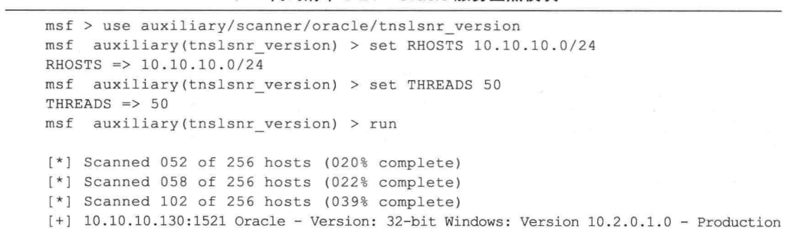

## 服务扫描与检查点
- 很多网络服务是漏洞频发的高危对象，对网络上的特定服务进行扫描，往往能让我们少走弯路，增加渗透成功的几率。确定开放端口后，通常会对相应端口上所运行服务的信息进行更深人的挖掘，通常称为服务查点。
- 在Metasploit 的Scanner 辅助模块中，有很多用于服务扫描和查点的工具，这些工具通常以 [service_nameJ _version 和 [service_name] _login 命名。
  - [service_name] _version 可用于遍历网络中包含了某种服务的主机，并进一步确定服务的版本。
  - [service_name] _login 可对某种服务进行口令探测攻击。
- 例如，http_ version 可用于查找网络中的web 服务器，并确定服务器的版本号，http_login 可用于对需要身份认证的 HTTP 协议应用进行口令探测。

 
 

- 在MSF终端中，可以输入search name:_version 命令查看所有可用的服务查点模块，该命令的执行结果如代码如下:

### 常见的网络服务扫描
- 1.Telnet服务扫描
  - Telnet 是一个历史悠久但先天缺三安全性的网络服务。由于 Telnet 没有对传输的数据进行加密，越来越多的管理员渐渐使用更为安全的 SSH 协议代替它。但是，很多旧版的网络设备不支持 SSH 协议，而且管理员通常不愿冒风险升级他们重要设备的操作系统，所以网络上很多交换机、路由器甚至防火墙仍然在使用 Telnet。一个有趣的现象是，价格昂贵、使用寿命更长的大型交换机使用 Telnet 协议的可能性会更大，而此类交换机在网络中的位置一般来说都非常重要。当渗透进人一个网络时，不妨扫描一下是否有主机或设备开启了 Telnet 服务，为下一步进行网络嗅探或口 令猜测做好准备。其使用方法如下所示。 

- 代码清单 3-19 中的扫描结果显示，IP 地址为 10.10.10.254 的主机（即网关服务器）开放了 Telnet 服务，通过返回的服务旗标 “Ubuntu 8.04\x0ametasploitable login ：”，可以进一步确认出这台主机的操作系统版本为 Ubuntu 8.04，而主机名为 metasploitable。

- 2.SSH服务扫描
  - SSH 是类 UNIX 系统上最常见的远程管理服务，与Telnet 不同的是，它采用了安全的加密信息传输方式。通常管理员会使用 SSH 对服务器进行远程管理，服务器会向 SSH 客户端返回一个远程的 Shell 连接。如果没有做其他的安全增强配置（如限制管理登录的IP地址），只要获取服务器的登录口令，就可以使用 SSH 客户端登录服务器，那就相当于获得了相应登录用户的所有权限。在下面的示例中，对网络中开放 SSH 服务的主机进行了扫描。

  - 上面例子中，使用 Metasploit 中的ssh_version 辅助模块，很快在网络中定位了两台开放 SSH 服务的主机，分别是 10.10.10.129（网站服务器）和10.10.10.254（网关服务器），并且显示了SSH 服务软件及具体版本号。

- 3.Oracle 数据库服务检查点
  - 各种网络数据库的网络服务端口是漏洞频发的“重灾区”，比如 Microsoft SQL Server 的 1433 端口，以及 Oracle sQL 监听器（tnslsnr）使用的1521 端口。可以使用 mssqlping 模块查找网络中的 Microsoft SQL Server， 使用tnslsnt_version 模块查找网络中开放端口的 Oracle 监听器服务。如上所示，使用 tnslsnr_version 模块在网络中发现后台服务器上开放的 Oracle 数据库，并获取其版本号。 
 

### 口令猜测与嗅探
- 对于发现的系统与文件管理类网络服务，比如 Telnet、SSH、FTP 等，可以进行弱口令的猜测，以及对明文传输口令的嗅探，从而尝试获取直接通过这些服务进人目标网络的通道。

- 1.SSH服务口令猜测
  - 在本节开始的时候已经向大家介绍了如何在网络上查找SSH 服务。现在，使用 Metasploit 中的ssh_login 模块对 SSH 服务尝试进行口令试探攻击。进行口令攻击之前，需要一个好用的用户名和口令字典。
  - 载人ssh 1ogin 模块后，首先需要设置RHOSTS 参数指定口令攻击的对象，可以是一个 IP 地址，或一段 IP 地址，同样也可以使用 CIDR 表示的地址区段。然后使用
USERNAME 参数指定一个用户名（或者使用 USER FILE 参数指定一个包含多个用户名的文本文件，每个用户名占一行)，并使用 PASSWORD 指定一个特定的口令字符串（或者
使用 PASS FILE 参数指定一个包含多个口令的字典文件，每个口令占一行），也可以使用 USERPASS FILE 指定一个用户名和口令的配对文件(用户名和口令之间用空格隔开，每对用户名口令占一行)。
  - 默认情况下，ssh 1ogin 模块还会尝试空口令，以及与用户名相同的弱口令进行登录测试。ssh_login模块的运行情况如下所示，从这次运行中你发现网关服务器 (Ubuntu
Metasploitable）的 root 用户口令为 ubuntu，并直接获得了这台主机的远程访问 Shell。

 - Bingo！不费吹灰之力，就搞定了定V 安全公司 DMZ 区的一台服务器访问权。然而你对使用这种简单方法获得访问权一直是嗤之以鼻的，你还想用更有技术难度的方法再次获得这台服务器的控制权。

- 2.psnuffle 口令嗅探
  - psnufnle 是目前 Metasploit 中唯一用于口令嗅探的工具，它的功能算不上强大，但是非常实用，可以使用它截获常见协议的身份认证过程，并将用户名和口令信息记录下来。
  - 下面看看如何使用它获取FTP 服务的明文登录口令。如代码清单3-24 所示，在攻击机上运行 Metasploit 中的 psnuffle 模块，在定v公司 DMZ 区网段中进行监听，截获了访问网关服务器 FTP 服务的口令认证过程，从中可以发现 FTP 服务的用户名与口令为 msfadmin:msfadmin。这样就得到了网关服务器的FTP 服务访问权限。

  
  - 在实际的渗透测试工作中，只有在得到能够接人对方网络的初始访问点之后，才能够方便地使用 Metasploit 中的psnuffle模块进行口令嗅探。如果条件允许的话，推荐在接人网络整个过程中都要保持嗅探器的运行，以增加截获口令的可能性。

