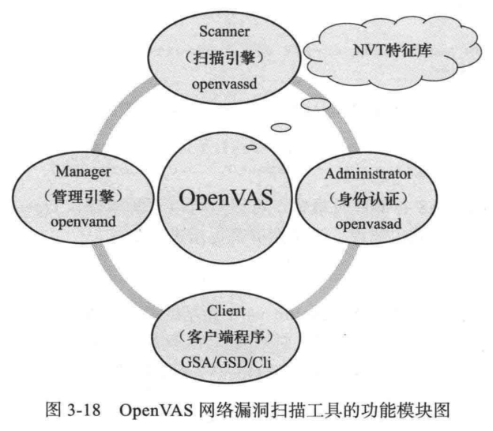
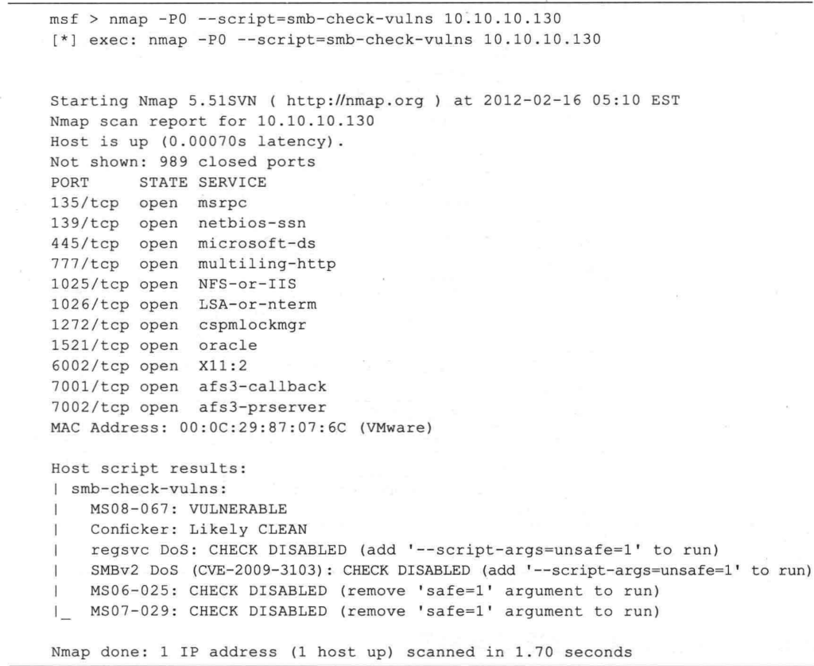

## 常用漏洞扫描工具
- Nessus
  - Nessus 是目前常用的系统漏洞扫描与分析软件。该工具提供了完整的漏洞扫描服务，并随时更新其漏洞数据库。而且，Nessus 可同时在本机操作或远程控制，进行系统的漏洞分析扫描。
- Openvas
  - OpenVAS 是类似 Nessus 的综合型漏洞扫描器，可以用来识别远程主机、Web 应用存在的各种漏洞。Nessus 曾经是业内开源漏洞扫描工具的标准，在Nessus 商业化不再开放源代码后，在它的原始项目中分支出 OpenVAS 开源项目。经过多年的发展，OpenVAs 已成为当前最好用的开源漏洞扫描工具，功能非常强大，甚至可以与一些商业的漏洞扫描工具媲美。OpenVAS 使用 NVT (Network Vulnerabilty Test， 网络漏洞测试）脚本对多种远程系统（包括 Windows、Linux、UNIX 以及web 应用程序等）的安全问题进行检测。
  - OpenvAs 开发组维护了一套免费的 NVT 库，并定期对其进行更新，以保证可以检测出最新的系统漏洞。OpenVAS 的主要功能模块如下图所示。
   
  

### Openvas部署
- 部署方式采用vmware ova模版部署。只需要将模版直接打开，vmware就会自动完成部署。

- ova 方式部署的默认登录账号密码:
  - Log in using the following login information:
  - User name: admin | Password: admin

- 本环境Openvas部署地址为10.10.10.150
- 自信的Openvas模版可以到https://www.greenbone.net/下载

### 利用Openvas扫描DMZ区主机
- OpenVAS 启动无误后，可以在浏览器中输人 https://10.10.10.150 打开 GSA 的主页面，如果此时尚末登录，会跳转到登录页面，输人正确的 OpenvAs 用户名、口令后，跳转到 GSA 的主界面，如下图所示。
 
  

- 创建Openvas扫描目标
- 创建Openvas扫描任务

### 在Metasploit内部使用Openvas

### 查找特定服务漏洞
- OpenVAS 这类通用漏洞扫描器是一种高度自动化的工具，只需将它接人网络中，它便能够自动地通过 “全面撒网”的方式来获取网络中尽可能多的安全漏洞，在方便快捷的同时，它也存在如下不可避免的问题。
  - 扫描过程过于 “简单粗暴”。如果从事过网络管理员的工作，你肯定会有这样的经验：对全网进行漏洞扫描时，人侵检测设备会声嘶力竭地不停报警，事后会记录下成千上万的攻击信息，这在一些需要隐秘进行的渗透测试任务中是非常尴尬的。
  - 在一些特殊的环境中具有“杀伤性”。比如对一些包含大量陈旧设备的局域网进行扫描时，很可能会造成重要网络设备的瘫痪；银行、金融等一些极其关注系统可用性的网络中，哪怕只有万分之一的故障概率也是不允许的。所以，使用漏洞扫描器对特定网络进行大范围扫描之前要慎之又慎。
  - 扫描结果存在漏的现象。在渗透测试工作中，如果漏掉一个重要的漏洞信息，可能会直接影响到整个工作的进展和结果。
- 因此，不应当把漏洞扫描器的结果当作 “救命稻草”，如果漏洞扫描的结果不能满足要求，或是网络中没有使用漏洞扫描器的条件，那么你仍然能够通过使用一些针对性扫描工具用来查找特定服务漏洞的工具）帮助你进行漏洞检测。查找特定漏洞的扫描工具的原理与
通用漏洞扫描器大相径庭，如果把通用漏洞扫描器比作杀伤面积巨大的地毯式轰炸，那么特定漏洞扫描工具则像是精准的狙击步枪，使用它可以悄无声息地发现网络上的致命漏洞。
- Nmap 是最常用到的一种针对性扫描工具之一。在前期的情报收集工作中，你了解到Windows 2003 的服务器（10.10.10.130），开放了SMB 服务，有了这些信息，便可以使用 Nmap 的 SMB 服务漏洞扫描模块对它进行探测。如下图所示。

  

- 可以看到，Nmap 扫描结果显示这台主机上的 SMB 服务包含 MS08-067 漏洞，这个漏洞在之前的OpenVAS 扫描中没有被找到。Nmap 目前集成了大量的扫描脚本，包括针对特定漏洞的扫描，有针对性的信息获取与枚举，各种协议认证口令的猜解，以及针对特定应用程序的攻击脚本，可以在 kali 中的/usr/share/nmap/scripts 目录中找到相应的脚本。

