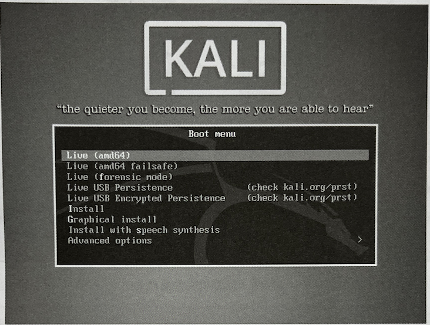
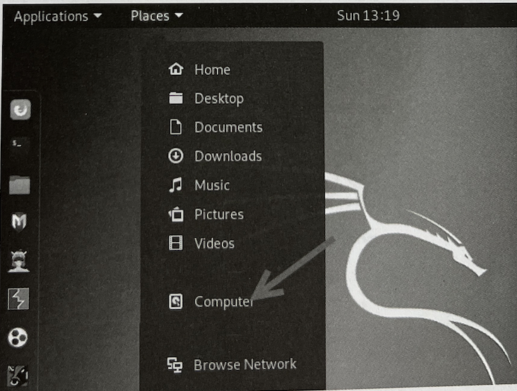
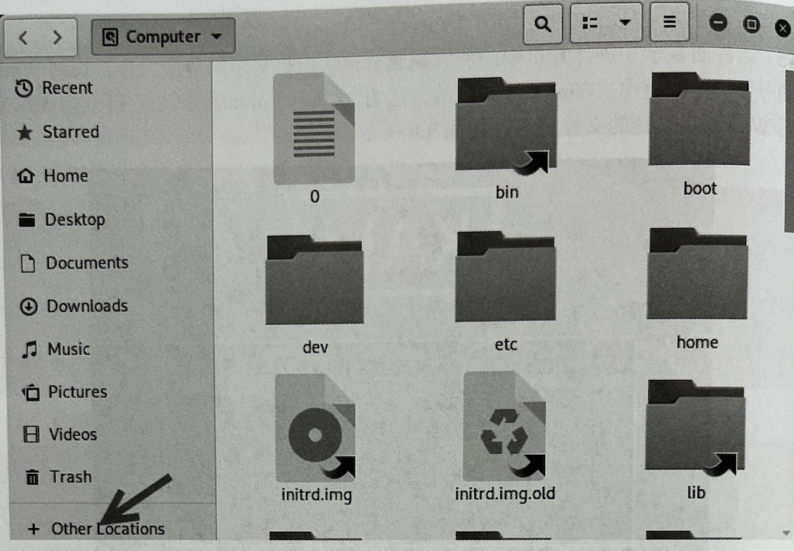

### 其他主机发现工具
##### Netdiscover
- Netdiscover 是一个支持主动和被动两种模式的ARP侦查工具。使用该工具可以在网络上扫描IP地址，检查在线主机。
  - 语法格式如下：
  `netdiscover -r [range]`
- 以上语法中的选项 -r [range]用来指定扫描的网络范围。如果用户没有指定目标，将自动选择目标网络实施扫描

- 使用 Netdiscover 工具扫描 192.168.1.0/24网段内在线主机,执行命令如下：
  
  
  
  - 在以上输出信息中共显示了5列，分别是IP（IP地址）、At MAC Address (MAC 地址）、Count（包数）、Len（长度）、MAC Vendor/Fostname （MAC 地址生产厂商/主机名）。通过分析捕获到的包，可以知道当前局域网中活动的主机IP 地址、MAC 地址及 MAC地址的生产厂商等。从1列可以看到在线主机的地址。其中，在线的主机地址为 192.168.1.1、192.168.1.3 和 192.168.1.43。而且，在输出信息的左上角可以看到，当前的扫描状态为Finished， 即扫描完成。此时，按 Ctrl+C 组合键即可退出 Netdiscover 工具的扫描界面。用户也可以不指定扫描范围，尽可能地发现多个在线主机。执行命令如下：
  
  
  
  - 从输出的信息可以看出扫描到的活动主机。在输出信息的左上角可以看到，目前正在扫描 192.168.171.0/16网段的主机。
 
#### 监听发现主机
- 监听就是不主动向目标发送数据包，仅监听网络中的数据包。在局域网中，一些协议将自动广播数据包，如 ARP 广播和 DHCP 广播。而广播包是局域网中的所有用户都可以接收到的数据包。因此，用户通过对这些数据包进行监听，可以探测网络中活动的主机。

##### ARP监听
  - ARP (Address Resolution Protocol， 地址解析协议）是根据IP地址获取物理地址的一个TCP/IP协议。主机发送信息时，将包含目标 IP 地址的ARP请求广播到网络上的所有主机，并接收返回消息，以此确定目标的物理地址。所以，通过实施 ARP 监听，即可发现局域网中活动的主机。下面将介绍使用 Neidiscover 工具的被动模式实施 ARP 监听，以此来发现在线主机。其中，Netdiscover 工具实施被动扫描的语法格式如下：
    ```shell
    netdiscover -p
    ```
  - 执行以上命令后，将显示如下信息：
  
  
  
  - 从输出的第1行信息中，可以看到正在使用被动模式 (passive）实施扫描。从第2行信息中，可以看到嗅探到的包数、主机数及包大小。第3行以下的信息，则是嗅探到的包信息。从IP列可以看到探测到的在线主机。其中，在线的主机地址分别是192.168.1.1、192.168.1.3、192.168.1.43

##### DHCP监听
 - DHCP (Dynamic Host Configuration Protocol，动态主机配置协议）是一个局域网的网络协议，其主要作用是实现内部网或网络服务供应商自动分配IP地址。当一个客户端需要获取一个 IP 地址时，将会发送广播包。然后，收到请求的 DHCP 服务器会提供一个可用的IP地址给客户端。所以，用户可以实施 DHCP 监听来判断网络中的在线主机。下面将介绍通过 Nmap 的 broadcast-dhcp-discover 脚本实施 DHCP 监听来发现主机。Nmap的broadcast-dhcp-discover 脚本能够用来发送一个 DHCP Discover 广播包，并显示响应包的具体信息。通过对响应包的信息进行分析，能够找到可分配的卫 地址。其中，使用该脚本实施被动扫描的语法格式如下：
  ```shell
  nmap --scirpt broadcast-dhcp-discover
  ```
